地图着色问题是如何解决的

罗宾·威尔逊

四色足矣

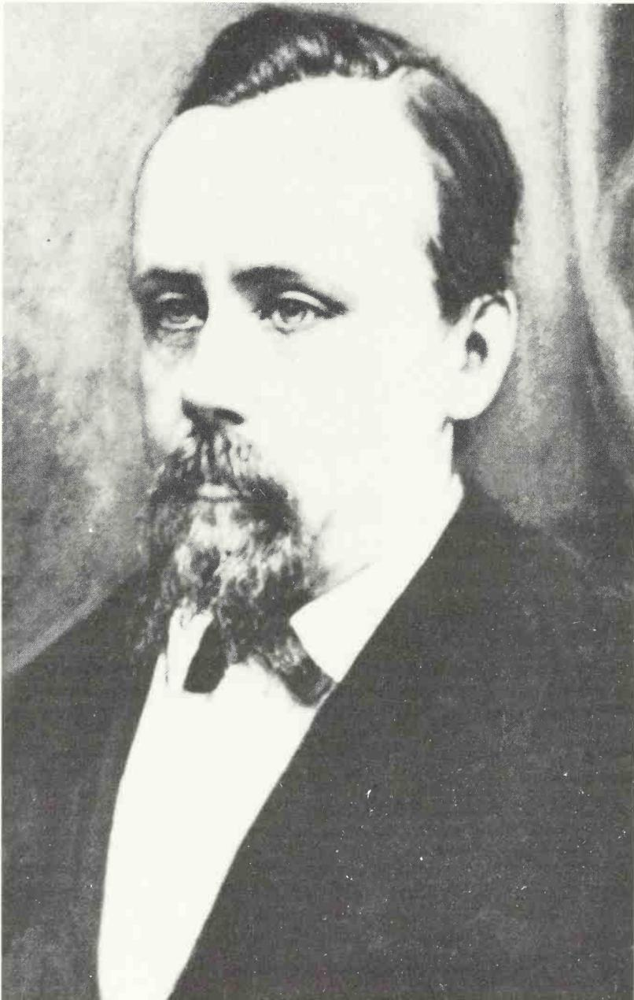

# 四色足矣

地图着色问题是如何解决的

罗宾·威尔逊

谨以此书纪念约翰·福韦尔——正是他鼓励我写下了这本书。

> 在此，一个周日的清晨
> 我的爱人与我躺在一起，
> 看那五彩缤纷的郡县，
> 听那云雀高高飞起
> 在我们头顶的天际。
> ——A. E. 豪斯曼（A. E. Housman），《什罗普郡一少年》

> 假设一位画家正在给一头棕色的小牛和一条大棕狗作画……他总得让人一眼就能分清谁是谁，对不对？那当然。那么，你想让他把两个都画成棕色吗？当然不想。他会把其中一个画成蓝色，这样你就不会认错了。地图也是同样的道理，这就是为什么每个州都被涂成了不同的颜色……
>
> ——马克·吐温（Mark Twain），《汤姆·索亚在国外》

> 由于地图印在平面上，只需四种颜色便足以把每个州的轮廓与相邻州区分开来。在球面——也就是地球仪上——四种颜色同样够用。可如果地图印在环面——也就是甜甜圈的表面上——就得用上七种颜色才能分清各州的形状。当然，人们很少会在自己的甜甜圈上看到美国地图，原因还有很多。
>
> ——汤姆·罗宾斯（Tom Robbins），《细腿与一切》

# 前言

数学问题能引起公众广泛关注的情形极为罕见。然而一个半世纪以来，关于地图着色的四色问题始终是整个数学领域最著名的难题之一——甚至可以说是最著名的那一个。成千上万的解谜爱好者、业余解题者和专业数学家都曾竭力尝试将其攻克。

在本书中，我将讲述四色问题及其解答的精彩历史。这段故事中出现了许多有趣而古怪的人物：刘易斯·卡罗尔（Lewis Carroll）、伦敦主教、一位法国文学教授、一个愚人节恶作剧者、一位痴迷石南花的植物学家、一位热衷高尔夫球的数学家、一个一年只对一次表的怪人、一位在蜜月期间忙着给地图着色的新郎，以及一位加利福尼亚的交通警察。

在给出问题的定义之后，我将解释证明的主要思路，讨论它所引发的哲学问题，并概述一些相关的着色问题——从在甜甜圈上绘制地图，到为帝国和马蹄铁着色，不一而足。

为便于读者查阅，正文之后的注释与参考文献部分之后，还附有本书所用技术术语的术语表，以及四色定理故事中主要事件的年表。

我要感谢以下诸位，他们或为我提供了宝贵的资料，或通过评论意见帮助改进了本书：弗兰克·阿莱尔（Frank Allaire）、肯·阿佩尔（Kenneth Appel）、汉斯-京特·比加尔克（Hans-Günther Bigalke）、诺曼·比格斯（Norman Biggs）、安德鲁·鲍勒（Andrew Bowler）、乔伊·克里斯平-威尔逊（Joy Crispin-Wilson）、罗伯特·爱德华兹（Robert Edwards）、保罗·加西亚（Paul Garcia）、沃尔夫冈·哈肯（Wolfgang Haken）、弗雷德·霍罗伊德（Fred Holroyd）、约翰·科赫（John Koch）、斯特凡·麦格拉斯（Stefan McGrath）、唐纳德·麦肯齐（Donald MacKenzie）、芭芭拉·马恩豪特（Barbara Maenhaut）、大卫·纳尔逊（David Nelson）、苏珊·奥克斯（Susan Oakes）、托比·奥尼尔（Toby O'Neil）、阿德里安·赖斯（Adrian Rice）、格哈德·林格尔（Gerhard Ringel）、特德·斯瓦特（Ted Swart）、斯坦·瓦根（Stan Wagon）、伊恩·万利斯（Ian Wanless）、道格拉斯·伍德尔（Douglas Woodall）和约翰·伍德拉夫（John Woodruff）。

本书付梓之时，恰逢四色问题提出150周年，也是其证明发表25周年。

2002年5月

      ——罗宾·威尔逊

在下面这幅不列颠地图中，各郡县被着上四种颜色，使相邻的郡县颜色互不相同。是不是每一幅地图都能这样只用四种颜色着色呢？

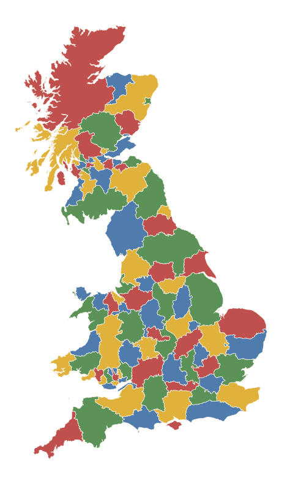

# 第1章 四色问题

在开始讲述这段历史之前，有几个基本问题需要先弄清楚。当然，首要的问题就是：

## 什么是四色问题？

四色问题的表述非常简单，说的是地图的着色问题。给地图着色时，我们自然希望相邻的国家颜色不同，以便相互区分。那么，要给整幅地图着色，究竟需要多少种颜色呢？

乍看之下，似乎地图越复杂，所需的颜色就越多——但出人意料的是，事实并非如此：似乎最多只需要四种颜色，就能给任何地图着色。例如，在对面的不列颠地图中，各郡县仅用四种颜色就完成了着色。于是，这就是四色问题：

## 四色问题

**每幅地图是否都能用最多四种颜色着色，使得相邻国家的颜色不同？**

## 它为什么有趣？

解决任何一种谜题——比如拼图或填字游戏——都能带来纯粹的放松和消遣之乐，四色问题当然也为许多人带来了数不清的乐趣，也带来了挫折。往深一层看，四色问题还可以被视为一种挑战：正如登山者要克服重重身体障碍才能登顶，这个问题——表述如此简单，却又如此难解——给数学家们带来了极其复杂的智力挑战。

## 它重要吗？

也许相当令人惊讶的是，四色问题对地图绘制者和制图师而言并不重要。在一篇1965年探讨该问题起源的文章中，数学史家肯尼思·梅（Kenneth May）指出：

> 在国会图书馆大量收藏的地图册样本中，并没有显示出尽量减少使用颜色数量的倾向。仅用四种颜色的地图很少见，而那些这样做的地图通常也只需要三种颜色。关于制图学和地图制作史的书籍并未提及四色性质，尽管它们经常讨论与地图着色相关的各种其他问题……
>
> 四色猜想的起源或应用都不能归功于制图学。

同样，被子制作者、拼布工人、镶嵌艺术家等似乎也从未想过要把布块或瓷砖的颜色数量限制为四种。

然而，四色问题绝不仅仅是满足好奇心的游戏。尽管它带有娱乐色彩，但多年来为解决它所做的种种尝试，催生了许多令人兴奋的数学进展，这些进展对现实中的重要问题有着诸多实际应用。许多实际的网络问题——例如公路网、铁路网或通信网络——追根溯源都可以归结为地图着色问题。事实上，据一本论述相关领域图论（研究对象之间连接关系的学科）的近作介绍，这门学科的整体发展都可以追溯到解决四色问题的尝试。在计算理论中，近来对算法（解决问题的逐步程序）的研究同样与着色问题密切相关。四色问题本身或许不是数学的主流，但它所激发的种种进展，正在数学的发展中扮演着越来越重要的角色。

## “解决”它意味着什么？

“证明四色定理”，就是要证明四种颜色足以给所有地图着色——无论是现实世界的地理地图，还是我们可能凭空发明的虚构地图。如果这个命题是假的，我们只需给出一幅需要五种或更多颜色的地图，就足以证明；但如果这个命题是真的，我们就必须为所有可能的地图证明它：仅仅给数百万甚至数十亿幅地图着色是不够的，因为很可能还存在一幅我们遗漏的地图，其国家排列方式需要五种或更多颜色。在科学的其他领域，“证明”某个断言，指的是在给定基本假设和已进行的实验条件下，该假设极有可能成立；但数学证明必须是绝对的，不允许有任何例外。要证明四色定理，我们必须找到一个适用于所有地图的通用论证，而要发现这样的论证，需要发展大量的理论工具。

## 谁提出了它，又是如何解决的？

正如我们将看到的，四色问题最初是在大约一百五十年前由弗朗西斯·格思里提出的，但直到一个多世纪之后——在无数次为地图着色的尝试、以及必要理论工具的发展之后——才最终确凿无疑地证明了四种颜色对所有地图都已足够。即便到了那时，仍然存在棘手的哲学问题。最终的解答由沃尔夫冈·哈肯和肯尼思·阿佩尔于1976年给出，耗费了超过一千小时的计算机时间，人们对此反应不一，既有热情，也有失落。尤其是，数学家们至今仍在争论：如果一个问题的解答无法由人工直接验证，那么这个问题是否能算作已经解决。

## 按数字涂色

在开始讲述这段历史之前，我们需要更清楚地说明什么是四色问题，以及我们做了哪些基本假设。比如，我们所说的“地图”究竟是什么意思？

我们可以把地图看作由许多国家或区域组成，这些区域可以是不列颠地图中的郡，也可以是美国地图中的州。每个国家的边界由若干条边界线组成，这些边界线在各个交汇点处相交。拥有一条共同边界线的两个国家称为相邻国家——例如，在下面的地图中，国家A和国家B就是相邻国家。

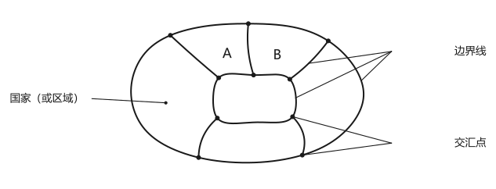

给地图着色时，我们必须始终让相邻国家的颜色不同。注意，有些地图确实需要四种颜色：下图(a)中有四个国家相互相邻，每个都与另外三个接壤，因此这四个国家必须颜色各不相同，需要四种颜色。这种情况在现实中也会发生：图(b)中，比利时、法国、德国和卢森堡彼此相邻，因此该地图需要四种颜色。

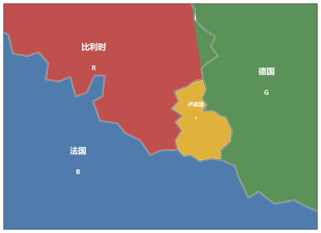

有些地图并不需要四种颜色。例如，在以下每幅地图中，外圈国家可以用两种颜色（红色和绿色）交替着色；中心的国家则必须赋予另一种颜色（蓝色），因此只需要三种颜色。

注意，即使地图中不存在四个相互相邻的国家，也可能需要四种颜色。在下面的地图中，外圈的五个国家无法只用两种颜色交替着色，因此需要第三种颜色；中心的国家又必须着上不同于这三种颜色的第四种颜色，所以整幅地图需要四种颜色。

最后这种情况，也出现在为美国本土48个毗连州（不包括阿拉斯加和夏威夷）着色时。西部的内华达州被俄勒冈、爱达荷、犹他、亚利桑那和加利福尼亚这五个州环绕；这一圈州需要三种颜色，内华达则必须赋予第四种颜色。这样的四色着色方案可以推广到整幅地图，如下页图所示。

我们还可以对这幅地图做进一步的观察。首先注意，在美国境内有一点是四个州的交汇处——犹他、科罗拉多、新墨西哥和亚利桑那。我们将采用这样一个约定：当两个国家仅在单独一点上相遇时，允许它们着相同颜色——因此犹他和新墨西哥可以同色，科罗拉多和亚利桑那也可以同色。这个约定是必要的，否则我们就可以构造出需要任意多种颜色的“馅饼地图”

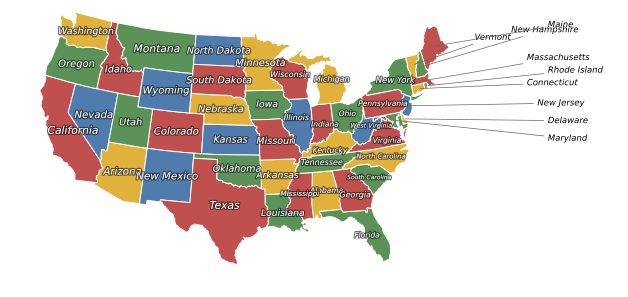

——例如，下面这幅切成八块的馅饼地图需要八种颜色，因为所有八块都在中心相遇；但按照我们的约定，这幅地图只需要两种颜色。

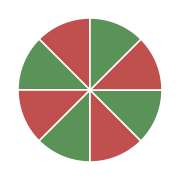

另一幅只需两种颜色的熟悉“地图”是棋盘：在每四个方格的交汇点处交替使用黑白两色，就形成了常见的棋盘着色（见后页）。

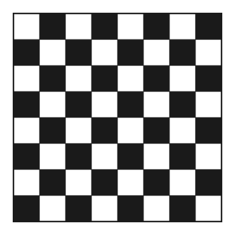

美国地图还有一个值得一提的特点：密歇根州由两部分组成（被大湖区的一个湖分隔），这两部分必须着相同颜色。像美国地图这样被分割的国家或州，在特定情况下未必会造成麻烦，但请看下面这幅地图，其中标有1的两个区域被视为同一国家的两部分。这里，五个“国家”中的每一个都与其他四个有一条共同边界线，因此需要五种颜色：

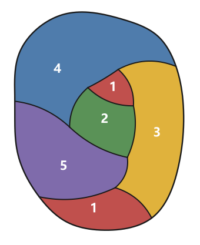

从现在起，我们规定每个国家必须是连成一整块的区域，以避免出现这种不理想的情况。

有些人还喜欢把“外部区域”也纳入着色范围。一般来说，这样做与否并无实质区别，因为我们可以把外部区域看作一个额外的（环形）国家（见下页上方）。

不过，理解外部区域更有用的方式，是把地图设想成画在一个球面上，而不是平面上。这样一来，外部区域看起来就和其他任何区域没有区别了。

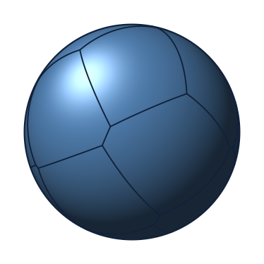

事实上，在平面上画地图，和在球体（用数学语言说，即球面）上画地图是等价的。我们可以从下面的插图中看出这一点，图中展示的是所谓的球极投影——从球面投影到与之相切的平面上。从球面上的任意一幅地图出发，我们可以将其由北极向下投影，得到一幅平面地图；反过来，给定任意一幅平面地图，我们也可以将其向上投影到球面上。

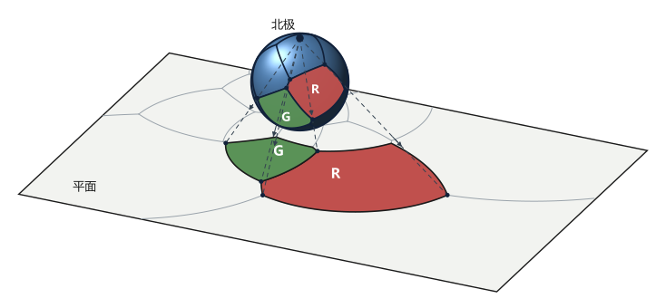

注意，这样的投影不会影响地图的着色——如果两个相邻国家分别着红色和绿色，那么无论朝哪个方向投影，它们的像也仍然分别是红色和绿色。由此可见，我们可以把四色问题改写成一个关于球面地图着色的问题：

## 球面上的四色问题

画在球面上的每幅地图是否都能用最多四种颜色着色，使得相邻国家的颜色不同？

如果我们能解决球面地图的四色问题，就立即得到了平面地图的解答；反过来，如果我们能解决平面地图的四色问题，也立即得到了球面地图的解答。因此，把地图看作画在平面上还是球面上并无区别，对于每幅地图，我们都可以自行选择是否给外部区域着色。

还有一些进一步的简化，它们并不实质性地影响四色问题本身，但有助于简化我们的论述。几乎不言而喻，我们所考虑的每幅地图都应是连成一整块的，因为各个分离的部分完全可以当作独立的地图分别着色。同样，我们也可以排除那些仅靠一个单点连接在一起的地图，因为各部分照样可以分别着色；特别是，我们可以忽略只有一条边界线的国家。因此，我们可以不必考虑像以下这样的地图：

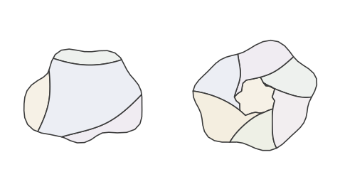

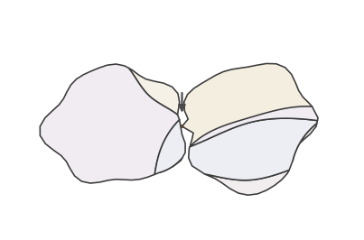

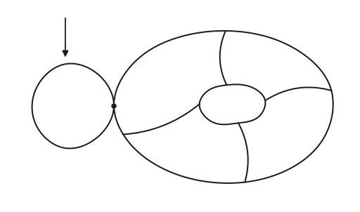

最后，我们可以假设每个交汇点处至少有三条边界线相交。如果某个交汇点只有两条边界线，只需去掉该点即可，不会影响着色。

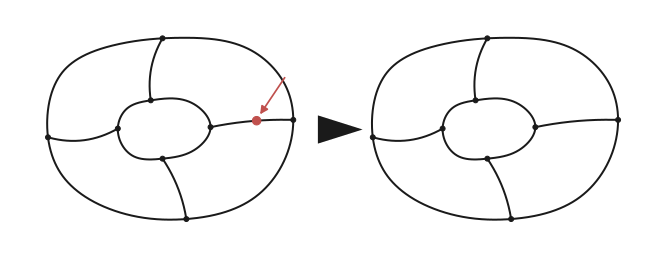

事实上，正如我们将在第4章中看到的，在尝试解决四色问题时，我们总是可以只关注那些每个交汇点处恰好有三条边界线相交的地图，如下页图所示。这类地图十分常见，我们给它们起了一个专门的名字：**三次图**。您可以尝试用四种颜色给这幅地图着色（它能只用三种颜色着色吗？）。

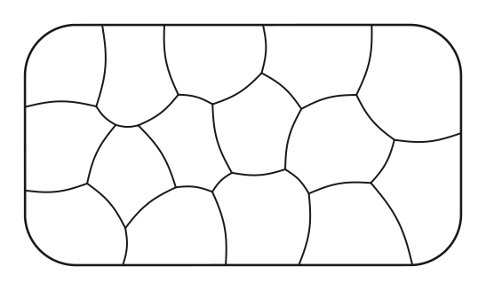

## 两个例子

作为本章的结尾，这里给出两个关于平面地图着色的练习。

## 例1

在下面的地图中，已经有三个国家被赋予了颜色。我们该如何用红、蓝、绿、黄四种颜色，给整幅地图完成着色？

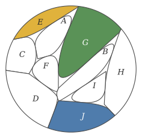

首先注意，国家A与着绿色和黄色的国家都有共同边界线，因此它只能着蓝色或红色。我们逐一考察这两种可能性。如果国家A着蓝色，那么F必须着红色（因为它与着蓝、绿、黄色的国家都共享边界线），接着国家D必须着绿色，E必须着黄色，由此得到以下着色。

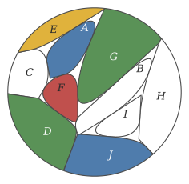

但这样一来，国家C就无法着色了，因为它与着全部四种颜色的国家都有共同边界线。因此A不能着蓝色，只能着红色。

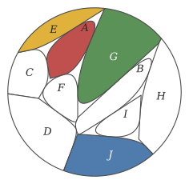

这时国家F必须着蓝色，C必须着绿色，D着红色，E着黄色；接下来国家H必须着红色，G着绿色，B着黄色，I着绿色，J着蓝色，这样就完成了整幅地图的着色。

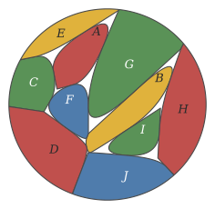

## 例2

我们的第二个例子最初其实是一个愚人节玩笑！多年来，马丁·加德纳（Martin Gardner）在《科学美国人》杂志上撰写了一个非常成功的数学专栏，他的许多专栏文章后来被结集出版。在1975年4月1日那期杂志上，他决定和读者开个玩笑，发表了“六项以某种方式未被公众注意到的轰动性发现”，其中包括一台会下棋的机器（当时被认为是不可能的）、一项反驳爱因斯坦（Albert Einstein）狭义相对论的思想实验，以及发现了一份古代手稿，证明列奥纳多·达·芬奇（Leonardo da Vinci）才是阀门冲水马桶的发明者。该专栏宣称：

> 去年纯数学领域最轰动的发现，无疑是找到了臭名昭著的四色地图猜想的一个反例……去年11月，纽约州瓦平格斯福尔斯市的图论学家威廉·麦格雷戈（William McGregor）构造了一幅由110个区域组成的地图，这幅地图不能用少于五种颜色来着色。

在1975年7月那期杂志中，这位愚人节恶作剧者坦白了真相，并透露他的专栏引来了一千多封读者来信，其中数百位读者寄来了只用四种颜色给该地图着色的方案。麦格雷戈的地图如下所示，你能用四种颜色给它着色吗？

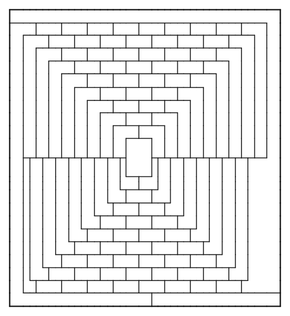

# 第2章 问题的提出

与数学中的许多问题不同，四色问题的起源可以精确追溯——追溯到1852年在伦敦写下的一封信。然而，多年来人们一直相信这个问题的历史还要更早——可以追溯到1840年左右在德国举行的一次讲座。我们的历史叙述就从审视这两种相互矛盾的说法开始，并解释这场混乱是如何产生的。

## 德摩根写信

1852年10月23日，伦敦大学学院的数学教授奥古斯塔斯·德摩根（Augustus De Morgan，1806–1871）写信给他的朋友——那位杰出的爱尔兰数学家兼物理学家威廉·罗恩·哈密顿（William Rowan Hamilton）爵士。这原本是再平常不过的事：两人已通信多年，互通家中近况，交流伦敦和都柏林两地最新的科学趣闻，也分享数学上的点滴心得。只是谁都没有想到，这封信的内容将写入数学史——因为四色问题正是在这里诞生的。

> 今天我的一位学生向我请教一个事实的理由，而我此前并不知道这是一个事实，至今仍无法确证。他说，如果一幅图形被随意分割成若干部分，并给各部分染上不同颜色，使得凡拥有一段公共边界线的两部分颜色都不相同——那么可能需要四种颜色，但不会更多。以下是他给出的、需要四种颜色的例子：
>
> A、B、C、D 为颜色的名称
>
> 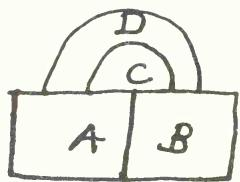
>
> 问题：是否可能构造出一个需要五种或更多颜色的例子……
>
> 您怎么看？如果这是真的，是否有人注意到过？我的学生说，他是在为英格兰地图着色时偶然想到这一点的……我越想越觉得这一点是显然的。如果您能举出一个非常简单的反例来推翻我，让我沦为一个可笑的畜生，那我想我也只能像斯芬克斯那样了……

像斯芬克斯那样做，后果可相当激烈：在古代神话中，斯芬克斯是一个传说中的人物，她在俄狄浦斯猜中她出的谜题后便跳崖自尽。那个谜题是：什么动物早晨用四条腿走路，中午用两条腿，晚上用三条腿？答案是人——婴儿时、壮年时和拄拐杖的老年时。

多年后，那位在这决定性的一天向德摩根请教的学生表明了身份——他是弗雷德里克·格思里（Frederick Guthrie），后来成为物理学教授，并创立了伦敦物理学会。但真正在为英格兰地图着色的另有其人，并非弗雷德里克本人，正如他在1880年回忆的那样：

> 大约三十年前，当我旁听德摩根教授的课时，我哥哥弗朗西斯·格思里——他当时刚结束听课（如今他是南非开普敦的南非大学数学教授）——向我展示了这样一个事实：为地图着色，使得共享一段边界线的相邻区域颜色互不相同，所需颜色的最大数目是四个。事隔多年，我不打算尝试复述他的证明，但关键的图示见下方。
>
> 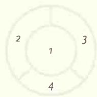
>
> 经家兄允许，我把这个定理提交给了德摩根教授，他对此十分满意；认为这是新发现；并且——据后来听他课的人告诉我——他此后总不忘说明这个结果的来历。
>
> 如果我没有记错，家兄自己给出的证明在他看来也不算完全令人满意；但对此问题感兴趣的人，我只能请他自己去向家兄请教了……

因此，弗雷德里克·格思里的哥哥弗朗西斯，可以合理地被视为四色问题的真正提出者，尽管他所给出的“证明”具体是什么样子已经无从知晓。弗朗西斯·格思里曾是德摩根在伦敦大学学院的学生，于1850年在那里取得文学学士学位，两年后又取得法学学士学位，并于1857年获得律师资格。他此后在南非开创了一番杰出的事业：先是在好望角殖民地新成立的赫拉夫－里内特学院担任数学教授，后来又转任开普敦的南非学院。格思里是一位深受爱戴的人物，他对植物学也颇有贡献——这后来成了他主要的爱好，植物*Guthriea capensis*和石楠花*Erica guthriei*都是以他的名字命名的。但他从未就地图着色，或这个有时仍被称为“格思里问题”的课题发表过任何文章。

弗雷德里克·格思里似乎是最先注意到四色问题在三维空间中并无有趣推广的人：如果允许“国家”是三维的，那么就能构造出需要任意多颜色的地图。他在关于哥哥的笔记中给出了一个例子，用的是一束彼此两两相触的柔性棒（或彩色羊毛线段）。由于每根棒都必须与它接触到的所有棒颜色不同，所需颜色的数目就必须与棒的数目相等：比如，下图中格思里画的五根棒就需要五种颜色。

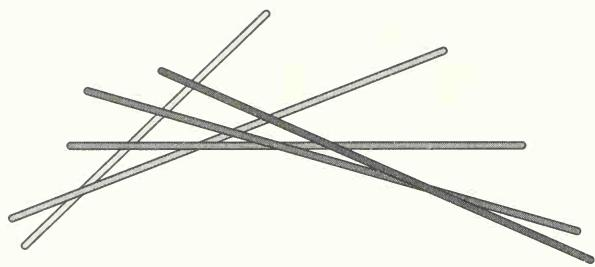

后来，奥地利数学家海因里希·蒂策（Heinrich Tietze）描述了另一个三维例子：取n根水平棒，编号1到n，在其上方架设n根同样编号为1到n的竖直棒，再把编号相同的一对水平棒与竖直棒连接起来（视为同一个“国家”）。这样我们便得到n个三维的国家，它们两两相触，因此需要n种颜色。这里n可以任意大：下图展示了n = 5时这五个国家的构造方式。

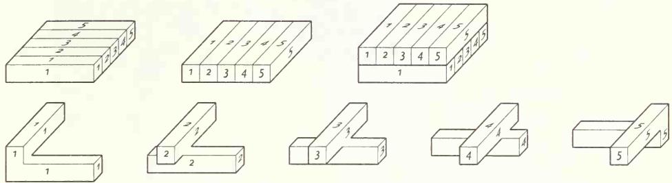

## 霍茨波与《雅典娜神殿》

到1852年，奥古斯塔斯·德摩根和威廉·罗恩·哈密顿爵士都已在各自的领域里卓然有成。德摩根曾就读于剑桥大学，后来成为新成立的伦敦大学学院的首位数学教授，在这个职位上任职超过三十年。他是一位风格独特、古怪多产的作家，最为人称道的是畅销书《悖论汇编》、集合论中的“德摩根律”，以及他在数理逻辑方面的贡献。哈密顿则是个神童：五岁便通晓拉丁语、希腊语和希伯来语，十四岁已能说阿拉伯语、梵文、土耳其语等多种语言。他还在都柏林三一学院读本科期间，就被任命为爱尔兰皇家天文学家，一直担任此职直至1865年去世。

正如前面提到的，德摩根1852年写给哈密顿的这封信并非孤立事件——两人经年累月保持通信，前后长达三十年。他们只见过一次面，大约在1830年，由查尔斯·巴贝奇（Charles Babbage）引荐相识——巴贝奇设计的所谓“分析机”，预示了一个世纪后可编程计算机的诞生。此外还有一次德摩根和哈密顿同时出席的场合，是一场为天文学家兼数学家约翰·赫歇尔（John Herschel）爵士举行的共济会晚宴，但当时人多拥挤，两人未能交谈。

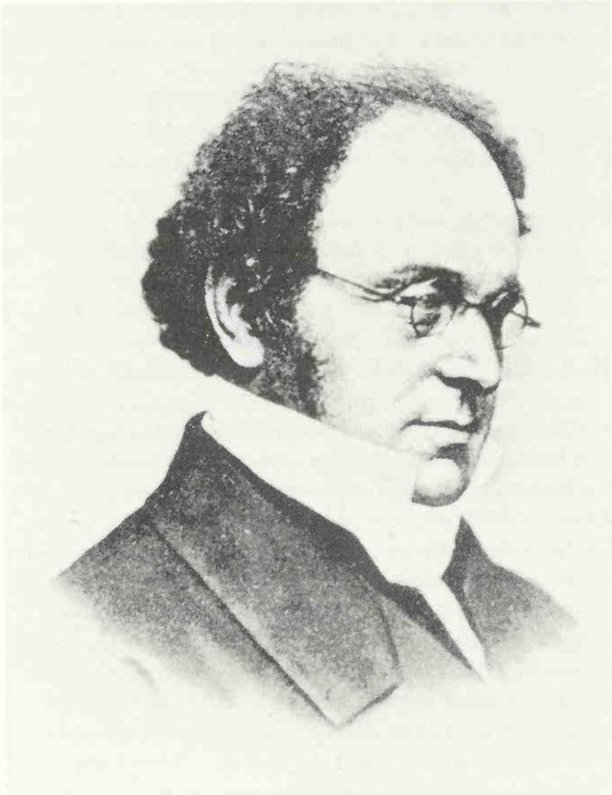  

当德摩根写信给哈密顿谈起地图着色问题时，他想必是希望能引起哈密顿的兴趣。毕竟，德摩根一直很关注哈密顿的研究，包括威廉爵士在四元数方面的开创性工作。许多数学运算都满足交换律，也就是说可以按任意顺序进行：比如普通数的加法和乘法就是可交换的（3 + 4 = 4 + 3，3 × 4 = 4 × 3）。然而，哈密顿的四元数乘法却不可交换：他的“数”是四项之和 $a + bi + cj + dk$（其中a、b、c、d为普通数，且 $i^{2} = j^{2} = k^{2} = -1$），它们相乘时并不满足交换律：例如 $i \times j = k$，但 $j \times i = -k$；又如 $k \times i = j$，但 $i \times k = -j$。

德摩根写给哈密顿谈及地图着色问题的信，得到的只是简短而古怪的一句回复：“我近期不太可能抽空去尝试你的颜色‘四元数’。”德摩根并未因此气馁，继续写信给数学界的其他朋友，试图引起他们对这个问题的兴趣。这个问题的复杂性令他着迷，在最初写给哈密顿的信中，他就曾试图解释困难所在：

> 就我目前所见，若有四个终极的隔间，其中每一个都与其余隔间之一有一条公共边界线，那么这四者中必有三个会将第四个围住，从而使得任何第五个隔间都不可能再与它相连。倘若此说为真，则四种颜色即可为任何地图着色，除非诸颜色仅在一点相遇，否则并无必要更多。
>
> 如今看来，画出三个两两相邻、共有边界的隔间A、B、C确非难事——但除非围住其中一个，否则无法使第四个隔间同时与它们全部相邻——只是这项推理颇为棘手，我并不能确定所有迂回的情形——您怎么看？如果这是真的，是否有人注意到过？
>
> 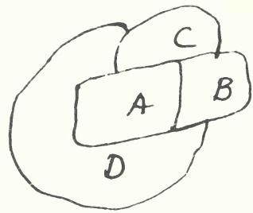

在这段文字中，德摩根发现了这样一个事实：如果一幅地图上有四个区域，每个都与其余三个相邻，那么其中必有一个被其他区域完全包围。他错误地认定这正是问题的核心，这个念头很快成了他的执念。由于始终无法证明它，他提议干脆将其当作一条公理接受下来——他把公理定义为“不能依托于任何显然更简单的命题的命题”。

1853年12月，德摩根写信给著名哲学家、剑桥大学三一学院院长威廉·休厄尔（William Whewell），把自己的这一观察描述为一条数学公理——这条公理此前一直“彻底沉寂”，直到在地图着色问题中才被用到：

> 我很快便发现了以下这一点——起初令人难以置信——继而确信无疑——最终成为一条公理——因为我无法使它依托于任何我看得更清楚的事物之上。
>
> 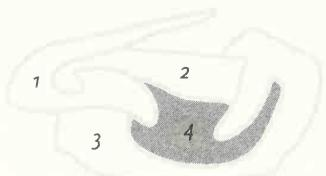
>
> 若有四个互不统属的隔间，其中每一个都与其余三个各有一条公共边界线——则这四者之中，必有一个被其余三个——或更少的隔间——所包围……

六个月后，在写给剑桥数学家罗伯特·埃利斯（Robert Ellis）的信中，德摩根进一步将其描述为休厄尔关于潜在公理的观点的一个例证——那些起初甚至令人难以置信的事物，最终却沉淀为最基本的原理。

四色问题第一次为人所知的印刷记录，同样与威廉·休厄尔有关。1860年4月14日，一篇评论休厄尔著作《发现哲学：历史的与批判的篇章》的长篇匿名书评，发表在当时颇受欢迎的文学期刊《雅典娜神殿》上。评论者在文中概述了四色问题，声称这个问题对制图师来说早已耳熟能详，并在描述之后又加了一段颇为晦涩的文字：

> 如今，地图着色者想必早就知道，四种不同的颜色便已足够。借用霍茨波的话说：让各郡按设计者的心意蜿蜒曲折地嵌入彼此，想要多迂回、多离奇便有多迂回、多离奇；让它们这样穿插往复、绕来绕去，以至于在女王的令状中要求治安官A. B. 在自己辖区内上下巡行都显得荒谬可笑：即便如此，四种颜色也足以做出所有必要的区分。

这里提到的霍茨波，出自莎士比亚（William Shakespeare）《亨利四世》上篇中的一段台词，霍茨波说道：“看这条河如何蜿蜒曲折地流进来……”

评论者接下来断言：如果地图上有四个区域两两与其余三个共有边界，那么其中一个必定会被其余区域包围——这段论述清楚地表明，德摩根正是这篇评论的作者。事实上，德摩根确实在1860年3月3日写信给休厄尔，感谢他寄来自己著作的副本，并告知对方自己又收到了《雅典娜神殿》寄来供撰写书评的另一份副本，“这本书原封未动地被退了回去”（那个年代，人们还需要用裁纸刀来裁开书页）。

由于德摩根在《雅典娜神殿》上的这篇评论，四色问题越过大西洋传到了美国。美国数学家、哲学家兼逻辑学家查尔斯·桑德斯·皮尔斯（Charles Sanders Peirce，发音近似“purse”）读到了它，并对这个问题产生了终身的兴趣。皮尔斯认为，“这样一个简单的命题竟找不到证明，实在是逻辑与数学的耻辱”，此后他便在哈佛大学，当着父亲本杰明·皮尔斯（Benjamin Peirce）——哈佛大学著名的数学与自然哲学教授——的面，提出了一个尝试性的解答。正如查尔斯·皮尔斯后来所写：

> 大约在1860年，德摩根在《雅典娜神殿》上提醒大家注意，这条定理从未被证明；此后不久，我便向哈佛大学的一个数学学会提交了对这一命题的一个证明，并将其推广到其他曲面——在那些曲面上，所需的颜色数目更多。我的证明从未付印，但在场的本杰明·皮尔斯、J. E. 奥利弗（J. E. Oliver）和昌西·赖特（Chauncey Wright）都未能从中挑出错误。

事实上，那次研讨会很可能发生在19世纪60年代末，但哈佛大学所藏的皮尔斯手稿并未透露他那个解答的具体内容。他所说的“推广到其他曲面”，指的是在球面之外的曲面上绘制地图。比如，假设我们生活在一个形状像轮胎内胎或环形甜甜圈表面的世界上——那时需要多少种颜色？（数学家称这种曲面为环面。）从他在哈佛大学留下的未发表笔记中可知，皮尔斯找到过一幅需要六种颜色的环面地图，但实际上还能做得更好。下面这幅环面地图上有七个国家两两相邻，因此需要七种颜色（我们将在第7章再回到环面上的地图着色问题）：

皮尔斯后来评论说，四色问题对检验他日渐成熟的逻辑能力大有裨益。事实上，他在数理逻辑方面的研究，包括发展出一种“关系逻辑”，并在1869年10月专门将其应用于地图着色问题（他的方法将在第5章中概述）。

1870年6月，皮尔斯在开始一次欧洲长途旅行之初，曾在伦敦拜访了病中的德摩根；若能知道他们是否谈起过四色问题，那将会非常有趣。但到这个时候，这个问题在英国似乎已被大多数人遗忘：至少没有证据表明，德摩根写信告知的对象——那位1852年第一次听闻此事的哈密顿——对这个问题产生过更浓厚的兴趣。1871年3月18日，奥古斯塔斯·德摩根在伦敦去世，他对四色问题的研究并无多少进展，也不会知道，还要再过一个多世纪，这个问题才会等到答案。

## 莫比乌斯与五位王子

正如我们所见，四色问题是弗朗西斯·格思里在1852年提出的。但有时也有人声称——这其实并不准确——这个问题的历史更为久远，可以追溯到德国数学家兼天文学家奥古斯特·费迪南德·莫比乌斯（August Ferdinand Möbius，1790–1868）在1840年前后的一次讲座。莫比乌斯所提出的五位王子问题，表面上与四色问题颇为相似，我们接下来将看到二者是如何被混为一谈的。

莫比乌斯多年间一直担任莱比锡大学的天文学教授，兼莱比锡天文台台长。在数学中，他的名字与数论中的莫比乌斯函数、几何中的莫比乌斯变换联系在一起。但他最为人所铭记的，还是莫比乌斯带（或称莫比乌斯环）——这是一种奇特的物体，取一条长长的矩形纸带，将一端扭转180°后再把两端粘合起来，即可得到，如下图所示。做成的这个物体只有一个面和一条边：也就是说，一只蚂蚁可以从它表面上任意一点爬到另一点，而无需离开表面或越过边缘。年届六十八岁的

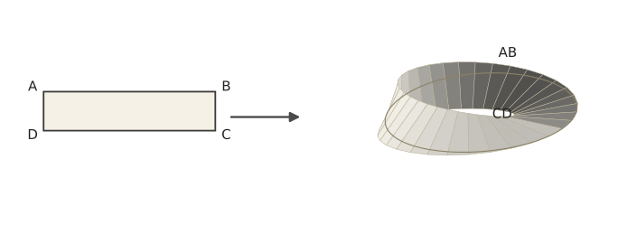

莫比乌斯于1858年末描述了这个物体，尽管早在六个月前，一位名叫约翰·本尼迪克特·利斯廷（Johann Benedict Listing）的光学教授就已经将它构造出来，只是利斯廷几乎没有因这项在先的发现而获得应有的认可。

在一次几何学讲座中，莫比乌斯提出了以下问题——据说这个问题是他在莱比锡大学的一位朋友、对数学怀有浓厚兴趣的古典学者本杰明·哥特霍尔德·韦斯克（Benjamin Gotthold Weiske）向他建议的：

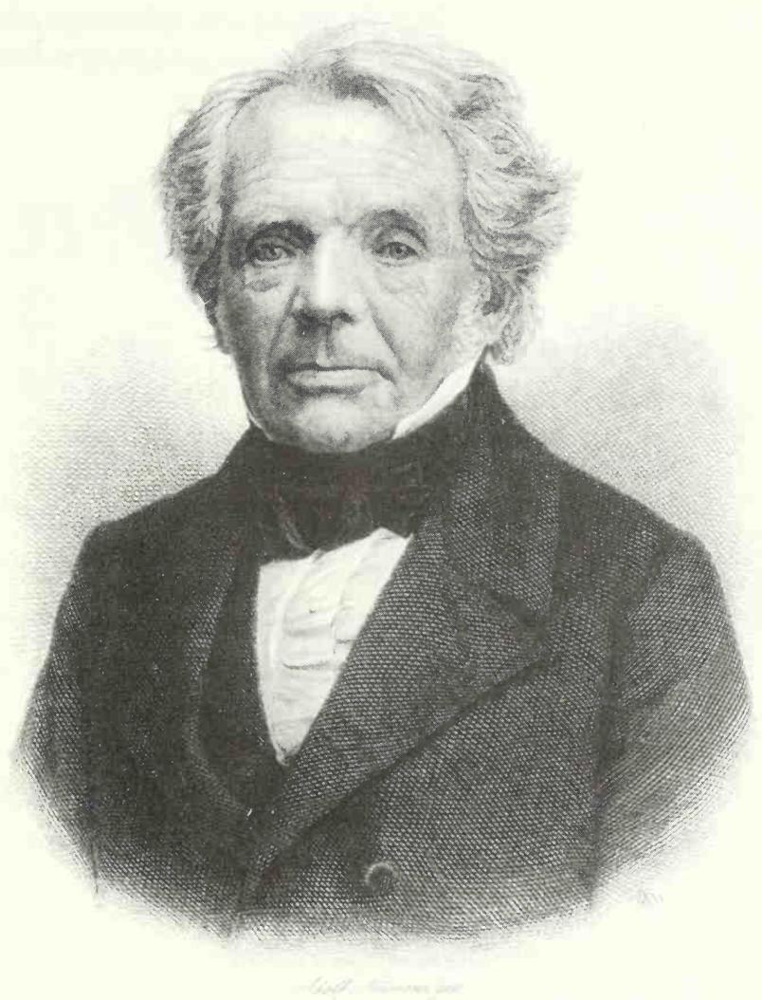  

## 五位王子问题

从前印度有一位国王，他拥有一个很大的王国和五个儿子。在他的遗嘱中，国王说他死后，儿子们应自己分割王国，使属于每个儿子的区域与其余四个区域有一条边界线（不仅仅是一个点）。应该如何分割这个王国？

在下一次讲座中，莫比乌斯的学生们承认，他们努力尝试过求解，却未能成功。莫比乌斯笑了，说很抱歉让他们白费了力气，因为这样的王国划分根本不可能实现。

要直观地看出莫比乌斯问题为何无解并不难。假设前三个儿子所属的区域分别称为A、B、C。这三个区域彼此之间必须都有共同边界，如下页图(a)所示。第四个儿子所属的区域D，此时必须整个落在A、B、C三区域所围成的面积之内，或者整个落在其外：这两种情形分别如图(b)和图(c)所示。无论哪种情形，都不可能再放置第五个儿子所属的区域E，使其同时与A、B、C、D四个区域都有边界：

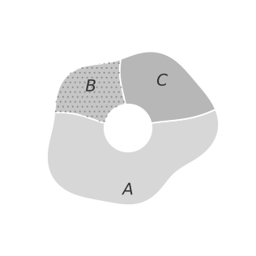  

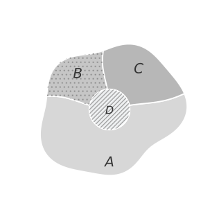  

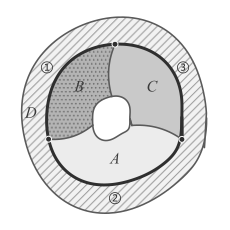  

莫比乌斯的五位王子问题后来被海因里希·蒂策加以推广，他提出了以下这个相关问题：

## 五座宫殿问题

国王额外要求他的五个儿子每人应在自己的区域内建一座宫殿，并且他们应该用道路将五座宫殿两两相连，使得没有两条道路交叉。道路应该如何布置？

这个问题同样无解，原因可以仿照上文对莫比乌斯问题无解的解释得出。

假设前三个儿子的宫殿分别称为A、B、C。这三座宫殿之间可以用互不交叉的道路两两连接，如下图(a)所示。第四个儿子的宫殿D，此时必须整个落在连接A、B、C的道路所围成的区域之内，或者整个落在其外：这两种情形分别如图(b)和图(c)所示。无论哪种情形，都不可能再建造第五个儿子的宫殿E，使其用互不交叉的道路与A、B、C、D四座宫殿都相连。

<!-- 四个相邻的区域 -->

<!-- 四座相互连接的宫殿 -->

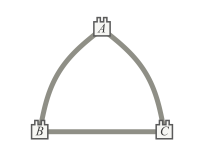  

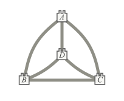  

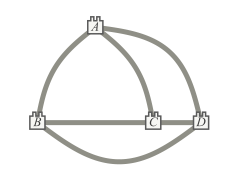  

值得注意的是，这两个问题中任何一个的解，都能给出另一个问题的解：如果王子们能把王国划分成五个两两相邻的区域，那么他们同样能在这些区域中各建一座宫殿，并用互不交叉的道路把宫殿连接起来。反过来，如果王子们能建好宫殿并用互不交叉的道路连接，那么他们也就能用五个两两相邻的区域把这些宫殿分别围起来。此外，如果国王只有四个儿子，那么如上文所示，王国既能被顺利划分，宫殿也能顺利建成并用互不交叉的道路连接：对四个儿子而言，任一问题的解都能推出另一个问题的解。

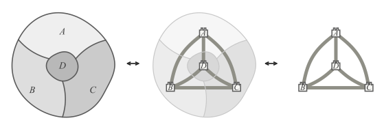

在告别莫比乌斯的五位王子问题之前，值得一提的是，海因里希·蒂策为它给出了一个“解”。他的叙述接着写道：

> 五位兄弟陷入了绝望，因为父亲遗嘱的条件显然不可能满足。就在这时，一位云游的巫师前来通报，声称自己掌握了解决之道……我们不妨假设，这位巫师后来得到了丰厚的报酬。

巫师的解决办法，是用一座桥把五个区域中的两个连接起来：

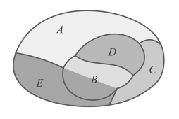

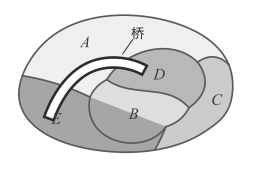

当然，这其实是耍花招：因为我们原本假定王国的划分被限制在平面上，而巫师的解法，实质上等同于在环面上求解莫比乌斯问题：

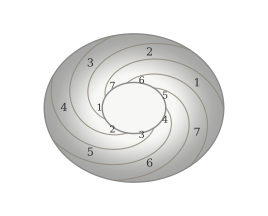

事实上，若允许这样“作弊”，国王最多甚至可以有七个儿子：上面的插图展示了如何把一个环面划分成七个两两相邻的区域，一个儿子一份。但若限制在平面上，那么正如我们所见，相邻区域的最大数目就是四个——在平面上，不可能存在五个两两相邻的区域。

## 混乱蔓延

莫比乌斯的五位王子问题与四色问题之间究竟有什么关联？它们又为何会被相互混淆？在回答这个问题之前，不妨先喝杯茶，理一理逻辑！我可以诚实地说：

如果茶太烫，那么我就不能喝。

另一种表达方式是将它反过来说：

如果我能喝茶，那么它就不太烫。

我不能说的是：

如果茶不太烫，那么我就能喝，因为可能还有许多其他原因让我无法喝：它或许太浓，或许太甜，又或许里面掉进了一只死苍蝇。

这种逻辑关系在算术中也有一个例子，涉及整数的整除性：

如果一个整数以0结尾，那么它能被5整除。

比如，10、70、530都以0结尾，也都能被5整除。

将此反过来，我们可以推断出：

如果一个整数不能被5整除，那么它不能以0结尾。

比如，11、69、534都不能被5整除，也都不以0结尾。

但我们不能说：

如果一个整数能被5整除，那么它以0结尾，

因为有许多数——比如15、75、535——虽能被5整除，却并不以0结尾。

逻辑学家喜欢用符号来表达这类陈述。若用字母P代表“茶太烫”或“一个整数以0结尾”，用字母Q代表“我不能喝”或“它能被5整除”，我们便可以把上述每组推理中的第一句话写成这样的形式：

如果P成立，那么Q成立——或者，等价地，P蕴涵Q。

将此反过来，我们得到：

如果Q为假，那么P为假——或者，非Q蕴涵非P。

但我们不能说的是：

如果P为假，那么Q为假——或者，非P蕴涵非Q。

现在回到莫比乌斯的五位王子问题。假设国王遗嘱的条件能够被满足：那么属于五个儿子的每一片区域，都将与其余四片区域共享边界线——也就是说，会出现五个两两相邻的区域。若要给这五个相邻区域分别着上不同颜色，就需要五种颜色（每个区域一种），于是四色定理便不成立了。

上述论证告诉我们：

如果存在一幅有五个相邻区域的地图，那么四色定理是假的。

（这里，P是陈述“存在一幅有五个相邻区域的地图”，Q是陈述“四色定理是假的”。）

像之前一样，将此反过来，我们发现：

如果四色定理是真的，那么没有地图有五个相邻区域。

我们不能说的是：

如果没有地图有五个相邻区域，那么四色定理是真的。

因此，我们前面用来证明莫比乌斯问题无解的那个小小论证，并不能证明四色定理。

多年来，许多人都曾试图通过证明不存在拥有五个相邻区域的地图来证明四色定理。但正如我们刚刚所见，这并不能证明所需要的结果：他们的逻辑其实是颠倒的。

一位落入这个陷阱而不自知的人，是德国几何学家理查德·巴尔策（Richard Baltzer）。1885年1月12日，他在莱比锡科学学会做了一次讲座，讲座中描述了五位王子问题（他是从莫比乌斯的遗稿中发现这个问题的），随后解释了为何不可能存在五个相邻区域。巴尔策后来发表了讲座内容，却错误地宣称四色定理可由他的证明直接得出。

巴尔策发表的这篇论文，被费城布林莫尔学院的伊莎贝尔·麦迪逊（Isabel Maddison）读到。1897年，她在读者甚广的《美国数学月刊》上发表了一篇题为《关于地图着色问题历史的一则注记》的文章，提到了巴尔策的论文，并评论道：“似乎鲜为人知的是，莫比乌斯早在1840年的讲座中，就已经以略微不同的形式描述过这个问题。”

从此，莫比乌斯是第一个提出四色问题的人这一说法广为流传，并因这一错误说法在多部知名数学著作——如埃里克·坦普尔·贝尔（Eric Temple Bell）的《数学的发展》——中被反复重复而愈发根深蒂固。直到1959年，几何学家H. S. M. 考克斯特（H. S. M. Coxeter）才澄清了事实真相，此后弗朗西斯·格思里才被普遍认可为四色问题真正的提出者。

我们将在第4章继续讲述四色问题的历史发展，但在此之前，我们要先回到18世纪，去探索多面体的世界。

# 第3章 欧拉的著名公式

我们从柏林开始，在普鲁士腓特烈大帝（Frederick the Great）的宫廷中。二十五年来，瑞士数学家莱昂哈德·欧拉（Leonhard Euler，1707–1783）是腓特烈宫廷的常客。欧拉于1741年被腓特烈任命为柏林科学院成员，并成为数学部的负责人。

起初他们相处得很好——欧拉甚至常常从他自己的花园里给腓特烈送草莓。然而，在1756—1763年的七年战争之后，当俄罗斯军队占领柏林时，他们的关系迅速恶化。腓特烈开始密切关注科学院的详细运作，几乎每天都见到欧拉。渐渐地，欧拉开始认为他的国王心胸狭窄且粗鲁无礼，而腓特烈——一位出色的作曲家和音乐表演者——则觉得这位数学家缺乏社交技巧，事实上相当像个乡巴佬。1766年，欧拉收到俄国女皇叶卡捷琳娜大帝（Catherine the Great）的邀请，请他回到圣彼得堡科学院——他在接受柏林任命之前，曾在那里担任数学部负责人——这无疑让他松了一口气。他在圣彼得堡度过了余生。

欧拉的心算能力堪称传奇。曾有两个学生尝试求一个复杂级数的和，算到第五十位小数时意见不一致，欧拉直接在头脑中算出了正确的值。这让法国物理学家弗朗索瓦·阿拉戈（François Arago）评论道：“他计算起来毫不费力，就像人呼吸一样自然，又像雄鹰在空中翱翔一般。”

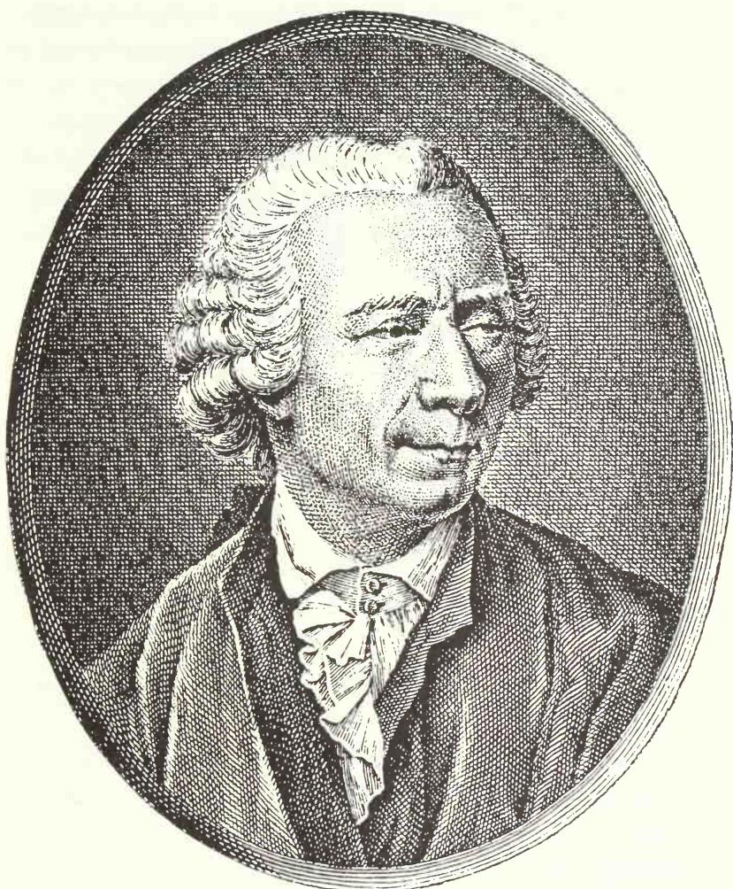

尽管欧拉日益失明，他的数学产出却丝毫未减。他是有史以来最多产的数学家，写下了数百部著作和论文，总计达数万页，他的《全集》至今仍在陆续出版。他写作的主题极为广泛，从素数的纯度、音乐和声学、三角形的几何，到微积分和力学，再到光学、天文学、声学和航海等实用领域，无所不包。应用数学家皮埃尔-西蒙·拉普拉斯（Pierre-Simon Laplace）后来对他的学生们热情洋溢地说：

> “读欧拉，读欧拉。他是我们所有人的导师。”

## 欧拉写信

1750年11月14日，在柏林期间，莱昂哈德·欧拉给克里斯蒂安·哥德巴赫（Christian Goldbach）写了一封信。哥德巴赫是欧拉在圣彼得堡的前同事，也是一位才华横溢、热情洋溢的数学家。正如一个世纪后德·摩根和哈密顿所做的那样，这两人通信多年，分享着数学最新进展的消息。如今，哥德巴赫主要以提出一个至今仍未解决的猜想而闻名：每一个大于2的偶数都可以写成两个素数之和。

例如，

$$
10 = 5 + 5, \quad 20 = 13 + 7, \quad 30 = 19 + 11 
$$

欧拉的这封信是关于多面体的——即由平面围成的立体形状，例如立方体（由六个正方形围成）或四棱锥（由一个正方形和四个三角形围成）。

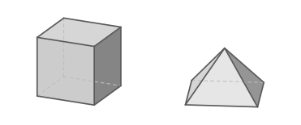

对多面体的研究历史悠久，至少可以追溯到公元前三千年的古埃及金字塔。希腊人对正多面体尤为感兴趣，例如立方体：其所有面都是相同类型的正多边形（如正方形），且每个角周围的排列方式相同。正多面体，如今常被称为柏拉图立体，由柏拉图（Plato）在其对话录《蒂迈欧篇》（约公元前400年）中讨论过。有史以来流传最广的数学著作——欧几里得（Euclid）的《几何原本》（约公元前300年）——展示了如何构造它们，并以一个证明作为结尾：只能存在五种正多面体（见后页）：

正四面体，由四个等边三角形围成；

立方体，由六个正方形围成；

正八面体，由八个等边三角形围成；

正十二面体，由十二个正五边形围成；

正二十面体，由二十个等边三角形围成。

希腊人将这些多面体与古代元素联系起来：火（正四面体）、土（立方体）、气（正八面体）和水（正二十面体）；正十二面体则与宇宙联系在一起。

如果我们现在放宽“所有面类型相同”的条件，但仍要求每个角周围的正多边形排列方式相同，就得到了半正多面体（或称阿基米德多面体）。半正多面体中有两个无穷家族：棱柱和反棱柱，它们都由顶部和底部一对全等多边形、以及环绕中部的一圈正方形或等边三角形组成。

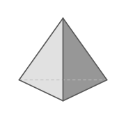

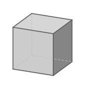

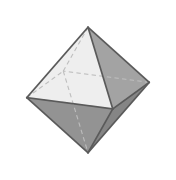

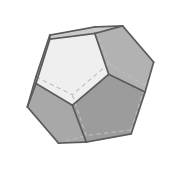

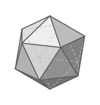

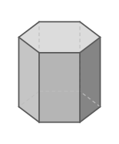

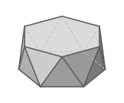

此外，还有十三种其他类型的半正多面体，其中一些有着奇妙的名字，比如扭棱立方体和大斜方截半二十面体。下面依次是截半立方体（正方形和三角形面）、截角八面体（正方形和六边形面）、截角二十面体（五边形和六边形面），以及大斜方截半立方体（正方形、六边形和八边形面）。

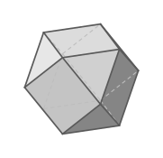

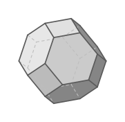

这些多面体不仅仅是数学上的奇观——它们广泛存在于自然界中：例如，黄铁矿晶体自然形成立方体、八面体和十二面体，而硫化铅晶体则呈截半立方体形态。更晚近的发现是，某些由碳原子组成的化学分子——称为巴克敏斯特富勒烯，俗称巴基球——被发现具有由五边形和六边形构成的多面体形态。（“巴克敏斯特富勒烯”和“巴基球”这两个术语来源于建筑师巴克敏斯特·富勒（Buckminster Fuller）的名字，他的测地线穹顶正是基于这种多面体。）最著名的巴基球化学式为 $C_{60}$，含60个碳原子，呈截角二十面体形态，类似于足球上五边形和六边形的排列方式。

尽管希腊人和其他古代数学家关心的是如何构造多面体，但在欧拉之前，似乎没有人研究过多面体的面数、棱数和顶点（角）数可能有哪些取值。正是欧拉首次引入了棱（他称之为acies）和顶点（他沿用了旧名anguli solidi，即立体角）的概念。

在给哥德巴赫的信中，欧拉用他惯用的拉丁语和德语的古怪混合体写道：

> 近来我突然想到要确定由平面围成的立体的一般性质，因为毫无疑问应当为它们找到一般的定理……

设H为面（hedrae）的总数，s为立体角（anguli solidi，即顶点）数，A为棱（acies）数，欧拉随后提出了一些论断。这些论断导出了若干个命题，其中第六个命题给他带来了一些困难：

> 然而我还不能对以下命题给出一个完全令人满意的证明：
>
> 6. 在每个由平面包围的立体中，面数与立体角数之和比棱数多2，即 $H + S = A + 2 \ldots$

$= (棱数) + 2$

欧拉评论道：“就我所知，立体几何中的这个一般结论此前尚未被人注意到。”现在这被称为欧拉多面体公式，或简称为欧拉公式，可表述为：

## 欧拉多面体公式

对于任何多面体，

(面数) + (顶点数) = (棱数) + 2

或等价地，

(面数) – (棱数) + (顶点数) = 2。

我们不采用欧拉选择的记号，而将面数记为 $F$，顶点数记为 $V$，棱数记为 $E$。那么**欧拉多面体公式即表明** $F - E + V = 2$。如果我们回顾五种正多面体，就能更好地理解这个公式。

对于立方体，有六个正方形面、十二条棱和八个顶点，因此 $F = 6$，$E = 12$，$V = 8$，而欧拉公式给出 $F - E + V = 6 - 12 + 8 = 2$，正如预期。类似地，

对于正四面体，$F = 4$，$E = 6$，$V = 4$，且 $F - E + V = 4 - 6 + 4 = 2$；  
对于正八面体，$F = 8$，$E = 12$，$V = 6$，且 $F - E + V = 8 - 12 + 6 = 2$；  
对于正十二面体，$F = 12$，$E = 30$，$V = 20$，且 $F - E + V = 12 - 30 + 20 = 2$；  
对于正二十面体，$F = 20$，$E = 30$，$V = 12$，且 $F - E + V = 20 - 30 + 12 = 2$。

## 欧拉公式对于非正多面体也成立：

对于截半立方体，$F = 14$（8个三角形和6个正方形），$E = 24$，$V = 12$，且 $F - E + V = 14 - 24 + 12 = 2$；对于截角八面体，$F = 14$（6个正方形和8个六边形），$E = 36$，$V = 24$，且 $F - E + V = 14 - 36 + 24 = 2$；对于截角二十面体，$F = 32$（12个五边形和20个六边形），$E = 90$，$V = 60$，且 $F - E + V = 32 - 90 + 60 = 2$；对于大斜方截半立方体，$F = 26$（12个正方形、8个六边形和6个八边形），$E = 72$，$V = 48$，且 $F - E + V = 26 - 72 + 48 = 2$。

欧拉公式有时被错误地归功于法国哲学家勒内·笛卡尔（René Descartes）。大约在1639年，笛卡尔对一个拥有 $F$ 个面和 $v$ 个立体角（顶点）的多面体中所有面的总角数产生了兴趣，并得到了公式 $2F + 2V - 4$。例如，一个立方体有六个正方形面，每个面有四个角，总共有24个角，而

$$
2 F + 2 V - 4 = (2 \times 6) + (2 \times 8) - 4 = 2 4.
$$

笛卡尔还观察到每个面的角数与边数一样多。但每条边为两个面共有，因此总角数等于2E。如果我们将这两个结果等同起来，就得到 $2F + 2V - 4 = 2E$，由之即可推出欧拉公式——但笛卡尔本人从未建立起这种联系，这或许是因为他缺乏建立这种联系所需的概念。因此，首次明确提出多面体公式的荣誉属于欧拉。笛卡尔关于多面体的工作，如今我们是通过戈特弗里德·威廉·莱布尼茨（Gottfried Wilhelm Leibniz）在1670年代制作的一份抄本而知晓的，但这份抄本直到1859年才重见天日，此时欧拉在该领域的工作早已得到公认。

尽管莱昂哈德·欧拉起初未能为他的公式“给出一个完全令人满意的证明”，但他最终获得了一个“剖分证明”：他相继从多面体中移除四面体形状的部分，且每次操作中 $F - E + V$ 都保持不变。继续这个过程，他最终到达了一个单独的四面体，其 $F - E + V = 2$，如上所述。由于 $F - E + V$ 的值在过程的每个阶段都保持不变，因此它必定等于他最初所取多面体的值2。欧拉于1751年9月9日向圣彼得堡科学院提交了他的证明，随后在科学院的论文集中发表了两篇关于多面体的重要论文，写于1752年，但直到1756年才出版。

可惜的是，欧拉的剖分程序是否总是可行并不显而易见，因此他的证明必须被认为是有缺陷的。事实上，第一个正确的证明直到1794年才出现，由法国数论学家、天文学家和教科书作者阿德里安-马里·勒让德（Adrien-Marie Legendre）给出。该证明发表于他的著作《几何原理》中，所使用的角度和面积的思想更接近于笛卡尔的方法而不是欧拉的方法。

## 从多面体到地图

所有这些多面体公式与地图有什么关系呢？我们可以通过将多面体从单个点投影到一个平面（如桌面）上，来看出其中的联系。为此，我们首先将多面体“膨胀”成一个球面，再将球面投影到平面上，正如我们在第1章中解释的那样。下面的图示展示了立方体是如何以这种方式被投影的。

我们可以用同样的方式获得任何多面体的平面版本。下面的图示展示了正十二面体在其立体形式和投影形式下的样子。

1813年，奥古斯丁-路易·柯西（Augustin-Louis Cauchy）对多面体产生了兴趣。柯西是十九世纪上半叶法国首屈一指的数学家，他获得了微积分的第一个严格版本，并推动开创了代数中一个现今称为群论的重要领域。以他的名字命名的结果和概念可能比其他任何数学家都多。

柯西通过首先将多面体投影到一个平面上（如上所述）来证明欧拉公式。该公式对这些平面图仍然成立，前提是我们谨慎处理外部区域。柯西倾向于忽略这个外部区域（当我们将多面体压平时出现的那个区域），这样他就比以前少了一个区域。他陈述的欧拉公式因此变为 $F - E + V = 1$；例如，压扁的立方体有5个“内部”区域、12条棱和8个顶点，因此 $F - E + V = 5 - 12 + 8 = 1$。然而，如果我们将外部区域包括在内，正如我们在处理多面体投影时通常选择的那样，那么 $F = 6$，且 $F - E + V = 6 - 12 + 8 = 2$，和之前一样。

这就是联系所在。我们也可以将这些平面图视为地图——面对应于国家，棱对应于边界线，顶点对应于交汇点。

欧拉公式于是采用以下形式：

## 地图的欧拉公式

如果包括外部区域，则 (国家数) - (边界线数) + (交汇点数) = 2。

为什么欧拉公式成立？一个解释与欧拉尝试的剖分证明有某些共同之处。我们在平面上画出多面体（或地图）的图形，然后每次移除一条边，始终保持图形连通，看看 $F - E + V$ 在每个阶段会发生什么变化。

我们如何移除边？有两种可能情况：

### 1. 被移除的边可能分隔两个不同的面

移除这样一条边会使边数减少1，顶点数保持不变，面数减少1（因为两个面合并为一个面）。因此，E和F各减少1，V保持不变，所以 $F - E + V$ 保持不变。

### 2. 被移除的边是一条“悬垂边”

移除这样一条边（以及与之相连的“悬垂顶点”）会使边数减少1，顶点数减少1，面数保持不变。因此，E和V各减少1，F保持不变，$F - E + V$ 再次保持不变。

下面的图示演示了当我们从一个四面体中相继移除边时的这个过程。注意整个过程中 $F - E + V$ 如何保持不变（在每种情况下，我们都包括了外部区域）。

不论我们从何种多面体或地图出发，最终都会得到一个单独的顶点，其 $F - E + V$ 的值为2。由于这个表达式在整个过程中保持不变，我们推出原始多面体必定满足 $F - E + V = 2$。这就证明了欧拉公式。

大约在柯西发表论文的同时，一位名叫西蒙-安托万-让·吕利耶（Simon-Antoine-Jean Lhuilier）的瑞士数学家指出，对于具有某些奇特性质的多面体，欧拉公式可能不成立。吕利耶列举了三类奇特的多面体，我们在此仅考虑其中一类。如果多面体上有一个或多个隧道穿透其中，我们将得到欧拉公式的一个变体，其中 $F - E + V$ 不再等于2。例如，吕利耶考虑了一个具有单个隧道的立方体，并添加了额外的边，使得每个面都由一个多边形环绕。得到的“多面体”有16个面、32条棱和16个顶点，因此 $F - E + V = 16 - 32 + 16 = 0$：

结果表明，对于任何具有单个隧道的多面体，都有 $F - E + V = 0$。更一般地，吕利耶证明了，每当我们在立体上再开一个隧道，欧拉公式的右边就减少2。因此，对于有两个隧道的多面体，$F - E + V = -2$，而一般地，对于有 $k$ 个隧道的多面体，$F - E + V = 2 - 2k$。

在本章的其余部分中，我们来看欧拉公式的两个应用。如果你主要关心该主题的历史发展，可以跳过数学细节，但请务必注意主要结论。

## 至多五邻国

我们在本章中遇到的所有多面体都至少包含一个三角形、正方形或五边形，这确实对所有多面体都成立。对应于绘制在平面或球面上的地图，相应结论为：

**“至多五邻国”定理** 每张地图至少有一个国家有五个或更少的邻国。

这个结果非常重要——它实际上是任何四色定理证明的核心。由于我们排除了单边国家，它告诉我们每张地图必定至少包含一个二边形、三角形、正方形或五边形：

为了证明“至多五邻国”定理，我们考虑一张有F个国家、E条边界线和v个交汇点的地图，并使用欧拉公式。根据第1章中关于地图的讨论，我们可以假设在我们的地图中，每个交汇点至少有三条边界线。

接下来，我们统计从这些交汇点发出的边界线。由于v个交汇点中每一个都至少连着3条边界线，粗看之下总数似乎至少是3v条。但每条边界线两端各连着一个交汇点，因此被计数了两次——所以必须除以2。由此，E，即边界线的总数，至少为 $\frac{3}{2}v$。用符号表示，$E \geq \frac{3}{2}v$，反过来可以写成 $v \leq \frac{2}{3}E$。

我们用反证法来证明地图中至少有一个国家的邻国数不超过五个：假设我们的地图不存在这样的国家，然后说明这个假设会导致荒谬的结果。这个假设意味着每个国家都被至少六个邻国环绕。于是，统计环绕所有国家的边界线，粗看之下总数似乎至少是6F条，因为F个国家中的每一个都被至少六条边界线环绕。但同样，每条线两侧各有一个国家，因此被计数了两次，所以必须除以2。由此E至少为 $\frac{6}{2}F$（也就是3F）。用符号表示，$E \geq 3F$，可以改写为 $F \leq \frac{1}{3}E$。

现在我们将这两个不等式 $F \leq \frac{1}{3} E$ 和 $V \leq \frac{2}{3} E$ 代入欧拉公式，得到

$$
F - E + V \leq \frac {1}{3} E - E + \frac {2}{3} E, \text {   即   } 0.
$$

但根据欧拉公式，$F - E + V$ 等于2，因此我们设法证明了一个非凡的结果：$2 = 0$。这显然是错误的。我们的错误源于我们假设每个国家至少有六个邻国——因此这个假设是不合理的。由此推出，至少有一个国家有五个或更少的邻国——这正是我们所要证明的。

## 计数公式

欧拉公式的第二个应用是得到一个对多面体有重要推论的结果，我们在第8章中将需要它——它被称为计数公式。为简单起见（也因为这是我们所关心的情况），我们限定自己讨论三次地图，即每个交汇点恰好有三条边界线的地图。

假设该地图有 $c_{2}$ 个二边形、$c_{3}$ 个三角形、$c_{4}$ 个正方形，依此类推。那么F，即国家总数（包括外部区域），是所有这些数之和：

$$
F = C _ {2} + C _ {3} + C _ {4} + C _ {5} + C _ {6} + C _ {7} + \dots \qquad(1)
$$

接下来，我们用这些数来统计地图中所有的边界线：

由于每个二边形有两条边界线，$c_{2}$ 个二边形总共由 $2c_{2}$ 条线环绕；

由于每个三角形有三条边界线，$c_{3}$ 个三角形总共由 $3c_{3}$ 条线环绕；

由于每个正方形有四条边界线，$c_{4}$ 个正方形总共由 $4c_{4}$ 条线环绕；

依此类推。

将所有这些数加起来，我们似乎得到了E，即边界线的总数。事实上，我们得到的是 $2E$，即边界线总数的两倍，因为每条边界线位于两个国家的边界上——即，

$$
2 E = 2 C _ {2} + 3 C _ {3} + 4 C _ {4} + 5 C _ {5} + 6 C _ {6} + 7 C _ {7} + \dots ,
$$

我们可以改写为

$$
E = C _ {2} + \frac {3}{2} C _ {3} + 2 C _ {4} + \frac {5}{2} C _ {5} + 3 C _ {6} + \frac {7}{2} C _ {7} + \dots \qquad(2)
$$

类似地，我们可以求出地图中的交汇点数。由于这是一张三次地图，在v个交汇点中的每一个都有恰好三条边界线，总共给出3v条线。但由于每条线连接两个交汇点，我们将每条线计数了两次。因此3v = 2E，我们可以用上述2E的表达式得到

$$
3 V = 2 C _ {2} + 3 C _ {3} + 4 C _ {4} + 5 C _ {5} + 6 C _ {6} + 7 C _ {7} + \dots ,
$$

我们可以改写为

$$
V = \frac {2}{3} C _ {2} + C _ {3} + \frac {4}{3} C _ {4} + \frac {5}{3} C _ {5} + 2 C _ {6} + \frac {7}{3} C _ {7} + \dots \qquad(3)
$$

这样我们就把F、E和V都用 $C_{2}$、$C_{3}$、$C_{4}$、$\ldots$ 表示出来了。

当我们把这三个编号的等式代入欧拉公式时会发生什么？我们有：

$$
\begin{array}{r l} 2 & = F - E + V \\ & = \left(C _ {2} + C _ {3} + C _ {4} + C _ {5} + C _ {6} + C _ {7} + \dots\right) \\ & - \left(C _ {2} + \frac {3}{2} C _ {3} + 2 C _ {4} + \frac {5}{2} C _ {5} + 3 C _ {6} + \frac {7}{2} C _ {7} + \dots\right) \\ & + \left(\frac {2}{3} C _ {2} + C _ {3} + \frac {4}{3} C _ {4} + \frac {5}{3} C _ {5} + 2 C _ {6} + \frac {7}{3} C _ {7} + \dots\right). \end{array}
$$

重新整理后得到

$$
\begin{array}{l} 2 = C _ {2} (1 - 1 + \frac {2}{3}) + C _ {3} (1 - \frac {3}{2} + 1) + C _ {4} (1 - 2 + \frac {4}{3}) + C _ {5} (1 - \frac {5}{2} + \frac {5}{3}) \\ \quad + C _ {6} (1 - 3 + 2) + C _ {7} (1 - \frac {7}{2} + \frac {7}{3}) + \dots \\ \quad = \frac {2}{3} C _ {2} + \frac {1}{2} C _ {3} + \frac {1}{3} C _ {4} + \frac {1}{6} C _ {5} + 0 C _ {6} - \frac {1}{6} C _ {7} - \dots . \end{array}
$$

最后，乘以6以消去分数，我们就得到了所需要的计数公式：

## 三次地图的计数公式

$$
4 C _ {2} + 3 C _ {3} + 2 C _ {4} + C _ {5} - C _ {7} - 2 C _ {8} - 3 C _ {9} - \dots = 1 2.
$$

注意系数（即c前面的数4, 3, 2, …）依次递减1，而 $c_{6}$（六边形国家的数目）不出现，因为它的系数是0。

作为计数公式的一个简单示例，考虑下面这张三次地图：

这张地图有9个四边形国家和2个九边形国家（包括外部区域那个），因此 $c_{4}=9$ 和 $c_{9}=2$；所有其他项都是0。计数公式于是简化为

$$
2 C _ {4} - 3 C _ {9} = (2 \times 9) - (3 \times 2),
$$

结果是12，正如预期。

注意到，在计数公式中，数 $c_{2}$、$c_{3}$、$c_{4}$ 和 $c_{5}$ 不可能全部为0，否则等式左边的前四项就会消失，使左边成为一个负数。但那是不可能的，因为右边是12，一个正数。由此推出，$c_{2}$、$c_{3}$、$c_{4}$ 和 $c_{5}$ 中至少有一个必须为正数，因此地图中必定至少有一个二边形、三角形、正方形或五边形。对于三次地图，这给了我们“至多五邻国”定理的另一种证明，即每张地图至少有一个国家有五个或更少的邻国。

此外，如果我们的地图不包含任何二边形、三角形或正方形，计数公式简化为

$$
C _ {5} - C _ {7} - 2 C _ {8} - 3 C _ {9} - 4 C _ {1 0} - \dots = 1 2.
$$

由于左边唯一的正项是第一项，$c_{5}$ 必定至少为12。由此推出：每张不含二边形、三角形或正方形的三次地图必定包含至少十二个五边形。我们将在第8章中使用这一事实。

最后，以下是三个由上述三次地图计数公式得出的关于多面体的结论。这些结论对任何三次多面体——即恰好有三个面在每个顶点相遇的多面体——都成立。

如果一个三次多面体的所有面都是五边形和六边形，那么恰好有十二个五边形。

这是因为非零项只有 $c_{5}$ 和 $c_{6}$，计数公式简化为 $c_{5}=12$：这种多面体的一个例子是截角二十面体——因此所有巴基球和足球都必定有十二个五边形！

如果一个三次多面体的所有面都是正方形和六边形，那么恰好有六个正方形。

这是因为非零项只有 $c_{4}$ 和 $c_{6}$，计数公式简化为 $2c_{4}=12$，得到 $c_{4}=6$：这种多面体的一个例子是截角八面体。

如果一个三次多面体的所有面都是正方形、六边形和八边形，那么正方形的数目比八边形数目多6。

这是因为非零项只有 $c_{4}$、$c_{6}$ 和 $c_{8}$，计数公式简化为 $2c_{4}-2c_{8}=12$，得到 $c_{4}-c_{8}=6$：这种多面体的一个例子是大斜方截半立方体。

# 第4章 凯莱重提问题……

1871年奥古斯塔斯·德摩根去世后，地图着色问题陷入了沉寂。尽管美国的查尔斯·桑德斯·皮尔斯仍在继续试图解决它，德摩根在英国的朋友们却对此只字未提。然而这个问题并未被完全遗忘：它无疑仍萦绕在剑桥大学的阿瑟·凯莱（Arthur Cayley，1821–1895）心头。

阿瑟·凯莱是发明家兼先驱飞行家乔治·凯莱爵士（George Cayley）的堂弟，是剑桥大学三一学院的杰出学生。他于1842年以最优等生（Senior Wrangler，年度第一名）的成绩毕业，同年10月当选三一学院院士，是十九世纪获得剑桥院士职位最年轻的人。然而，当时大学规定院士须在获得硕士学位后七年内加入圣职。凯莱不愿如此，便离开剑桥投身法律界，在伦敦林肯律师学院学习。

凯莱于1849年取得律师资格，并极为成功地执业了十四年。在此期间他仍未放下数学研究，发表了不下三百篇论文，其中许多包含了他最优秀、最具原创性的工作。特别是，他是矩阵代数的奠基人之一，并于1858年就该主题撰写了第一篇重要论文。他19世纪50年代初在代数方面的大部分工作，是与才华横溢但性情难测的詹姆斯·约瑟夫·西尔维斯特（James Joseph Sylvester，1814–1897）合作完成的——西尔维斯特当时未能在英国谋得数学职位，我们将在下一章再次遇到他。

1863年，凯莱当选为剑桥大学新设立的萨德勒纯数学教授席位，并获得了宗教要求的豁免。他当选为三一学院荣誉院士，并在那里度过了余生。

## 凯莱的询问

1878年6月13日，阿瑟·凯莱出席了伦敦数学学会（LMS）的一次会议。这个崇高的团体于1865年在伦敦大学学院成立，奥古斯塔斯·德摩根为首任会长，相继由西尔维斯特和凯莱继任。到1878年，会员人数已从最初的27人增加到约150人。

在这次会议上，前任会长、牛津大学的亨利·史密斯（Henry J. S. Smith）教授担任主席，会上宣读了从“空间的曲率”到“求代数方程的微分预解式”等各类主题的论文。据学会《会议录》记载，凯莱随后提出了一个询问：

> 凯莱教授，皇家学会会士，提出问题（是否有人已给出以下陈述的解答：在给一个分为各郡的国家的地图着色时，仅需四种颜色，便可使任何两个相邻的郡不致涂上相同的颜色？）

7月11日，《自然》杂志在会议报道中重复了凯莱的询问。

在此后将近一个世纪里，直到1976年德摩根发表在《雅典娜神殿》上、评论休厄尔《发现哲学》的那篇文章被重新发现之前（见第2章），这些报道一直被认为是最早提及四色问题的印刷文献。在那次伦敦数学学会会议一百年后的1978年6月13日，我在BBC早间广播节目《今日》中发表了一篇关于该问题的短文，以此纪念凯莱询问一百周年，为数百万人的早餐时光添了些乐趣。（此前曾有人提议用一部电视纪录片来纪念这个百年，却被BBC《地平线》栏目的制作人以“社会相关性不足”为由拒绝；而接下来的一周，《地平线》播出的却是一部关于南美短吻鳄性生活的纪录片！）

凯莱对四色问题确实抱有真切的兴趣，提出询问后不久，他便就该主题发表了一篇短注——不是发表在成熟的数学期刊上，而是发表在一本全新的地理学期刊上。在1879年4月号的《皇家地理学会会议录》中，他承认：“我尚未能获得一个一般性的证明：值得解释一下困难究竟在哪里。”

凯莱首先提到，这个结果“已故的德摩根教授在某个地方提到过，他将其视为制图者所知的一个定理”：我们如今已知这个“某个地方”就是1860年那篇《雅典娜神殿》评论。凯莱随后陈述了四色问题，并给出了通常的四国例子来说明可能需要四种颜色。接着他观察到：

> 如果一幅已有任意数量n个区域的地图已经用四种颜色着色，此后再添加第$(n+1)$个区域，并不能由此推出：我们能用同样的四种颜色为新区域着色，而无需改动原有的着色方案。

例如，他说，如果原有的着色方案在边界上恰好出现了全部四种颜色，而新区域又将它们全部包围，那么新区域就无色可用，只能重新着色。

凯莱接着提出了一个有用的观察：在试图证明四种颜色总是足够时，我们可以对地图施加更严格的条件。特别是，我们可以把注意力限制在三次图上，即每个交汇点处恰好有三个国家相接的地图。要理解为什么这样做是可行的，不妨假设地图中有些交汇点处相接的国家多于三个。在每一个这样的点上，我们都可以贴上一小片圆形的“补丁”，从而生成一幅新地图，其中每个交汇点处都恰好有三个国家相接。如果这幅新地图能像假设的那样用四种颜色着色，那么我们只需把每个补丁缩小成一个点，就能轻易得到原地图的着色。

类似地，我们还可以施加其他限制条件——例如，正如凯莱观察到的，如果我们能用四种颜色给所有地图着色，那么我们总能做到只在外边界上出现三种颜色。这是因为我们总可以添加一个新的环形国家把地图包围起来。用四种颜色给这幅新地图着色，立即就给出了原地图的一种着色，且外边界上只有三种颜色。

## 推倒多米诺骨牌

凯莱的这番论述——取一幅已用四种颜色着色的n国地图，添加第$(n+1)$个国家，再尝试把着色扩展到新国家上——引出了解决该问题的一种方法。数学中称之为数学归纳法，它至少可以追溯到十四世纪法国数学家利瓦伊·本·格尔森（Levi ben Gerson），他是航海用十字测天仪的发明者，曾用数学归纳法证明过涉及排列和组合的各种结果。

在四色问题的语境中，数学归纳法采取以下形式。假设我们能对任意数n证明：

> 如果所有n国地图都能用四种颜色着色，那么所有$n+1$国地图也能用四种颜色着色。

我们当然知道所有不超过四国的地图都能用四种颜色着色，因此：

取n = 4，可推出所有5国地图都能用四种颜色着色；

再取n = 5，可推出所有6国地图都能用四种颜色着色；

再取n = 6，可推出所有7国地图都能用四种颜色着色；

依此类推。

照此推演下去，便可得出所有地图都能用四种颜色着色的结论。

我们可以把归纳证明想象成推倒一排无尽的多米诺骨牌。先推倒第一张骨牌（在这里是前四张），它接着推倒下一张。根据我们的假设，每张骨牌都会推倒下一张——第n张推倒第$(n+1)$张——因此最终所有骨牌必定倒下。

但我们究竟如何把一个n国地图的着色扩展为一个$n+1$国地图的着色呢？在某些情形下这很容易：下面这种着色可以直接扩展而无需重新着色，只需把额外的国家涂成红色即可。

但有时着色无法直接扩展，如下面第二个例子所示，外边界上出现了四种不同的颜色。不过，只要把地图左侧的红色国家改涂绿色、绿色国家改涂红色，我们就可以把额外的国家涂成红色。

在这些简单情形中，我们不费力气就能把给定的着色扩展到额外的国家上，但随着地图愈发复杂，可能需要大量重新着色才能给额外的国家上色。你不妨尝试把下页地图的着色扩展到中间那个未着色的国家。（我们将在第7章再次遇到这个例子。）

由此可见，寻找一种通用的着色扩展方法困难重重，而四色问题的巨大难度正在于此。

## 最小罪犯

解决四色问题还有一种替代但相关的方法。假设四色定理是假的，即存在一些不能用四种颜色着色的地图。在这些需要五种或更多颜色的特殊地图中，必定有一些国家数尽可能少的地图。我们称这样的地图为最小反例，或最小罪犯——它们表现出“犯罪”行为，因为不能用四种颜色着色；而称之为“最小”，是因为在此条件下它们的国家数已尽可能少。由此可知：

> 一个最小罪犯不能用四种颜色着色，但任何国家数更少的地图都能用四种颜色着色。

要证明四种颜色足够，我们必须证明最小罪犯根本不可能存在，而我们试图通过对它们施加越来越严格的条件来做到这一点。事实上，我们要让它们的生存变得如此艰难，以致于它们根本无法存在！

举例来说，我们可以轻松证明最小罪犯不能包含一个两面国家（二边形）。假设存在一个包含二边形的最小罪犯，如下图所示。如果我们移除二边形的一条边界线，将它与一个邻国合并，就会得到一个国家数更少的新地图。根据我们的假设，这个新地图可以用四种颜色着色。

现在我们将移除的边界线复原，从而恢复二边形。由于有四种颜色可用，而二边形两侧的国家只用了其中两种，必定还有一种备用颜色可给二边形。这样一来，我们便用四种颜色给这个最小罪犯着了色，与假设矛盾。这表明最小罪犯不可能包含二边形。

类似地，我们可以证明最小罪犯不能包含一个三面国家（三角形）。假设它能，如下页图所示。现在我们移除一条边界线，将三角形与一个邻国合并，便得到一个国家数更少的地图，同样可以像之前一样用四种颜色着色。

现在我们恢复三角形。由于三角形周围的国家只用了四种颜色中的三种，我们便可以用第四种颜色给三角形着色。这样我们就用四种颜色给这个最小罪犯着了色，与假设矛盾。所以最小罪犯不能包含三角形。

如果我们试图把这些想法推广到包含一个四面国家（正方形）的最小罪犯，会发生什么？和之前一样，我们移除一条边界线，将正方形与一个邻国合并，得到一个国家数更少的地图。同样，这个新地图可以用四种颜色着色。

但当我们恢复正方形时，它周围的国家可能已经用满了四种颜色，这时就没有备用颜色可给正方形，证明无法像之前那样继续下去。

同样的情况也发生在我们试图把这些想法推广到包含一个五面国家（五边形）的最小罪犯时。和之前一样，我们移除一条边界线，将五边形与一个邻国合并，得到一个国家数更少的地图。与前面所有情形一样，这幅新地图可以用四种颜色着色。

当我们恢复五边形时，它周围的国家可能同样已经用满了四种颜色，没有备用颜色可用。证明再次陷入僵局。

在下一章中，我们将看到阿尔弗雷德·肯普（Alfred Bray Kempe，1849–1922）如何用他的肯普链方法克服了最小罪犯包含正方形时的困难，然后又如何试图把这一想法推广到包含五边形的最小罪犯。

## 六色定理

最小罪犯的思想可以用来证明每幅地图都能用六种颜色着色。这虽然比四色定理弱得多，但仍然是一个了不起的结果。

## 六色定理

**每幅地图都能用六种颜色着色，使得相邻国家的颜色不同。**

要证明六色定理，我们首先假设它为假，然后寻找矛盾。根据这一假设，存在不能用六种颜色着色的地图。在这些需要七种或更多颜色的地图中，我们考虑一个最小罪犯，即国家数尽可能少的一个：这幅地图不能用六种颜色着色，但任何国家数更少的地图都能用六种颜色着色。

现在我们用上第3章的“只有五个邻居”定理。这个定理告诉我们，这幅地图必定包含一个邻居数不超过五个的国家C，如下图所示。我们从国家C移除一条边界线，将该国与它原来的一个邻国合并，便得到一个国家数更少的地图；根据我们的假设，这幅地图可以用六种颜色——红色、蓝色、绿色、黄色、紫色和白色——着色。

现在我们恢复国家C。由于有六种颜色可用，而C周围的国家最多只用了其中五种，必定还有一种备用颜色可用来给C着色。这样，我们便用六种颜色给整幅地图着了色，与假设矛盾。这一矛盾表明最小罪犯根本不可能存在，六色定理由此得证。

# 第5章 ……肯普解决了它

现在我们来到整个数学史上最著名的错误证明——伦敦律师兼业余数学家阿尔弗雷德·布雷·肯普（发音为“肯普”）对四色问题给出的所谓解答。遗憾的是，他如今主要因这个有缺陷的证明而被人们记住，然而他其实是一位优秀的数学家，深受同时代人推崇。可以为肯普说句公道话：他的错误极其微妙，直到十一年后才被发现，而且他的“解答”包含了许多原创性的思想，这些思想在后来的工作中被证明是极其重要的。肯普的这篇名作发表在《美国数学杂志》上，我们的故事就从这里继续。

## 西尔维斯特的新期刊

就像他的数学好友阿瑟·凯莱一样——19世纪50年代初两人合作极富成果——詹姆斯·约瑟夫·西尔维斯特在谋求学术职位时也遇到了巨大困难。直到1871年，牛津大学和剑桥大学的教授都须签署英格兰教会的《三十九条信纲》，而西尔维斯特身为犹太人，没有资格在这两所古老大学中任职。事实上，尽管他在剑桥大学圣约翰学院学习期间在学位考试中取得了巨大成功，但直到多年后才被允许获得学位。1837年至1841年，他在不分教派的伦敦大学学院担任自然哲学教授，多年前他十四岁时曾在那里短暂师从奥古斯塔斯·德摩根学习。直到1855年，在伦敦衡平与人寿保险公司做了十一年精算师之后，他才得以在伍尔维奇皇家军事学院谋得一个教职。1870年，陆军部新规要求所有军事院校的教职员工年满五十五岁即须领取半薪退休，西尔维斯特不情愿地离开了伍尔维奇，准备在退休中度过余生——至少他当时是这样想的。

有五年时间，西尔维斯特出版了一本诗集，在音乐会上演唱（他曾师从法国作曲家夏尔·古诺（Charles Gounod）学习声乐），并涉猎数学。但1875年末发生了一件改变他一生的事。在美国，马里兰州巴尔的摩的新约翰斯·霍普金斯大学正在筹建，其首任校长丹尼尔·吉尔曼（Daniel Gilman）决心聘请最优秀的教师。西尔维斯特此时可能是英语世界中最杰出的数学家，他受邀并接受了这个新挑战，年薪五千美元，以黄金支付。

西尔维斯特在约翰斯·霍普金斯过得无比幸福。在这里，他得以用一种在伍尔维奇——那里日常教学是常态——不可能实现的方式，去发展自己的研究思路。在巴尔的摩，他被一群理想主义且充满热情的同事所围绕，如数学家威廉·斯托里（William Story）和天文学家西蒙·纽科姆（Simon Newcomb），他给自己定下的任务，是激发约翰斯·霍普金斯乃至整个美国的数学研究活力。

作为这一雄心勃勃计划的一部分，西尔维斯特于1878年创办了《美国数学杂志》，自任主编，斯托里任责任副主编。这份刊物至今仍在出版，虽然“其版面将始终对来自国外的投稿开放”，但它本是被设计为美国数学家之间交流的媒介。事实上，西尔维斯特向国内外杰出的朋友们约稿，前两卷中就收录了阿瑟·凯莱及其他英格兰学者的文章，以及来自法国、德国和丹麦的论文。无疑是在凯莱的鼓励下，主编向阿尔弗雷德·肯普约了一篇稿。这篇论文题为“论四色地理问题”。

## 肯普的论文

阿尔弗雷德·布雷·肯普毕生对数学怀有浓厚的兴趣。他在剑桥大学三一学院师从凯莱学习，1872年毕业后开始了成功的法律生涯。同年他写了自己的第一篇数学论文，关于用机械方法解方程；五年后，受波塞利耶（Peaucellier）发现的一种绘制直线的连杆机构启发，他发表了一篇广受欢迎的连杆机构通俗论文，题为“如何画一条直线”。（[译者注：在研究波塞利机构后，肯普和他的同行们致力于减少所需连杆的数量或优化结构，由7根减少到了5根，并在1876年提出的肯普通用性定理，证明了任何能用多项式方程 $f(x, y) = 0$ 表达的二维代数曲线，都可以通过一个由铰链和连杆构成的平面机械机构精准绘制出来，也就是“能为你签名的机械连杆”]{.tnote}）

肯普在连杆机构方面的工作深受同时代人推崇，以至于当他被提名为皇家学会会士时，提名所引用的八篇论文中前七篇都是关于这一主题的，第八篇才是他关于四色问题的论文。他后来成为皇家学会的财务主管，担任此职超过二十年，并于1912年因其对学会的诸多贡献被授予爵士称号。他还是一位热心的登山者，南极洲的肯普山和附近的肯普冰川都是以他的名字命名的。

肯普对地图着色的兴趣，是由凯莱在伦敦数学学会会议上的一番询问引发的——肯普当时也出席了那次会议——以及凯莱随后发表在1879年4月《皇家地理学会会议录》上的论文。到那年六月，肯普已经得出了他对四色问题的解答，并于7月17日在《自然》杂志上发表了预览。完整版本在当年底发表于《美国数学杂志》第2卷。1880年2月26日，肯普又在《自然》和《伦敦数学学会会议录》上发表了其解答的简化版本，修正了原论文中的一些小错误，但那个致命的缺陷依然留在其中。

<figure class="linkage-figure"><svg viewBox="140 60 380 380" xmlns="http://www.w3.org/2000/svg" role="img" aria-labelledby="linkageTitle" style="width:100%;max-width:420px;height:auto;display:block;margin:0 auto;"><title id="linkageTitle">波塞利-利普金连杆机构动画：曲柄 MA 转动，画笔点 D 始终沿一条直线移动</title><circle class="locus-guide" cx="260.0" cy="250.0" r="60.0"/><line class="trace-line" x1="450.0" y1="88.0" x2="450.0" y2="412.0"/><line class="link" x1="260.0" y1="250.0"><animate attributeName="x2" values="320.0;319.7;318.8;317.4;315.4;313.1;310.4;307.4;304.3;301.2;298.2;295.3;292.6;290.3;288.2;286.6;285.5;284.7;284.5;284.7;285.5;286.6;288.2;290.3;292.6;295.3;298.2;301.2;304.3;307.4;310.4;313.1;315.4;317.4;318.8;319.7;320.0;319.7;318.8;317.4;315.4;313.1;310.4;307.4;304.3;301.2;298.2;295.3;292.6;290.3;288.2;286.6;285.5;284.7;284.5;284.7;285.5;286.6;288.2;290.3;292.6;295.3;298.2;301.2;304.3;307.4;310.4;313.1;315.4;317.4;318.8;319.7;320.0" dur="6s" repeatCount="indefinite" calcMode="linear"/><animate attributeName="y2" values="250.0;256.0;261.9;267.6;273.0;278.0;282.6;286.8;290.4;293.6;296.3;298.5;300.4;301.8;302.9;303.8;304.3;304.7;304.8;304.7;304.3;303.8;302.9;301.8;300.4;298.5;296.3;293.6;290.4;286.8;282.6;278.0;273.0;267.6;261.9;256.0;250.0;244.0;238.1;232.4;227.0;222.0;217.4;213.2;209.6;206.4;203.7;201.5;199.6;198.2;197.1;196.2;195.7;195.3;195.2;195.3;195.7;196.2;197.1;198.2;199.6;201.5;203.7;206.4;209.6;213.2;217.4;222.0;227.0;232.4;238.1;244.0;250.0" dur="6s" repeatCount="indefinite" calcMode="linear"/></line><line class="link" x1="200.0" y1="250.0"><animate attributeName="x2" values="385.0;381.1;376.9;372.7;368.5;364.5;360.7;357.4;354.6;352.4;350.9;350.1;350.1;350.7;352.0;353.8;355.8;357.5;358.2;357.5;355.8;353.8;352.0;350.7;350.1;350.1;350.9;352.4;354.6;357.4;360.7;364.5;368.5;372.7;376.9;381.1;385.0;388.6;391.9;394.7;396.9;398.6;399.6;400.0;399.7;398.8;397.3;395.2;392.6;389.5;386.2;382.8;379.7;377.3;376.3;377.3;379.7;382.8;386.2;389.5;392.6;395.2;397.3;398.8;399.7;400.0;399.6;398.6;396.9;394.7;391.9;388.6;385.0" dur="6s" repeatCount="indefinite" calcMode="linear"/><animate attributeName="y2" values="326.0;335.0;343.3;350.9;357.7;363.8;369.0;373.4;376.9;379.5;381.3;382.2;382.2;381.5;380.0;377.9;375.4;373.3;372.4;373.3;375.4;377.9;380.0;381.5;382.2;382.2;381.3;379.5;376.9;373.4;369.0;363.8;357.7;350.9;343.3;335.0;326.0;316.4;306.3;295.8;284.9;273.8;262.5;251.0;239.6;228.3;217.1;206.3;195.9;186.1;177.1;168.9;162.2;157.4;155.6;157.4;162.2;168.9;177.1;186.1;195.9;206.3;217.1;228.3;239.6;251.0;262.5;273.8;284.9;295.8;306.3;316.4;326.0" dur="6s" repeatCount="indefinite" calcMode="linear"/></line><line class="link" x1="200.0" y1="250.0"><animate attributeName="x2" values="385.0;388.6;391.9;394.7;396.9;398.6;399.6;400.0;399.7;398.8;397.3;395.2;392.6;389.5;386.2;382.8;379.7;377.3;376.3;377.3;379.7;382.8;386.2;389.5;392.6;395.2;397.3;398.8;399.7;400.0;399.6;398.6;396.9;394.7;391.9;388.6;385.0;381.1;376.9;372.7;368.5;364.5;360.7;357.4;354.6;352.4;350.9;350.1;350.1;350.7;352.0;353.8;355.8;357.5;358.2;357.5;355.8;353.8;352.0;350.7;350.1;350.1;350.9;352.4;354.6;357.4;360.7;364.5;368.5;372.7;376.9;381.1;385.0" dur="6s" repeatCount="indefinite" calcMode="linear"/><animate attributeName="y2" values="174.0;183.6;193.7;204.2;215.1;226.2;237.5;249.0;260.4;271.7;282.9;293.7;304.1;313.9;322.9;331.1;337.8;342.6;344.4;342.6;337.8;331.1;322.9;313.9;304.1;293.7;282.9;271.7;260.4;249.0;237.5;226.2;215.1;204.2;193.7;183.6;174.0;165.0;156.7;149.1;142.3;136.2;131.0;126.6;123.1;120.5;118.7;117.8;117.8;118.5;120.0;122.1;124.6;126.7;127.6;126.7;124.6;122.1;120.0;118.5;117.8;117.8;118.7;120.5;123.1;126.6;131.0;136.2;142.3;149.1;156.7;165.0;174.0" dur="6s" repeatCount="indefinite" calcMode="linear"/></line><line class="link"><animate attributeName="x1" values="320.0;319.7;318.8;317.4;315.4;313.1;310.4;307.4;304.3;301.2;298.2;295.3;292.6;290.3;288.2;286.6;285.5;284.7;284.5;284.7;285.5;286.6;288.2;290.3;292.6;295.3;298.2;301.2;304.3;307.4;310.4;313.1;315.4;317.4;318.8;319.7;320.0;319.7;318.8;317.4;315.4;313.1;310.4;307.4;304.3;301.2;298.2;295.3;292.6;290.3;288.2;286.6;285.5;284.7;284.5;284.7;285.5;286.6;288.2;290.3;292.6;295.3;298.2;301.2;304.3;307.4;310.4;313.1;315.4;317.4;318.8;319.7;320.0" dur="6s" repeatCount="indefinite" calcMode="linear"/><animate attributeName="y1" values="250.0;256.0;261.9;267.6;273.0;278.0;282.6;286.8;290.4;293.6;296.3;298.5;300.4;301.8;302.9;303.8;304.3;304.7;304.8;304.7;304.3;303.8;302.9;301.8;300.4;298.5;296.3;293.6;290.4;286.8;282.6;278.0;273.0;267.6;261.9;256.0;250.0;244.0;238.1;232.4;227.0;222.0;217.4;213.2;209.6;206.4;203.7;201.5;199.6;198.2;197.1;196.2;195.7;195.3;195.2;195.3;195.7;196.2;197.1;198.2;199.6;201.5;203.7;206.4;209.6;213.2;217.4;222.0;227.0;232.4;238.1;244.0;250.0" dur="6s" repeatCount="indefinite" calcMode="linear"/><animate attributeName="x2" values="385.0;381.1;376.9;372.7;368.5;364.5;360.7;357.4;354.6;352.4;350.9;350.1;350.1;350.7;352.0;353.8;355.8;357.5;358.2;357.5;355.8;353.8;352.0;350.7;350.1;350.1;350.9;352.4;354.6;357.4;360.7;364.5;368.5;372.7;376.9;381.1;385.0;388.6;391.9;394.7;396.9;398.6;399.6;400.0;399.7;398.8;397.3;395.2;392.6;389.5;386.2;382.8;379.7;377.3;376.3;377.3;379.7;382.8;386.2;389.5;392.6;395.2;397.3;398.8;399.7;400.0;399.6;398.6;396.9;394.7;391.9;388.6;385.0" dur="6s" repeatCount="indefinite" calcMode="linear"/><animate attributeName="y2" values="326.0;335.0;343.3;350.9;357.7;363.8;369.0;373.4;376.9;379.5;381.3;382.2;382.2;381.5;380.0;377.9;375.4;373.3;372.4;373.3;375.4;377.9;380.0;381.5;382.2;382.2;381.3;379.5;376.9;373.4;369.0;363.8;357.7;350.9;343.3;335.0;326.0;316.4;306.3;295.8;284.9;273.8;262.5;251.0;239.6;228.3;217.1;206.3;195.9;186.1;177.1;168.9;162.2;157.4;155.6;157.4;162.2;168.9;177.1;186.1;195.9;206.3;217.1;228.3;239.6;251.0;262.5;273.8;284.9;295.8;306.3;316.4;326.0" dur="6s" repeatCount="indefinite" calcMode="linear"/></line><line class="link"><animate attributeName="x1" values="320.0;319.7;318.8;317.4;315.4;313.1;310.4;307.4;304.3;301.2;298.2;295.3;292.6;290.3;288.2;286.6;285.5;284.7;284.5;284.7;285.5;286.6;288.2;290.3;292.6;295.3;298.2;301.2;304.3;307.4;310.4;313.1;315.4;317.4;318.8;319.7;320.0;319.7;318.8;317.4;315.4;313.1;310.4;307.4;304.3;301.2;298.2;295.3;292.6;290.3;288.2;286.6;285.5;284.7;284.5;284.7;285.5;286.6;288.2;290.3;292.6;295.3;298.2;301.2;304.3;307.4;310.4;313.1;315.4;317.4;318.8;319.7;320.0" dur="6s" repeatCount="indefinite" calcMode="linear"/><animate attributeName="y1" values="250.0;256.0;261.9;267.6;273.0;278.0;282.6;286.8;290.4;293.6;296.3;298.5;300.4;301.8;302.9;303.8;304.3;304.7;304.8;304.7;304.3;303.8;302.9;301.8;300.4;298.5;296.3;293.6;290.4;286.8;282.6;278.0;273.0;267.6;261.9;256.0;250.0;244.0;238.1;232.4;227.0;222.0;217.4;213.2;209.6;206.4;203.7;201.5;199.6;198.2;197.1;196.2;195.7;195.3;195.2;195.3;195.7;196.2;197.1;198.2;199.6;201.5;203.7;206.4;209.6;213.2;217.4;222.0;227.0;232.4;238.1;244.0;250.0" dur="6s" repeatCount="indefinite" calcMode="linear"/><animate attributeName="x2" values="385.0;388.6;391.9;394.7;396.9;398.6;399.6;400.0;399.7;398.8;397.3;395.2;392.6;389.5;386.2;382.8;379.7;377.3;376.3;377.3;379.7;382.8;386.2;389.5;392.6;395.2;397.3;398.8;399.7;400.0;399.6;398.6;396.9;394.7;391.9;388.6;385.0;381.1;376.9;372.7;368.5;364.5;360.7;357.4;354.6;352.4;350.9;350.1;350.1;350.7;352.0;353.8;355.8;357.5;358.2;357.5;355.8;353.8;352.0;350.7;350.1;350.1;350.9;352.4;354.6;357.4;360.7;364.5;368.5;372.7;376.9;381.1;385.0" dur="6s" repeatCount="indefinite" calcMode="linear"/><animate attributeName="y2" values="174.0;183.6;193.7;204.2;215.1;226.2;237.5;249.0;260.4;271.7;282.9;293.7;304.1;313.9;322.9;331.1;337.8;342.6;344.4;342.6;337.8;331.1;322.9;313.9;304.1;293.7;282.9;271.7;260.4;249.0;237.5;226.2;215.1;204.2;193.7;183.6;174.0;165.0;156.7;149.1;142.3;136.2;131.0;126.6;123.1;120.5;118.7;117.8;117.8;118.5;120.0;122.1;124.6;126.7;127.6;126.7;124.6;122.1;120.0;118.5;117.8;117.8;118.7;120.5;123.1;126.6;131.0;136.2;142.3;149.1;156.7;165.0;174.0" dur="6s" repeatCount="indefinite" calcMode="linear"/></line><line class="link"><animate attributeName="x1" values="450.0;450.0;450.0;450.0;450.0;450.0;450.0;450.0;450.0;450.0;450.0;450.0;450.0;450.0;450.0;450.0;450.0;450.0;450.0;450.0;450.0;450.0;450.0;450.0;450.0;450.0;450.0;450.0;450.0;450.0;450.0;450.0;450.0;450.0;450.0;450.0;450.0;450.0;450.0;450.0;450.0;450.0;450.0;450.0;450.0;450.0;450.0;450.0;450.0;450.0;450.0;450.0;450.0;450.0;450.0;450.0;450.0;450.0;450.0;450.0;450.0;450.0;450.0;450.0;450.0;450.0;450.0;450.0;450.0;450.0;450.0;450.0;450.0" dur="6s" repeatCount="indefinite" calcMode="linear"/><animate attributeName="y1" values="250.0;262.5;275.0;287.5;299.8;312.0;323.9;335.6;346.9;357.6;367.8;377.3;385.9;393.5;400.0;405.1;408.9;411.2;412.0;411.2;408.9;405.1;400.0;393.5;385.9;377.3;367.8;357.6;346.9;335.6;323.9;312.0;299.8;287.5;275.0;262.5;250.0;237.5;225.0;212.5;200.2;188.0;176.1;164.4;153.1;142.4;132.2;122.7;114.1;106.5;100.0;94.9;91.1;88.8;88.0;88.8;91.1;94.9;100.0;106.5;114.1;122.7;132.2;142.4;153.1;164.4;176.1;188.0;200.2;212.5;225.0;237.5;250.0" dur="6s" repeatCount="indefinite" calcMode="linear"/><animate attributeName="x2" values="385.0;381.1;376.9;372.7;368.5;364.5;360.7;357.4;354.6;352.4;350.9;350.1;350.1;350.7;352.0;353.8;355.8;357.5;358.2;357.5;355.8;353.8;352.0;350.7;350.1;350.1;350.9;352.4;354.6;357.4;360.7;364.5;368.5;372.7;376.9;381.1;385.0;388.6;391.9;394.7;396.9;398.6;399.6;400.0;399.7;398.8;397.3;395.2;392.6;389.5;386.2;382.8;379.7;377.3;376.3;377.3;379.7;382.8;386.2;389.5;392.6;395.2;397.3;398.8;399.7;400.0;399.6;398.6;396.9;394.7;391.9;388.6;385.0" dur="6s" repeatCount="indefinite" calcMode="linear"/><animate attributeName="y2" values="326.0;335.0;343.3;350.9;357.7;363.8;369.0;373.4;376.9;379.5;381.3;382.2;382.2;381.5;380.0;377.9;375.4;373.3;372.4;373.3;375.4;377.9;380.0;381.5;382.2;382.2;381.3;379.5;376.9;373.4;369.0;363.8;357.7;350.9;343.3;335.0;326.0;316.4;306.3;295.8;284.9;273.8;262.5;251.0;239.6;228.3;217.1;206.3;195.9;186.1;177.1;168.9;162.2;157.4;155.6;157.4;162.2;168.9;177.1;186.1;195.9;206.3;217.1;228.3;239.6;251.0;262.5;273.8;284.9;295.8;306.3;316.4;326.0" dur="6s" repeatCount="indefinite" calcMode="linear"/></line><line class="link"><animate attributeName="x1" values="450.0;450.0;450.0;450.0;450.0;450.0;450.0;450.0;450.0;450.0;450.0;450.0;450.0;450.0;450.0;450.0;450.0;450.0;450.0;450.0;450.0;450.0;450.0;450.0;450.0;450.0;450.0;450.0;450.0;450.0;450.0;450.0;450.0;450.0;450.0;450.0;450.0;450.0;450.0;450.0;450.0;450.0;450.0;450.0;450.0;450.0;450.0;450.0;450.0;450.0;450.0;450.0;450.0;450.0;450.0;450.0;450.0;450.0;450.0;450.0;450.0;450.0;450.0;450.0;450.0;450.0;450.0;450.0;450.0;450.0;450.0;450.0;450.0" dur="6s" repeatCount="indefinite" calcMode="linear"/><animate attributeName="y1" values="250.0;262.5;275.0;287.5;299.8;312.0;323.9;335.6;346.9;357.6;367.8;377.3;385.9;393.5;400.0;405.1;408.9;411.2;412.0;411.2;408.9;405.1;400.0;393.5;385.9;377.3;367.8;357.6;346.9;335.6;323.9;312.0;299.8;287.5;275.0;262.5;250.0;237.5;225.0;212.5;200.2;188.0;176.1;164.4;153.1;142.4;132.2;122.7;114.1;106.5;100.0;94.9;91.1;88.8;88.0;88.8;91.1;94.9;100.0;106.5;114.1;122.7;132.2;142.4;153.1;164.4;176.1;188.0;200.2;212.5;225.0;237.5;250.0" dur="6s" repeatCount="indefinite" calcMode="linear"/><animate attributeName="x2" values="385.0;388.6;391.9;394.7;396.9;398.6;399.6;400.0;399.7;398.8;397.3;395.2;392.6;389.5;386.2;382.8;379.7;377.3;376.3;377.3;379.7;382.8;386.2;389.5;392.6;395.2;397.3;398.8;399.7;400.0;399.6;398.6;396.9;394.7;391.9;388.6;385.0;381.1;376.9;372.7;368.5;364.5;360.7;357.4;354.6;352.4;350.9;350.1;350.1;350.7;352.0;353.8;355.8;357.5;358.2;357.5;355.8;353.8;352.0;350.7;350.1;350.1;350.9;352.4;354.6;357.4;360.7;364.5;368.5;372.7;376.9;381.1;385.0" dur="6s" repeatCount="indefinite" calcMode="linear"/><animate attributeName="y2" values="174.0;183.6;193.7;204.2;215.1;226.2;237.5;249.0;260.4;271.7;282.9;293.7;304.1;313.9;322.9;331.1;337.8;342.6;344.4;342.6;337.8;331.1;322.9;313.9;304.1;293.7;282.9;271.7;260.4;249.0;237.5;226.2;215.1;204.2;193.7;183.6;174.0;165.0;156.7;149.1;142.3;136.2;131.0;126.6;123.1;120.5;118.7;117.8;117.8;118.5;120.0;122.1;124.6;126.7;127.6;126.7;124.6;122.1;120.0;118.5;117.8;117.8;118.7;120.5;123.1;126.6;131.0;136.2;142.3;149.1;156.7;165.0;174.0" dur="6s" repeatCount="indefinite" calcMode="linear"/></line><circle class="joint-fixed" cx="200.0" cy="250.0" r="7"/><text class="lbl" x="178.0" y="255.0">O</text><circle class="joint-fixed" cx="260.0" cy="250.0" r="7"/><text class="lbl" x="252.0" y="238.0">M</text><circle class="joint-move" r="7"><animate attributeName="cx" values="320.0;319.7;318.8;317.4;315.4;313.1;310.4;307.4;304.3;301.2;298.2;295.3;292.6;290.3;288.2;286.6;285.5;284.7;284.5;284.7;285.5;286.6;288.2;290.3;292.6;295.3;298.2;301.2;304.3;307.4;310.4;313.1;315.4;317.4;318.8;319.7;320.0;319.7;318.8;317.4;315.4;313.1;310.4;307.4;304.3;301.2;298.2;295.3;292.6;290.3;288.2;286.6;285.5;284.7;284.5;284.7;285.5;286.6;288.2;290.3;292.6;295.3;298.2;301.2;304.3;307.4;310.4;313.1;315.4;317.4;318.8;319.7;320.0" dur="6s" repeatCount="indefinite" calcMode="linear"/><animate attributeName="cy" values="250.0;256.0;261.9;267.6;273.0;278.0;282.6;286.8;290.4;293.6;296.3;298.5;300.4;301.8;302.9;303.8;304.3;304.7;304.8;304.7;304.3;303.8;302.9;301.8;300.4;298.5;296.3;293.6;290.4;286.8;282.6;278.0;273.0;267.6;261.9;256.0;250.0;244.0;238.1;232.4;227.0;222.0;217.4;213.2;209.6;206.4;203.7;201.5;199.6;198.2;197.1;196.2;195.7;195.3;195.2;195.3;195.7;196.2;197.1;198.2;199.6;201.5;203.7;206.4;209.6;213.2;217.4;222.0;227.0;232.4;238.1;244.0;250.0" dur="6s" repeatCount="indefinite" calcMode="linear"/></circle><circle class="joint-move" r="7"><animate attributeName="cx" values="385.0;381.1;376.9;372.7;368.5;364.5;360.7;357.4;354.6;352.4;350.9;350.1;350.1;350.7;352.0;353.8;355.8;357.5;358.2;357.5;355.8;353.8;352.0;350.7;350.1;350.1;350.9;352.4;354.6;357.4;360.7;364.5;368.5;372.7;376.9;381.1;385.0;388.6;391.9;394.7;396.9;398.6;399.6;400.0;399.7;398.8;397.3;395.2;392.6;389.5;386.2;382.8;379.7;377.3;376.3;377.3;379.7;382.8;386.2;389.5;392.6;395.2;397.3;398.8;399.7;400.0;399.6;398.6;396.9;394.7;391.9;388.6;385.0" dur="6s" repeatCount="indefinite" calcMode="linear"/><animate attributeName="cy" values="326.0;335.0;343.3;350.9;357.7;363.8;369.0;373.4;376.9;379.5;381.3;382.2;382.2;381.5;380.0;377.9;375.4;373.3;372.4;373.3;375.4;377.9;380.0;381.5;382.2;382.2;381.3;379.5;376.9;373.4;369.0;363.8;357.7;350.9;343.3;335.0;326.0;316.4;306.3;295.8;284.9;273.8;262.5;251.0;239.6;228.3;217.1;206.3;195.9;186.1;177.1;168.9;162.2;157.4;155.6;157.4;162.2;168.9;177.1;186.1;195.9;206.3;217.1;228.3;239.6;251.0;262.5;273.8;284.9;295.8;306.3;316.4;326.0" dur="6s" repeatCount="indefinite" calcMode="linear"/></circle><circle class="joint-move" r="7"><animate attributeName="cx" values="385.0;388.6;391.9;394.7;396.9;398.6;399.6;400.0;399.7;398.8;397.3;395.2;392.6;389.5;386.2;382.8;379.7;377.3;376.3;377.3;379.7;382.8;386.2;389.5;392.6;395.2;397.3;398.8;399.7;400.0;399.6;398.6;396.9;394.7;391.9;388.6;385.0;381.1;376.9;372.7;368.5;364.5;360.7;357.4;354.6;352.4;350.9;350.1;350.1;350.7;352.0;353.8;355.8;357.5;358.2;357.5;355.8;353.8;352.0;350.7;350.1;350.1;350.9;352.4;354.6;357.4;360.7;364.5;368.5;372.7;376.9;381.1;385.0" dur="6s" repeatCount="indefinite" calcMode="linear"/><animate attributeName="cy" values="174.0;183.6;193.7;204.2;215.1;226.2;237.5;249.0;260.4;271.7;282.9;293.7;304.1;313.9;322.9;331.1;337.8;342.6;344.4;342.6;337.8;331.1;322.9;313.9;304.1;293.7;282.9;271.7;260.4;249.0;237.5;226.2;215.1;204.2;193.7;183.6;174.0;165.0;156.7;149.1;142.3;136.2;131.0;126.6;123.1;120.5;118.7;117.8;117.8;118.5;120.0;122.1;124.6;126.7;127.6;126.7;124.6;122.1;120.0;118.5;117.8;117.8;118.7;120.5;123.1;126.6;131.0;136.2;142.3;149.1;156.7;165.0;174.0" dur="6s" repeatCount="indefinite" calcMode="linear"/></circle><circle class="joint-trace" r="8"><animate attributeName="cx" values="450.0;450.0;450.0;450.0;450.0;450.0;450.0;450.0;450.0;450.0;450.0;450.0;450.0;450.0;450.0;450.0;450.0;450.0;450.0;450.0;450.0;450.0;450.0;450.0;450.0;450.0;450.0;450.0;450.0;450.0;450.0;450.0;450.0;450.0;450.0;450.0;450.0;450.0;450.0;450.0;450.0;450.0;450.0;450.0;450.0;450.0;450.0;450.0;450.0;450.0;450.0;450.0;450.0;450.0;450.0;450.0;450.0;450.0;450.0;450.0;450.0;450.0;450.0;450.0;450.0;450.0;450.0;450.0;450.0;450.0;450.0;450.0;450.0" dur="6s" repeatCount="indefinite" calcMode="linear"/><animate attributeName="cy" values="250.0;262.5;275.0;287.5;299.8;312.0;323.9;335.6;346.9;357.6;367.8;377.3;385.9;393.5;400.0;405.1;408.9;411.2;412.0;411.2;408.9;405.1;400.0;393.5;385.9;377.3;367.8;357.6;346.9;335.6;323.9;312.0;299.8;287.5;275.0;262.5;250.0;237.5;225.0;212.5;200.2;188.0;176.1;164.4;153.1;142.4;132.2;122.7;114.1;106.5;100.0;94.9;91.1;88.8;88.0;88.8;91.1;94.9;100.0;106.5;114.1;122.7;132.2;142.4;153.1;164.4;176.1;188.0;200.2;212.5;225.0;237.5;250.0" dur="6s" repeatCount="indefinite" calcMode="linear"/></circle></svg><figcaption>波塞利-利普金连杆机构：转动曲柄 <em>MA</em>，红色的画笔点 <em>D</em> 始终精确地沿一条直线移动——这正是肯普那篇通俗文章《如何画一条直线》所要展示的机械原理。（静态阅读设备将只显示动画的初始帧。）</figcaption></figure>

在《美国数学杂志》的论文中，肯普首先介绍了四色问题，并像凯莱那样，提到德摩根“曾在某处说过”这个问题在制图者中是众所周知的。他随后提到凯莱的贡献，并继续写道：

关于这个问题的困难本质，除非其薄弱点被发现并加以攻击，否则从以下事实可以窥见一斑：地图上一处极小的改动可能使得全图都需要重新着色。经过一番相当艰苦的探索，我终于——如人们所期望的那样突然——找到了这个薄弱点，而它证明是易于攻击的……应主编之邀，我将尽力解释如何做到这一点。

论文的其余部分分为三个主要部分，随后是几个较短的观察。在其中一个部分，肯普推导了欧拉公式在地图上的扩展，引用了柯西推导的相应平面版本（见第3章）。他的表述如下：

在画在单连通曲面上的每幅地图中，交汇点数和区域数之和比边界线数多一

（即 $v + F = E + 1$ ）。由此，他推导出公式

$$
5 d _ {1} + 4 d _ {2} + 3 d _ {3} + 2 d _ {4} + d _ {5} - \dots = 0,
$$

其中每个 $d_{k}$ 表示有k条边界线的区域的数目。这与我们在第3章推导的计数公式类似，只是肯普还允许一面区域。由于前五项是仅有的正值项，他推出 $d_{1}, d_{2}, d_{3}, d_{4}$ 或 $d_{5}$ 这些量不可能全部为零——用他自己的话说，“画在单连通曲面上的每幅地图必定有一个少于六条边界线的区域”。这正是我们称为“只有五个邻居”定理的结果。

利用这个结果，肯普接着描述了一种给任何地图着色的方法，可以概括为六个步骤：

1. 找到一个有五个或更少邻居的国家（根据上述结果，这样的国家一定存在）。

2. 用一张形状相同但稍大的空白纸片（补丁）覆盖这个国家。

3. 将所有与这个补丁相交的边界线延伸，并在补丁内将它们连接到同一点，如下图所示，这相当于把该国缩小为一个点，效果是将国家数减少1。

4. 对新地图重复上述步骤，如此继续，直到只剩下一个国家：此时整个地图就称为已补丁完毕。

5. 用四种颜色中的任意一种给剩下来的这唯一国家着色。

6. 逆转上述过程，按相反顺序揭下补丁，直到恢复原地图。在每个阶段，用任何可用的颜色给恢复的国家着色，直到整个地图都用四种颜色着色完毕。

正是在尝试执行这最后一步时，肯普对地图着色做出了他最重要的贡献。问题出在这里：当一个国家被恢复时，我们如何能始终确保四种颜色中总有一种可用？正如我们在上一章末尾看到的，如果恢复的国家至多有三条边界线，就没有困难。比如说，如果是一个三角形国家，它就被三个仅用三种颜色着色的国家包围；于是自然还有第四种颜色可用来给三角形着色，如下所示。用上一章的话说，这表明没有最小罪犯能包含三角形。

但是，如果恢复的国家有四条或五条边界线——即它是一个正方形或五边形——又该怎么办？在这两种情况下，恢复的国家都可能被用满四种颜色的国家包围，如下图所示，此时便没有可用的颜色来给正方形或五边形着色。

## 肯普链
### 情况1
为克服这个困难，肯普引入了一种现在称为**肯普链方法**（或肯普链论证）的方法：观察围绕中心国家的那些颜色，从中选出两个不相邻的颜色——比如红色和绿色——然后只看着上这两种颜色的国家。我们先来看肯普如何处理一个正方形（记为S）的情形，该正方形被四个不同颜色的国家包围，这对应于最小罪犯包含一个正方形的情况。

我们首先看正方形S的红色和绿色邻居。每一个都是地图上某个红–绿部分——即完全由红色或绿色国家组成的地图部分——的起点。（尽管被称为肯普链，这些双色地图部分通常并不是链，而可能包含“分支”，如下面的图示所示：这些分支可以包含任意排列的国家，只要它们的着色合法，其存在就不影响给S着色的问题。）

现在我们要问：这两个红–绿部分究竟是彼此分离，还是连在一起？这里有两种可能：

此处，从S的红色邻居出发、S上方能到达的红、绿国家，与从S的绿色邻居出发、S下方能到达的红、绿国家，并没有连在一起。因此我们可以互换S上方红绿国家的颜色，如下所示，而不影响S下方红绿国家的着色。正方形S此时只被绿色、蓝色和黄色包围，于是S可以着红色，着色完成。

### 情况2

此处，S上方的红–绿部分确实与S下方的红–绿部分连在一起。这使事情稍微棘手一些，因为互换红绿色不再有任何好处：S的红色邻居变成绿色，S的绿色邻居变成红色，处境并没有比之前更好。

我们转而关注蓝色和黄色国家，以及正方形S左右两侧的蓝–黄地图部分。这里，S右侧的蓝–黄部分与S左侧的蓝–黄部分被切断了，因为红绿国家链挡住了去路。

这样一来，我们就可以互换S右侧蓝黄国家的颜色，而不影响S左侧蓝黄国家的着色。正方形S此时只被黄色、红色和绿色包围，于是S可以着蓝色。

当恢复的国家是正方形时，这就完成了地图的着色，也就表明没有最小罪犯能包含正方形。

肯普接着转向恢复的国家是五边形的情形（记为P），该五边形被五个用四种不同颜色着色的国家包围。（正是证明的这一部分埋下了根本性的缺陷，我们将在第7章解释。）

他再次从包围颜色中选出两个不相邻的颜色。他首先考虑P上方和下方那两个不相邻的黄色和红色国家：如果P上方的黄–红部分没有与P下方的黄–红部分相连，那么我们就可以互换P上方黄红国家的颜色，而不影响P下方黄红国家的着色。

五边形P此时只被红色、绿色和蓝色包围，于是P可以着黄色，从而完成此种情形下地图的着色。因此，我们剩下的是P上方的红–黄部分与P下方的红–黄部分相连的情形。

肯普接下来考虑了P上方和下方不相邻的绿色和红色国家。如果P上方的绿–红部分没有与P下方的绿–红部分相连，那么我们同样可以互换P上方绿红国家的颜色，而不影响P下方绿红国家的着色。

五边形P此时只被红色、黄色和蓝色包围，于是P可以着绿色，完成此种情形下地图的着色。因此，我们剩下的是P上方的绿–红部分与P下方的绿–红部分相连的情形。把这一情形与前一种结合，我们得到：

注意，P右侧的蓝–黄部分与P左侧的蓝–黄部分是分开的，因为红绿国家链挡住了去路。这样，我们可以互换P右侧蓝–黄部分的颜色，而不影响P左侧蓝–黄部分的着色。

类似地，$P$ 左侧的蓝–绿部分与 $P$ 右侧的蓝–绿部分也是分开的，因为红黄国家链挡住了去路。这样，我们可以互换 $P$ 左侧蓝–绿部分的颜色，而不影响 $P$ 右侧蓝–绿部分的着色：

如果我们同时进行这两次颜色互换，那么五边形P就只被黄色、红色和绿色包围，于是P可以着蓝色。

当恢复的国家是五边形时，这就完成了地图的着色，也就表明没有最小罪犯能包含五边形。

既然我们现在已经处理了所有可能的情况，四色定理就得证了。

## 一些变体

虽然肯普的证明并不正确，正如我们将在第7章解释的那样，但他的论文中还包含了一些进一步的评论。其中一条涉及两个前人未曾提及的有趣特例：

如果一幅三次地图的每个区域，沿其边界所形成的每条回路都与偶数个其他区域接触，那么三种颜色就足以给地图着色。

在这种情况下，每个国家都有偶数个邻居——特别地，地图中没有三角形或五边形——因此任何给定国家周围的国家都必须交替着色。

如果每个交汇点处都有偶数条边界线相遇，那么两种颜色就足够了。

在这种情况下，每个交汇点都被偶数个国家包围，这些国家必须交替着色。肯普进一步观察到，这样的地图可以通过“画任意多条相互交叉、也可自身交叉任意多次的连续线”得到：比如，上面的地图就是通过画三个相交的圆得到的。

肯普的第二条评论是，地图着色的思想可以推广到画在球面以外的曲面上的地图。和19世纪60年代的查尔斯·桑德斯·皮尔斯一样，他也提到画在环面上的地图可能需要六种颜色——事实上，它们可能需要多达七种颜色，正如我们在第2章中看到的。这一给一般曲面上的地图着色的想法，将在1890年由珀西·希伍德（Percy Heawood，1861–1955）大幅推进（见第7章）。

在告别肯普这篇经典论文之前，我们还应提到地图着色与他在连杆机构方面的工作之间一个重要的联系。正如肯普所说：

如果我们取一张描图纸覆盖在地图上，在每个区域上标一个点，并把对应于有共同边界的区域的点连接起来，我们就在描图纸上得到了一幅“连杆机构”图，而这正是我们一直在考虑的问题的精确类比——即用尽可能少的字母给连杆机构中的点标记，使得没有两个直接相连的点标有相同的字母。

这种构造与我们在第2章中把五座宫殿问题同莫比乌斯的五位王子问题相关联时所用的构造类似。从澳大利亚大陆地图得到的连杆机构如对页所示：地图各国的任何一种着色，都会给连杆机构中的各点产生一种字母标记，使得没有两个直接相连的点标记相同。

我们现在把这种连杆机构称为图（这个术语是西尔维斯特在1878年于化学语境中创造的，与该术语通常的用法无关），并把上述构造过程称为构造地图的图（或对偶图）。把四色问题重新表述为涉及点标记的问题，这一思路在19世纪80年代曾短暂重现（见第6章），后来又在20世纪30年代被重新引入，并被用于所有后续的解决尝试中。

为了不使问题复杂化，我们在本书余下部分仍将坚持给地图的国家着色（而不是转而给图的点标记字母）。

## 回到巴尔的摩

与此同时，在约翰斯·霍普金斯大学，肯普的论文引起了极大兴趣。1879年11月5日，威廉·斯托里在约翰斯·霍普金斯科学协会的一次会议上，向十八位听众介绍了肯普证明的主要思想。斯托里建议对肯普的工作做一些小修正，把欧拉公式部分扩展到肯普忽略的某些地图类型。此外，为了“使证明绝对严格”，他还在《美国数学杂志》肯普论文之后，附上了一篇四页的“关于上述论文的注释”。遗憾的是，斯托里的这些改进并未涉及那个根本性的错误。

斯托里的这篇“注释”让他与脾气暴躁的西尔维斯特产生了争执。西尔维斯特认为它的发表不合适，也认为他这位副主编的行为不够专业，于是写了一封措辞激烈的信给吉尔曼校长：

当我考虑到今年我不在期间斯托里的行为，再加上去年我不在时他不服从我指示的事实，以及他在处理肯普先生那篇有价值的论文时所表现出的不可原谅的缺乏应有情谊（更不用说其中的恶意），我得出结论：我们不应再继续共同主办这份期刊……

幸运的是，吉尔曼平息了事态，但斯托里的名字从此不再以“责任副主编”的身份出现在期刊的扉页上。

出席十一月聚会的还有查尔斯·桑德斯·皮尔斯，他此时是约翰斯·霍普金斯大学的兼职逻辑讲师，同时为美国海岸测量局工作。想必是受到肯普手稿的启发，皮尔斯于8月17日写信给斯托里，提到他刚刚找到了自己关于四色问题的旧解答——可能就是他在19世纪60年代在哈佛大学提交的那个所谓证明（见第2章）。在11月5日讨论肯普证明的会议上，“C. S. 皮尔斯先生就这篇论文发表了评论”；在随后12月3日的会议上，皮尔斯

讨论了关于四色地理问题的一个新观点，通过逻辑论证表明，比肯普先生所给出的证明更好的证明是可能的。

皮尔斯这个“更好的证明”的细节已不复存在，但他用代数术语重铸四色问题的表述概述如下。这里，$A$、$B$、$C$ 和 $D$ 代表颜色，1、2和3是国家。符号 $c_2$ 表示颜色 $c$ 分配给国家2：如果国家2确实被这样着色，他就写“方程” $c_{2}=1$ ，否则写 $c_{2}=0$ 。皮尔斯随后将四色问题重新表述如下（符号i指国家1、2、3中的任意一个），紧接其后给出了解释。

$A_{i}^{2} - A_{i} = 0$ ；对 $B, C, D$ 类似；

$A_{i}B_{i}=0;$ 对由A、B、C、D组成的所有配对类似。

还有 $A_{i} + B_{i} + C_{i} + D_{i} = I$ 。

并且如果 $i$ 和 $j$ 是有共同边界的两个区域的编号，那么 $A_{i}A_{j} = 0$ ，$B$、$C$、$D$ 的任意类似配对之积同样成立。

第一行中，方程 $A_{i}^{2}-A_{i}=0$ 可解出 $A_{i}=1$ 或0——即颜色A要么分配给国家i，要么没有——对其他每种颜色B、C、D同理。第二行断言颜色A和B不能同时分配给国家i，对其他任意一对颜色同理。第三行意味着颜色A、B、C、D中必有一种分配给国家i。第四行告诉我们，如果国家i和j有一条共同边界线，那么颜色A不能同时分配给两者——对颜色B、C、D同理。

对肯普证明的进一步宣传，出现在1879年圣诞节《纽约期刊》的版面上：在其书评和音乐会、戏剧与歌剧的报道中，夹着一篇关于当期《美国数学杂志》的讨论，其中既有对“棒球中的曲线球”的解释，也有“皮尔斯先生的通告”，涉及“一个数学命题——该命题在被证明之前多年已知为真——的首次证明”，其完成者是“以连杆机构研究而闻名的肯普先生”。

皮尔斯和斯托里在余生中都一直对四色问题保持着兴趣。皮尔斯于1899年11月15日在纽约的国家科学院会议上就此问题做了讲座，在哈佛大学收藏的他的各种笔记中，还留有许多地图及其着色的草稿。我们用斯托里致皮尔斯的一封信的摘录来结束本章，这封信很好地道出了这个问题带给他们的挫败感。

> 1900年12月1日
>
> **亲爱的皮尔斯：**
>
> ……至于我没有回复你关于四色问题的信，是因为我对那个题目已经彻底厌倦了。我在上面花了大量时间，却全都徒劳无功。你的第一种方法我多年前也曾想到过，但没能从中得出任何结果。
>
> 1900年12月6日
>
> 这封信迟迟未寄出，主要是你自己的错。你又一次让我想起了那个迷人却难以捉摸的问题；自从上面写下那些文字之后，我一直在努力解决它，但唉！我相信，肯普方法出问题的情形要求地图中至少有一个三角形或四边形区域——如果是这样，五边形就不会是接下来要着色的区域，也就是说例外情形并不会发生。但我无法证明这一点……
>
> 你真诚的，
>
> 威廉·E·斯托里

# 第6章 一波三折

肯普对四色定理的证明被广泛接受，并迅速成为数学民间传说的一部分。我们已经看到它是如何在巴尔的摩的约翰斯·霍普金斯大学引发讨论的，而且似乎也被英国数学家普遍接受，包括阿瑟·凯莱，以及我们即将看到的彼得·格思里·泰特（Peter Guthrie Tait，1831–1901）。肯普于1879年11月24日被正式提名为皇家学会会士，并于1881年6月2日当选。

有一位维多利亚时代的英国人对四色问题乐在其中，他就是刘易斯·卡罗尔，《爱丽丝梦游仙境》和《镜中奇遇》的作者。他以真名查尔斯·勒特威奇·道奇森在牛津大学基督堂学院讲授数学多年。他是传统几何方法的坚定倡导者，尤其钟情于欧几里得《几何原本》的研究，同时还在一个称为符号逻辑的数学领域进行了开创性工作。有一个故事说（道奇森本人始终否认），维多利亚女王对爱丽丝系列书籍如此着迷，以至于要求他的下一本书也呈送给她。等她拿到道奇森的《行列式初论》时，却并不觉得有趣。

道奇森喜欢发明谜题和游戏，并展示给他认识的许多孩子看，比如爱丽丝·利德尔（Alice Liddell）及其姐妹们——他正是为她们写下了爱丽丝系列书。据他的侄子斯图尔特·科林伍德（Stuart Collingwood）说，道奇森最喜爱的谜题之一是：

A画一幅分成各郡的虚构地图。

B用尽可能少的颜色为其着色（或者说用颜色名称标记各郡）。

相邻的两个郡必须颜色不同。

A的目标是迫使B使用尽可能多的颜色。

A最多能迫使B用多少种颜色？

在法国，肯普论文的译文由爱德华·卢卡斯（Édouard Lucas）发表在《科学评论》上。十一年后，卢卡斯去世不久，一个扩展版本出现在他著名的四卷本著作《数学娱乐》的最后一卷中。

在德国，理查德·巴尔策1885年在莱比锡科学学会讲座上谈到莫比乌斯的五位王子问题（见第2章）时，杰出的德国数学家费利克斯·克莱因（Felix Klein）提请巴尔策注意“伦敦的肯普先生关于四色地理问题的相关工作”。正如我们所看到的，巴尔策把这两个问题混为一谈，声称自己对五个相邻区域不可能性的证明，为四色问题提供了一个简单得多的解法，并总结道：“莫比乌斯若能看到他的朋友韦斯克的简练证明有如此深远的应用，该多么高兴啊。”（韦斯克显然是向莫比乌斯提出五位王子问题的那位同事。）不幸的是，正如我们接下来会看到的，巴尔策并非唯一栽了跟头的人。

## 主教的挑战

1887年1月1日，以下段落出现在《教育杂志》上。它们是詹姆斯·莫里斯·威尔逊（James Maurice Wilson）牧师寄来的，他是学校科学教学的先驱，也是布里斯托尔地区克利夫顿学院（一所男校）的校长。

克利夫顿学院的“制度”之一是，校长每学期向全校提出一个挑战题。有时这些问题涉及机械发明或电的应用；有时是数学问题，解答靠的是聪明才智而非知识。例如，他出过的数学题之一是：证明如果一个正十边形的所有顶点都连接起来，且所有边和对角线都无限延长，那么这样形成的三角形数量将是10,000个。

他好意地把上个学期的挑战题寄给了我们，现附在后面。也许这会吸引某些通讯员寄来解答。

> “在给平面郡县地图着色时，自然希望任何两个有共同边界的郡县不要涂上相同颜色；而经验发现，四种颜色总是足够的，无论郡县或区域的形状和数量如何。要求：一个好的证明。为什么是四？如果区域画在整个球面上，这还成立吗？”
>
> “解答须在12月1日或之前寄给校长……解答不得超过一页、30行手稿和一页图示。”

克利夫顿学院的挑战题引起了极大兴趣，并在高层圈子里被讨论。在1889年6月1日的《教育杂志》上，威尔逊再次写道：

> 前段时间贵刊栏目中曾陈述过一个引起相当大兴趣的问题……许多人做了尝试，一些数学家写信给我说，他们对所得的任何证明都不满意；也常有人问我，是否有什么简洁而令人满意的解答。因此我想，贵刊的许多读者会乐于看到我现在寄出的这份解答。它出自伦敦主教之手。他写道：——“我在———— ————的一次晚间会议上写了附上的内容，当时一位激烈的————正说着我不愿听的内容。”

次日晨报报道说：

> 伦敦主教对某——先生的演讲极感兴趣，有人观察到他在演讲的整个过程中一直在做笔记。

弗雷德里克·坦普尔（Frederick Temple），伦敦主教，后来的坎特伯雷大主教，曾在牛津大学贝利奥尔学院教授数学，对数学游戏和谜题特别感兴趣。不幸的是，他那份被全文刊出的“解答”，显示出他和理查德·巴尔策以及许多其他人一样，误以为只要证明平面中不可能画出五个相互相邻的区域，就足以证明四色问题。坦普尔的这一误解，几年后由牛津大学威克姆逻辑教授约翰·库克·威尔逊（John Cook Wilson）作了详细澄清。

## 访问苏格兰

另一个栽了跟头的人是彼得·格思里·泰特，爱丁堡的自然哲学教授，他与威廉·汤姆森（William Thomson，即开尔文勋爵 / Lord Kelvin）合著了一本广受欢迎的《自然哲学论》。泰特是一位杰出的数学物理学家，同时也是一位高尔夫球迷，他对轨迹模型和材料受冲击行为的兴趣，促使他写出了一篇关于高尔夫球轨迹的经典论文。经过一番实地实验后，他算出了高尔夫球理论上能飞行的最大距离，并把结果提交给了爱丁堡皇家学会。据《高尔夫》杂志讲述的一则轶事，他的儿子弗雷德里克·格思里·泰特（Frederick Guthrie Tait）——当时最优秀的业余高尔夫球手——后来把球打出了比他父亲预测的最大距离还要远五码的成绩！不过，这则报道更可能是出自某位记者丰富的想象力。

泰特对肯普1880年2月26日在《自然》上关于四色问题解答的短注特别感兴趣。几年前，泰特已经从凯莱那里第一次听说这个问题，当时他正研究一些涉及纽结的数学问题，并独立得出了与肯普相同的结果：如果地图中每个交汇点处有偶数条边界线，那么两种颜色就足够了（尽管，正如他指出的，“边界通常以三条相交”）。

泰特认为肯普对四色问题的解答冗长得没有必要，对问题“真实的性质和意义几乎没有什么洞察”，于是在不到三周的时间里，他给出了四五个自己认为更简便的解答——可惜没有一个是正确的。他信心十足地在3月15日把它们提交给爱丁堡皇家学会，并在其《会议录》上发表了自己的结果。

泰特对这个问题的第一次尝试沿用了肯普的连杆机构图，用点代表国家，用线连接代表相邻的国家。他添加额外的线，把图划分成一个个三角形——因为，如果这幅“三角化图”上的点能用四个字母标记，使得没有两个相连的点标记相同，那么（只需移除添加的线）原图上的点自然也能做到。

泰特接着添加额外的点，使所有三角形国家都变成四边形；然后所有点都可以交替标记为A和B。接着，他说，“再用另一种方式重复同样的操作”，得到第二组字母标记。最后，他把这两幅标了字母的地图叠加在一起，省略所有添加的点。

泰特声称，对于任意一幅地图，这样得到的最终图形会用四个复合“字母”AA、AB、BA和BB标记各点，使任意两个相连的点标记都不相同。然而，这种标记是否总能完成，其实完全没有把握。泰特在1880年4月13日写给肯普的一封信中也承认了这一点，那封信是他在监考时匆匆写就的：

> 起初关于图的两种不同字母标记方法——如何使两份副本整体上互不相同——有一点小困惑——但借助一些简单规则就不难克服了。

由于他没有解释这“一些简单规则”究竟是什么，也没有说明他的方法为何有效，他的这次尝试并不能算作四色问题令人满意的解答。

1880年晚些时候，泰特提出了他在这个主题上唯一切实有用且原创的想法，他相信这将给出四色问题的解答。事实并非如此，但它却开辟出一个至今仍然活跃的有趣研究领域。他从一幅三次地图出发，考虑的不是给国家着色，而是给边界线着色：

> 在一幅每个点只有三条边界相交的地图中，边界线可以用三种颜色着色，使得没有两条同色线共用端点。

（如果两条边界线共享一个公共端点，就称为共端。）例如，考虑任何一幅国家已着上A、B、C、D四色的三次地图。我们可以用三种颜色 $\alpha$（阿尔法）、$\beta$（贝塔）和 $\gamma$（伽马）给边界线着色，方法如下：

对所有A、B两色国家之间、或C、D两色国家之间的线使用颜色 $\alpha$ ；
对所有A、C两色国家之间、或B、D两色国家之间的线使用颜色 $\beta$ ；
对所有A、D两色国家之间、或B、C两色国家之间的线使用颜色 $\gamma$ 。

过程如下图所示：

这个过程总是可以逆转的。假设我们有一幅三次地图，其边界线已按前述方式着色：三种颜色都出现在每个交汇点上。任选一个国家，将它着为A色。上面的方法便告诉我们相邻国家的颜色：例如，如果原国家与相邻国家之间的边界线是 $\beta$ 色，那么相邻国家必须着C色。按此方式继续下去，我们就能给地图的所有国家着色。

还有另一种逆转过程的方式——后面会用到——即只选取两种颜色，看这两种颜色的边界线：它们总是形成一个或多个“闭合环路”。

现在我们取第一组环路，给所有环路内的国家写1，环路外的国家写0；对第二组环路重复此操作，然后把两个结果叠加起来：

这样总能得到用四种“颜色”00、01、10、11对国家的一种着色。

泰特正确地意识到给地图边界线着色的重要性，于是又给肯普写了一封信。他认为自己更早得出的结果——三次地图的边界线总能用三种颜色着色——是

> 真正应该开始的正确出发点；作为一个容易证明的引理。
>
> 所以我已经撤回了我那篇长论文，并在上次皇家学会爱丁堡会议上宣读了一篇更短也更简单的论文（基于上述引理）。
>
> 我想我现在看到了整个问题赖以成立的简单原理。

泰特于1880年7月19日将这个结果提交给爱丁堡皇家学会，一篇摘要随后适时地出现在学会的《会议录》中。泰特相信他这个“容易证明的引理”可以通过数学归纳法（见第4章）轻松证明，而四色问题的解答随后就能由此推导出来，如上所述。不幸的是，这个“容易证明的引理”其实和原始的四色定理一样难证。

关于泰特早期对四色问题的写作，还有一段后记。他的第一篇论文，激发了爱丁堡皇家学会《会议录》中另一篇“关于地图着色的注释”。它开头写道：

> 从《爱丁堡皇家学会会议录》第106期第501页来看，地图着色问题正在受到关注。本注释主要涉及此事的史实。

作者是弗雷德里克·格思里，正是他在这篇注释中确认了他哥哥弗朗西斯是四色问题的最初提出者，这一点我们在第2章已经见过。

## 在多面体间循环

泰特在《爱丁堡皇家学会会议录》中的摘要，很快被扩展为一篇发表在学会《汇刊》上的论文。在这篇题为“关于位置几何中一个定理的注释”的文章里，他又回到了给三次地图边界线着色的问题：

> 如果有2n个点由3n条线连接，使得恰好三条且仅三条线在每个点相交，这些线可以（通常有多种不同的方式）分成三组，每组n条，使得在每一个点处每组各有一条线为其端点。

例如，在以下这幅有8个点、12条线的着色图中（对应n = 4），着 $\alpha$ 色的线构成三组中的一组，着 $\beta$ 色的线构成第二组，着 $\gamma$ 色的线构成第三组。

泰特接着做出了一个令人困惑的断言：

> 获得这个定理的简单证明之所以困难，源于这样一个事实：它并非没有限制条件地成立。

他举出的反例是以下这幅有14个点、21条线的图（对应n = 7）。不过，这幅图并不对应任何一幅真实地图，因为图中中间那条线并没有分隔两个不同的国家：

泰特于是把关注点集中在可由多面体投影到平面上得到的那些三次地图上，从而排除了这种不受欢迎的情况。要使一个多面体投影为一幅三次地图，它必须是一个三次多面体，比如四面体、立方体或十二面体，即每个顶点恰好有三条棱（或三个面）相交；八面体和二十面体就不是三次多面体，因为它们每个顶点处相交的棱（或面）超过三条。泰特相信他的结果对所有三次多面体“普遍成立”，并断言：

> 四色定理蕴涵着、并被以下陈述所蕴涵：这些多面体地图的边界线可以用三种颜色着色，使得三种颜色都出现在每个交点上。

作为攻克这个“受限问题”的一种途径，泰特提出了以下问题：

> 对于每个三次多面体，是否总存在一条通过所有顶点恰好一次的单一闭合环路？

对于十二面体和截角八面体，下面这样的闭合环路能通过所有顶点恰好一次：

泰特之所以对这些环路感兴趣，是因为如果一个三次多面体存在这样的环路，我们就可以沿环路交替着红色和绿色、再把剩余的棱着上蓝色，从而给它的棱涂上三种颜色。比如，我们可以得到立方体的棱的如下着色：

事实上，寻找通过多面体所有顶点的环路这个问题，早在二十多年前就已经由牧师托马斯·彭宁顿·柯克曼（Thomas Penyngton Kirkman，1806–1895）和威廉·罗恩·哈密顿爵士研究过了。我们不妨稍作离题，来看看他们二人的贡献。

## 环游世界

托马斯·柯克曼是兰开夏郡沃灵顿附近克罗夫特与索斯沃斯小教区的教区长。他的教区职责并不繁重，让他有足够的时间生养七个孩子，还能做大量数学研究，并因此当选皇家学会会士。柯克曼对多面体十分着迷，一直试图找到通过给定多面体每个顶点恰好一次的闭合环路。

不幸的是，他的论文并不容易读懂，因为他自创了一套术语，比如用p-edral q-acron表示有p个面和q个顶点的多面体，用triedral summit（他自己独特的拼写）表示三个面相交的顶点。

1855年，柯克曼找到了一个不存在这种环路的多面体。用他自己的话说：

> 如果我们用一个平行于蜂巢六条平行棱的截面把蜂巢一分为二，就会得到一个13-acron，它的面由一个六边形和九个四边形组成。这个封闭的十三边形无法画出环路。

这个多面体可以投影到平面上，如下所示：

要理解为什么没有通过全部十三个顶点的环路，我们可以把顶点染成黑白两色，使每条棱都有一个黑色端和一个白色端。这样一来，任何环路都必须在黑色顶点和白色顶点之间交替，而这只有在黑白顶点数目相同时才可能。可是这里有七个黑色顶点、六个白色顶点，所以不可能存在这样的环路。不过，正如柯克曼所观察到的，如果把中心顶点与其左侧的顶点连接起来，我们就能画出所需的环路了。

第二年，威廉·罗恩·哈密顿（我们在第2章中简要见过）由于他的四元数研究——他称之为二十元演算——而对在十二面体上画环路产生了兴趣。他特别考虑了三个量，用希腊符号 $\iota$（约塔）、$\kappa$（卡帕）和 $\lambda$（拉姆达）表示，它们满足方程

$$
\iota^ {2} = 1, \kappa^ {3} = 1 \text { 且 } \lambda^ {5} = 1, \text { 其中 } \lambda = \iota \kappa .
$$

令 $\mu(mu)=\iota k^{2}$ ，哈密顿证明了 $\mu^{5}=1$ 。他还得到了一个冗长的表达式

$$
\lambda^ {3} \mu^ {3} \lambda \mu \lambda \mu \lambda^ {3} \mu^ {3} \lambda \mu \lambda \mu = 1,
$$

然后把它解释为十二面体上的一条环路：

> 如果我们从顶点B出发，向C行进，并在每个结点把 $\lambda$ 视为“右转”、$\mu$ 视为“左转”，那么就能得到所需的环路，各点依字母顺序排列：
>
> B C D F G H J K L M N P Q R S T V W X Z，
>
> 最终回到B。

哈密顿对自己的二十元演算颇为自豪，甚至把它改造成了《环游世界》——一种“新颖且极为有趣的客厅游戏”，其中顶点用二十个辅音字母B、C、D、……、X、Z标记，分别代表布鲁塞尔、广州、德里、……、赫雷斯、桑给巴尔等城市。游戏的目标是“环游世界”，沿途经过这些城市，再回到出发点；按字母顺序行进就是其中一种解法，如上所示。哈密顿“发现有些年轻人很爱玩”这个游戏，还颇为自得地以25英镑的价格，把它卖给了伦敦哈顿花园的游戏制造商约翰·雅克父子公司。事后看来，这对哈密顿倒是件幸事，因为这款游戏并没有卖出去。

二十元游戏配有二十个编号的桩子，需按循环顺序放入孔B、C、D、……中。说明书写道：

> 伦敦：
> 二十元游戏
> 已在出版同业公会登记。
> 依据维多利亚女王五、六年法令第100章注册。
> 由约翰·雅克父子公司发行并批发，哈顿花园102号；
>并可在王国境内大多数主要精品店购得。

在这款新游戏（由都柏林的威廉·罗恩·哈密顿爵士，法学博士等发明，并由他命名为Icosian，源自一个意为“二十”的希腊词）中，一位玩家要把一整套或部分二十个编号的棋子或人偶放置在板上由上述图形所示的点或孔上，且始终沿着图形的线行进，同时满足另一玩家可以以各种方式指定的某些其他条件。这样一来，无论是提出还是解答游戏问题，都可以充分锻炼聪明才智和技巧。举例来说，第一位玩家可以把前五枚棋子放在任意五个连续的孔上，然后要求第二位玩家把剩余的十五枚棋子依次放置，使整个序列构成一个循环，即20号与1号相邻；这样的问题总是有解的。比如，若B C D F G是给定的五个初始点，可以按图中所示的二十个辅音字母顺序完成序列；但也可以像之前那样，在把6号棋子放入孔H之后，把7号放入X而非J（这在给定条件下同样允许），然后以序列W R S T V J K L M N P Q Z结束。二十元问题的其他例子及其部分解答，可在下一页找到。

游戏说明书还包含了各种形式的谜题，比如“给定五个初始点，有多少种方式可以完成环路？”例如，以BCDFG开头的环路有多少条（答案是两条），以LTSRQ开头的呢，以JVTSR开头的呢？

哈密顿爵士的重要性和影响力如此之大，以至于这些环路如今被称为哈密顿环路（或哈密顿回路），而更公允地说，这份荣誉其实应当归于柯克曼——他比哈密顿早了好几个月就发现了这些环路，而且研究的还是普适多面体上的环路，并不局限于十二面体。

## 小小星球

现在我们回到彼得·格思里·泰特的工作。正如前面所说，泰特对三次多面体上的哈密顿回路感兴趣，是因为它们让他能够用三种颜色给棱着色，进而用四种颜色给面着色。在他1880年11月的论文中，泰特讨论了自己的“定理”——每个三次多面体都存在这样一条环路——并评论道：

> 哈密顿的二十元游戏是这个定理的一个具体应用，对应的图形正是五边形十二面体的投影。启发他想到这一点的，是柯克曼先生关于多面体的论文（《哲学汇刊》1858年，第160页）中的一条评论，该评论指出有一种唯一类型的“棱之环”能通过这个多面体的所有顶点。

泰特说柯克曼给了哈密顿二十元游戏的灵感，这是不准确的。

三年后，泰特以一场在爱丁堡数学学会的讲座，以及发表在《哲学杂志》上的另一篇论文，作为对该论文的后续，其中他重申了自己的观点——所有三次多面体都存在哈密顿回路——并评论道：

> 也许这个奇特命题的证明至今未被发现，正是因为它极其简单。惯于仰望星空的观星者，容易错过脚边更为卑微之物的美。

与此同时，柯克曼于1881年重新回到多面体环路这一主题，或许是受到泰特对其工作的关注所鼓舞。他把三次多面体上的哈密顿回路问题改写成诗歌形式，寄给了《教育时报》的《数学问题与解答》栏目。维多利亚时代的数学家们常常喜欢用诗句来表达自己的问题，柯克曼也不例外。第6610题以一首总共53行、堪称相当糟糕的打油诗开头：

> 6610.（由牧师 T. P. 柯克曼，文学硕士，皇家学会会士提出）——
> 对于一颗新近发现的小小星球，
> 我必须附加一个意见
> 关于如何实现他们正在筹划的
> 一项改善他们小小疆域的设计。
> 厌倦了他们的岛屿，他们渴望一块大陆：
> 以下是他们给我的陈述，他们的需求所在——

结尾是：

> 在岛屿上，三个、四个或两个，
>
> 城镇，多至六十个或两个，
>
> 用三面顶点覆盖你的n面体；
> 当它们被画好，
> 在你的岛屿上运行一片铅笔绘的云，
> 给城市分配合适的海岸线。
> 白色将是
> 渡口、缆线和海。
> 你也许会感到有些骄傲，
> 如果在辛勤劳动之后，你找到了你想要的，一个
> 完整单一的城镇环线在大陆上。
>
> 当它找到时，没有困难要面对，
> 但要证明一个适合每种情况的规则。

“提问者本人的解答”开篇写道：

> 定理——在只有三面顶点的每个 $p$ 面体 $P$ 上，存在一条闭合的棱环路通过每个顶点一次——具有这样一种恼人的趣味，它既嘲弄怀疑又戏谑证明。

换句话说，要判断每个三次多面体是否都存在哈密顿回路，是极其困难的：柯克曼的蜂窝多面体没有哈密顿回路，但它并不构成反例，因为它根本不是三次多面体。

柯克曼接着对这一命题给出了一个看似合理的证明，并总结道：

> 这是我目前想要提出的、证明这一般性定理的唯一尝试。这算不上证明；但它或许能令人信服，直到有人举出一个找不到所求环路的p面体为止。眼下非常需要一个严格的证明，它应当能从三面顶点p面体的简单定义中自然导出。但我同意P. G. 泰特教授的看法，我们获得这样一个证明的前景相当渺茫。据我所知，他比任何人都更了解这些环路。

最终，又过了六十五年，才有人证明这样的证明根本不可能找到。1946年，对页所示的这个三次多面体，由英国数学家比尔·塔特（Bill Tutte）发现——它不包含哈密顿回路，从而证明不幸的泰特又一次错了。

我们以下面这段趣闻来结束本章：和肯普一样，塔特名字中的“e”不发音，这曾激发一位同事写下这样的话：

> 当心塔特（Tutte）的不悦：
> 他通常是温和的，但
> 当人们说“肯普-e”时
> 他就发脾气，
> 并且咕哝着“不是塔特-e，是塔特。”

# 第7章 来自达勒姆的炸弹

肯普对四色定理的证明是一个非常好的证明。它是错误的，但却是一个非常精彩的错误证明：它不仅让维多利亚时代的数学家们信服了长达十一年之久，其中包含的大部分思想还是正确的，并为后来对这一问题的种种攻坚——包括最终获得成功的那一次——奠定了基础。发现肯普论文中错误的功劳，应归于珀西·希伍德（发音为“haywood”），他是达勒姆学院（现达勒姆大学）的数学讲师。

## 希伍德的地图

珀西·约翰·希伍德曾在牛津大学埃克塞特学院学习，获得了数学和古典学两个学位，并赢得了该大学的初级和高级数学奖。1887年，他被任命为达勒姆的“数学讲师”，此后便在那里度过了余生，先是升任教授，最终担任副校长，于1939年七十八岁时退休。

希伍德一生都对参加各种委员会充满热情，认为一天里如果没有出席至少一次委员会会议，便是虚度。他还是一位颇有名望的拉丁语、希腊语和希伯来语学者，退休后仍继续从事数学和古典学研究，在九十岁高龄时发表了两篇研究论文——一篇是关于四色问题的，刊登在《伦敦数学学会会议录》上；另一篇是关于最后晚餐日期考证的，刊登在《犹太评论季刊》上。

就像我们故事中的其他几位人物一样，希伍德也是个有些古怪的人。正如《伦敦数学学会学报》上那篇亲切的讣告所写：

> 在外表、举止和思维习惯上，希伍德都是一位极其不寻常的人。他留着浓密的髭须，身形瘦削、微微佝偻。他常穿一件图案奇特、明显年代久远的因弗内斯披肩斗篷，提着一个古旧的手提包。他步态轻盈而匆忙，身边常有一条狗相伴，这条狗甚至被允许进入他的课堂。

绰号“小猫咪”希伍德（因他的髭须形似猫须而得名）还有一个格外古怪的习惯：他一年只对一次表，就在圣诞节那天。每当需要知道时间，他就会根据表走快或走慢的速度，在心里做一番换算。据说有一次一位同事问他几点了，他坦诚地答道：“不，它不是快了两小时，而是慢了十小时！”

除了下面要讲的地图着色工作外，希伍德的一项主要成就是拯救了宏伟的十一世纪达勒姆城堡——它坐落在韦尔河上方的一处岬角上——使其免于滑下悬崖、坠入下面的河水中。1928年，人们发现城堡的地基已不稳固，而修缮资金又迟迟难以筹集。作为城堡保护委员会的秘书，希伍德几乎是凭一己之力筹集到了所需的资金，城堡才得以保全。由于这些贡献，达勒姆大学于1931年授予他荣誉民法学博士学位，他本人也于1939年被授予大英帝国官佐勋章（OBE）。

珀西·希伍德对四色问题的兴趣，可以追溯到他在牛津大学的第一个学期。在20世纪20年代写给比利时数学家阿尔弗雷德·埃雷拉（Alfred Errera）的一封信中，他回忆道：

> 1880年我作为学生进入牛津大学时，H. J. S. 史密斯是几何学教授。他是一位思路清晰、讲课生动的讲师，在正式讲授课程内容之前，先将几何性质分为（1）位置性质、（2）描述性质、（3）度量性质三类；在（1）的两三个例子中，他提到了四色定理，说它可能为真但尚未获得证明——从那时起，这个问题就一直令我着迷。

我们在第4章中看到，亨利·史密斯曾主持过伦敦数学学会的那次会议，凯莱正是在那次会议上提出了他关于地图着色的疑问，但史密斯显然并不知道肯普随后给出的解答。希伍德的信接着写道：

> 因此，当我听说肯普所谓的证明时，自然就去查阅了它——经过仔细审查，我发现了那个后来在刊出的注释中指出的错误。在我的论文发表在《季刊》上之前，我从未听说过有人对其有效性提出过质疑。

希伍德于1889年6月写成了他那篇著名的论文《地图着色定理》，并于次年6月适时地发表在《数学季刊》上。在引言中，希伍德对于要揭露肯普论文中的错误，似乎还有几分歉意：

> 本文并不试图给出这个原始定理的证明；事实上，其目的与其说是建设性的，不如说是破坏性的，因为我们将要指出，在目前似乎被普遍认可的证明中存在一个缺陷……

希伍德对肯普证明的拆解，核心在于肯普处理五边形时所用的论证。正如我们在第5章中看到的，肯普考虑了如下国家排列：

（此处包围五边形的颜色已作调整，以与本章中的示例保持一致。）肯普接着两次同时进行颜色互换，重新给五边形两侧的国家着色，从而让五边形本身也能被着色。这两次颜色互换单独来看都完全合法，但同时进行却是不被允许的。

为了解释原因，希伍德给出了对页的地图。在这幅地图中，二十五个国家里的每一个都被着上红色、蓝色、黄色或绿色，唯独中间的五边形（我们称之为P）除外。这幅地图当然可以用四种颜色着色，但希伍德举这个例子的用意，正是要说明肯普的证明方法是错误的。

按照肯普的方法，我们现在尝试重新着色五边形的两个邻居，使P能得到一种备用颜色。首先注意到，P的蓝色邻居和黄色邻居被一条蓝–黄国家链连接起来，这条链把P上方的红–绿部分与P下方的红–绿部分分隔开，如下页图(a)所示。因此我们可以互换P上方红–绿部分的颜色，而不影响P下方的红–绿部分，如图(b)。

或者，我们也可以执行另一种不同的颜色互换。P的蓝色邻居和绿色邻居被一条蓝–绿国家链连接起来，这条链把P上方的红–黄部分与P下方的红–黄部分分隔开，如下页图(c)所示。因此我们可以互换P下方红–黄部分的颜色，而不影响P上方的红–黄部分，如图(d)。

这两种颜色互换中的任何一种，单独进行都是允许的，但肯普的错误在于试图同时进行它们两个。因为如果我们同时互换P上方红–绿部分和P下方红–黄部分的颜色，绿色国家A和黄色国家B就都会变成红色——这是不允许的。

因此，肯普的证明——它默许了这种同时颜色互换的可能——是错误的。用希伍德自己的话说：

> 但不幸的是，可以想见，虽然任何一种互换单独进行都能移除一处红色，两者同时进行却未必能移除两处红色。我的地图正是这种可能性的一个实际例证：其中任何一种互换都会使另一种互换失效，因为它把红色和其他部分带进了同一区域；因此肯普先生的证明并不成立，除非能对它作出某些修改，以应付这种失效的情形。

肯普论证中的这个缺陷，事实证明是致命的。阿尔弗雷德·肯普在《伦敦数学学会会议录》的通信栏中承认了自己的错误，并于1891年4月9日在学会的一次会议上讨论了这一困难：

> 我的证明由一种方法组成，借助这种方法，任何地图都可以用四种颜色着色。希伍德先生给出了该方法失效的一个实例，从而表明证明是错误的。我未能成功弥补这个缺陷，尽管可以证明希伍德先生给出的那幅地图本身可以用四种颜色着色，因此他的批评只适用于我的证明，而非定理本身。

事实上，希伍德的地图并不是他本可以给出的最简单的例子，两位比利时数学家的工作就说明了这一点。一个更精巧的例子具有巴基球 $C_{30}$ 的形式（见第3章），由阿尔弗雷德·埃雷拉于1921年描述。它的一个版本如下所示；和之前一样，我们可以执行红–绿和红–黄颜色互换中的任何一种，但不能两者同时进行。更早的时候，在1896年，以研究素数分布、证明素数定理而闻名的夏尔-让-居斯塔夫-尼古拉·德拉瓦莱普桑（Charles-Jean-Gustave-Nicolas de la Vallée Poussin）也曾给出过一个例子。

他读到了爱德华·卢卡斯《数学娱乐》一书中对肯普证明的译述，在不知道希伍德论文的情况下，独立找出了肯普的错误。在此，五边形显示为一个单点，我们可以互换左侧着有bleu和jaune的国家，或互换右侧着有bleu和vert的国家，但若两者都做，那两个阴影国家就都会变成bleu。

## 一次补救行动

尽管希伍德无法弥补肯普证明中的漏洞，但他从肯普的思想中挽救出了足够多的内容，从而证明了五色定理。这个结果虽然弱于四色定理，却依然是一项了不起的成就：

## 五色定理

**每幅地图都能用最多五种颜色着色，使得相邻国家的颜色互不相同。**

为了证明五色定理，我们模仿凯莱和肯普在第4章和第5章中对四色问题所用的方法。也就是说，我们首先假设五色定理是假的，因此存在一些无法用五种颜色着色的地图——在这些需要五种或更多颜色的特殊地图中，我们考虑一个最小罪犯，即国家数尽可能少的那一个。这幅地图不能用五种颜色着色，但任何国家数更少的地图都能用五种颜色着色。

现在我们用上第3章的“只有五个邻居”定理。这个定理告诉我们，地图中必定存在一个邻居数不超过五的国家——二边形、三角形、正方形或五边形。如果存在二边形、三角形或正方形，证明很简单，我们不妨以包含正方形的地图为例来说明证明方法。（二边形或三角形的证明类似但更简单，几乎与第4章中对包含二边形或三角形的四色定理证明相同。）

假设我们的最小罪犯包含一个正方形，如下所示。如果从正方形中移除一条边界线，将正方形与它的一个原邻居合并，我们就得到一张国家数更少的地图。根据假设，我们可以用五种颜色——红色、蓝色、绿色、黄色和橙色——给这张新地图着色。

现在我们把正方形恢复原状。由于有五种颜色可用，而正方形周围的国家只用掉了其中四种，必定还有一种备用颜色可给正方形。这样，我们就能用五种颜色给这个最小罪犯着色，与假设相矛盾。这说明最小罪犯不可能包含正方形。

如果最小罪犯包含一个五边形，那么和之前一样，我们移除一条边界线，将五边形与它的原邻居合并，得到一张国家数更少的地图。根据假设，我们可以用五种颜色给这张新地图着色（如下所示）。

和之前一样，我们接下来把五边形恢复原状。但这一次，五边形周围的国家可能已经用掉了全部五种颜色，因此没有备用颜色可以给五边形着色。

为了挽救局面，我们借助肯普链论证（见第5章）。我们从包围颜色中选出两种不相邻的——比如红色和绿色——然后只考察那些被着上这两种颜色的国家。（从这里开始，证明几乎与包含正方形的四色定理证明完全一致。）

我们首先看五边形（称之为P）的红色邻居和绿色邻居。它们各自都是地图中一个完全由红色或绿色国家组成的部分的起点。现在的问题是：这两个红–绿部分是彼此分离的，还是连在一起的？

可能出现两种情况：

### 情况1

在第一种情况下，P上方那些从P的红色邻居可达的红–绿国家，与P下方那些从P的绿色邻居可达的红–绿国家并未连在一起。因此我们可以互换P上方红–绿国家的颜色，如下所示，而不会影响P下方红–绿国家的着色。这样一来，五边形P就只被绿色、蓝色、黄色和橙色包围了，因此可以给P着红色，地图的着色就此完成。

### 情况2

在第二种情况下，P上方的红–绿部分确实与P下方的红–绿部分连在一起，互换颜色也就不再有用。于是我们转而关注蓝色和黄色国家，即五边形P左右两侧的蓝–黄地图部分。这里，P右侧的蓝–黄部分与P左侧的蓝–黄部分被一条红–绿国家链挡住而彼此切断，如下图所示。因此我们可以互换P右侧蓝–黄国家的颜色，而不影响P左侧蓝–黄国家的着色。这样一来，五边形P就只被黄色、红色、绿色和橙色包围了，因此可以给P着蓝色，第二种情况下的着色就此完成。

因此，无论哪种情况，最小罪犯都能用五种颜色着色，这与假设相矛盾。这说明最小罪犯不可能包含五边形，五色定理的证明也就至此完成。

## 为帝国着色

珀西·希伍德热衷于把地图着色的想法推广到原始四色问题之外。在《数学季刊》那篇论文的引言中，他指出自己的主要目的既不是提醒人们注意肯普证明中的错误，也不是证明五色定理，而是要将四色问题与“它的若干显著推广作一番对比，这些推广的奇特之处在于，其严格证明反而容易得多”。其中之一便是帝国问题，可以看作是对一幅包含多个“帝国”的地图着色的问题：每个帝国由一个“母国”和若干必须与母国着相同颜色的“殖民地”组成。

在第1章中，我们给出了以下由希伍德提出的例子，其中一个国家分裂成两块，需要超过四种颜色。

接着他又问，如果“任何国家可以由两个不同的部分组成，但不能更多”——也就是每个帝国由一个母国和至多一个殖民地组成——那么需要多少种颜色。他给出的简单例子用了五种颜色，但也可以构造出需要远比这更多颜色的地图。借助基于欧拉公式的论证，他证明所需颜色数不超过十二种。但是否真的存在需要全部十二种颜色的地图呢？

希伍德给出了下面这个例子，“以或多或少带点经验性的方式、费了不小力气”才得到的。它由十二对国家组成，其性质是：每一对都与其余各对中的某个国家有一条共同的边界线。例如，在编号为8的两个国家中，一个与编号1、2、6、7、9、10、12的国家有共同边界线，另一个则与其余编号3、4、5、11的国家有共同边界线。这样一来，就存在十二个“两两相邻的国家对”，因此需要十二种颜色。

希伍德再次利用基于欧拉公式的论证，证明如果每个帝国由三个不同的部分组成，则至多需要十八种颜色；更一般地，对任意大于1的数 $r$，如果每个帝国由 $r$ 个不同的部分组成，则至多需要6r种颜色。然而，除了上面 $r = 2$ 的情形外，希伍德未能找到达到这些界限的地图。

此后又过了九十多年，帝国问题才取得进一步进展。1981年，赫伯特·泰勒（Herbert Taylor）解决了 $r = 3$ 的情形，构造出了如下的十八色地图。一般r值的解则在三年后由布拉德·杰克逊（Brad Jackson）和格哈德·林格尔获得。

## 甜甜圈上的地图

希伍德还研究了画在球面以外曲面上的地图着色问题。在1890年的论文中，他给出了一个画在环面（甜甜圈）表面上的地图例子，其中每个国家都与其余所有国家相邻。下面这样一幅环面地图——与希伍德给出的类似——我们在第2章中提到过，它与莫比乌斯的王子问题有关。

这幅地图有七个两两相邻的国家，因此给它着色需要七种颜色。但环面上的所有地图，是否都能用七种颜色着色呢？

要回答这个问题，我们需要一个适用于画在环面上的地图的欧拉公式版本。回顾第3章，对于画在平面或球面上的地图，欧拉公式采取以下形式：

（国家数）–（边界线数）+（交汇点数）= 2

或，用符号表示，

$$
F - E + V = 2.
$$

对于画在环面上的地图，欧拉公式类似，只是右侧出现的是0：

## 环面的欧拉公式

（国家数）–（边界线数）+（交汇点数）= 0

或，用符号表示，

$$
F - E + V = 0.
$$

这个结果本质上与吕利耶针对贯穿一个孔洞的多面体给出的公式相同（见第3章）。例如，上面那幅环面地图有7个国家、21条边界线和14个交汇点，因此 $F = 7$ 、 $E = 21$ 、 $V = 14$ ，欧拉公式便是 $F - E + V = 7 - 21 + 14 = 0$ 。

正如平面或球面上的每幅地图都至少有一个邻居数不超过五的国家一样，对于环面我们也有如下结果：

## 环面的“只有六个邻居”定理

环面上的每幅地图至少有一个邻居数不超过六的国家。

要证明这一点，我们模仿第3章中给出的证明。

考虑环面上的一幅有F个国家、E条边界线和V个交汇点的地图。和之前一样，我们可以假设每个交汇点处至少有三条边界线，并再次得到不等式 $v \leq \frac{2}{3}E$ 。

为了证明该地图至少有一个邻居数不超过六的国家，我们假设情况相反——即地图中没有这样的国家。根据这个假设，每个国家都被至少七个邻居包围。于是，把所有国家的边界线加总起来，我们似乎得到至少7F条线，因为F个国家中的每一个都被至少七条线所包围。但每条线都被计算了两次，因为它两侧各有一个国家，所以必须除以2。这样E至少是 $\frac{7}{2}F$ ：用符号表示即 $E \geq \frac{7}{2}F$ ，可以改写为 $F \leq \frac{2}{7}E$ 。

如果现在将这些不等式 $F \leq \frac{2}{7} E$ 和 $v \leq \frac{2}{3} E$ 代入环面的欧拉公式，我们得到

$$
F - E + V = \frac {2}{7} E - E + \frac {2}{3} E = - \frac {1}{2 1} E.
$$

但根据欧拉公式， $F - E + V$ 等于0。由此得出 $0 \leq -\frac{1}{21} E$ ，这显然是荒谬的。错误就出在我们的假设上——每个国家至少有七个邻居——因此这个假设不成立。由此可知，至少存在一个国家的邻居数不超过六个。

借助“只有六个邻居”定理，我们现在可以证明我们的主要结果——环面上的每幅地图都可以用七种颜色着色。为此，我们假设存在一个最小罪犯：这样一幅地图不能用七种颜色着色，但任何国家数更少的地图都能用七种颜色着色。根据上述结果，这幅地图中有一个邻居数不超过六的国家C。如果我们从国家C移除一条边界线，将C与它的一个邻居合并，就得到一张国家数更少的地图。根据假设，我们可以用七种颜色给这张新地图着色，比如选用红色、蓝色、绿色、黄色、橙色、白色和紫色：

现在我们把移除的那条线放回去，恢复国家C。由于有七种颜色可用，而C周围的国家最多只用掉了其中六种，必定还有一种备用颜色可以给C着色。这样，我们就能用七种颜色给这个最小罪犯着色，与假设相矛盾。这说明环面上的每幅地图都可以用七种颜色着色。

我们可以将上述讨论总结如下：

环面上的每幅地图都可以用七种颜色着色——并且确实存在需要七种颜色的环面地图。

希伍德在论文中证明了这些结果，接着试图将它们推广到带有不止一个孔洞的甜甜圈（或“椒盐卷饼”）上。例如，给如下所示的双孔环面上的地图着色，需要多少种颜色？

通过与上述类似的论证，可以证明这个“神奇数字”是8：

双孔环面上的每幅地图都可以用八种颜色着色——并且确实存在需要八种颜色的双孔环面地图。

我们可以继续这样：

三孔环面上的每幅地图都可以用九种颜色着色——并且确实存在需要九种颜色的三孔环面地图；

十孔环面上的每幅地图都可以用十四种颜色着色——并且确实存在需要十四种颜色的十孔环面地图；

依此类推。

对于具有任意个孔洞的环面上的地图，希伍德使用了吕利耶的欧拉公式版本：

## h孔环面的欧拉公式

（国家数）–（边界线数）+（交汇点数）= 2 – 2h

或，用符号表示，

$$
F - E + V = 2 - 2 h.
$$

这引出了一个看起来相当复杂的结果：

具有h个孔洞的环面上的每幅地图都可以用 $H(h)$ 种颜色着色，其中 $H(h)$ 是数字

$$
\left[ \frac {1}{2} (7 + \sqrt {1 + 4 8 h}) \right].
$$

这里，方括号表示如果数字不是整数则向下取整——例如，

$$
[ 7 ] = 7 \text { 且 } [ 9. 9 9 ] = 9.
$$

因此，当h = 1（环面）时，颜色数为

$$
H (1) = \left[ \frac {1}{2} (7 + \sqrt {4 9}) \right] = [ 7 ] = 7;
$$

当h = 2（双孔环面）时，颜色数为

$$
H (2) = \left[ \frac {1}{2} (7 + \sqrt {9 7}) \right] = [ 8. 4 2 \dots ] = 8;
$$

当 $h = 10$ （十孔环面）时，颜色数为

$$
H (1 0) = \left[ \frac {1}{2} (7 + \sqrt {4 8 1}) \right] = [ 1 4. 4 6 \dots ] = 1 4.
$$

这些值与上面给出的数字一致。

数字 $H(h)$ 有时被称为h孔环面的希伍德数。对于较小的h值，$H(h)$ 的数值表如下：

<table><tr><td>孔数h</td><td>1</td><td>2</td><td>3</td><td>4</td><td>5</td><td>6</td><td>7</td><td>8</td><td>9</td><td>10</td></tr><tr><td>颜色数H(h)</td><td>7</td><td>8</td><td>9</td><td>10</td><td>11</td><td>12</td><td>12</td><td>13</td><td>13</td><td>14</td></tr></table>

不幸的是，即使是希伍德也难免犯错。正如我们看到的，他正确证明了环面地图的公式，表明七种颜色已经足够，并给出了一个确实需要七种颜色的环面地图例子。对于更大的h值，他也确实证明了h孔环面上的每幅地图都可以用 $\left[\frac{1}{2}(7+\sqrt{1+48h})\right]$ 种颜色着色。但接下来他断言存在需要用满这么多颜色的地图时，却略去了证明，只是评论道：

> 对于连通程度较高的曲面，不难看出通常会有充裕、乃至绰绰有余的接触点，使上述每个部分都能彼此触碰。

希伍德的这一遗漏是个不小的疏忽。1891年——希伍德发表论文的第二年——德国吉森大学的洛塔尔·赫夫特（Lothar Heffter）首先注意到了这一点。赫夫特设法证明，当 $h = 2, 3, 4, 5, 6$ 以及其他几个值时，确实存在需要 $H(h) = \left[\frac{1}{2}(7 + \sqrt{1 + 48h})\right]$ 种颜色的地图，但无法给出一般性的证明。正如我们将在第9章中看到的，七十七年之后，后来被称为希伍德猜想的命题才最终得到证明：

## 希伍德猜想

对每个正数h，在h孔环面的表面上存在一幅需要 $H(h) = \left[\frac{1}{2}(7 + \sqrt{1 + 48h})\right]$ 种颜色的地图。

尽管希伍德和赫夫特都未能活着见到这个猜想得到证明，但他们研究甜甜圈着色的经历似乎为他们带来了长寿：希伍德活到九十四岁，赫夫特则活到了九十九岁高龄。

## 收拾残局

希伍德的论文似乎在很大程度上被忽视了。在爱德华·卢卡斯《数学娱乐》的最后一卷中——该书于作者去世后的1894年出版——收录了肯普论文的一个扩展版本，却没有提及其中的错误。在《数学家中间人》——一本新创刊的巴黎数学问题传播刊物——上，P. 芒雄（P. Mansion）提出了四色问题，看起来对之前的相关工作一无所知。回应很快到来：先是H. 德拉努瓦（H. Delannoy）和A. S. 拉姆齐（A. S. Ramsey）分别引用了肯普和泰特的论文；接着德拉瓦莱普桑给出了一个揭露肯普错误的更简单的反例地图；德拉努瓦又一次现身，却因未能理解德拉瓦莱普桑的例子，仍坚称肯普的证明一直是正确的！

《中间人》上的讨论随后转向了泰特的断言：所有三次多面体都存在哈密顿回路——即经过所有顶点的回路。1898至99年间，丹麦数学家尤利乌斯·彼得森（Julius Petersen）写了两篇短文，评论泰特的工作与四色定理之间的联系，并指出“肯普先生只是浅尝辄止地触及了问题；他恰恰在困难真正开始的地方犯了错误。”彼得森以一个令人意外的判断作结：“我没有十足的把握，但如果一定要打赌，我会赌四色定理是不成立的。”

彼得森如今主要因彼得森图而被人们记住，下面以几种不同的形式呈现了这个图：它通常的画法、彼得森本人1898年发表在《中间人》上的原始绘图，以及十二年前肯普给出的一个版本。可以证明，彼得森图不存在哈密顿回路，也不是由任何多面体产生的。

在《中间人》的这些通信中，希伍德的成就始终未被提及。但希伍德并未因此气馁，在接下来的六十年里继续与四色问题搏斗。1898年，他写了一篇论文，对泰特联系（见第6章）——将三次地图边界线的三色着色与国家的四色着色联系起来——作出了一个特别有用的发展：

希伍德的做法是关注每个交汇点：如果颜色 $a$ 、 $\beta$ 和 $\gamma$ 按顺时针顺序出现，就赋予其值1；如果按逆时针顺序出现，就赋予其值-1。例如，上图中的顶部点被赋予值1，因为颜色 $a$ 、 $\beta$ 和 $\gamma$ 在那里正是按顺时针顺序出现的。由此得到如下1和-1的排列。

希伍德证明，地图中每个国家周围的数字之和必定能被3整除：这里，中间国家的和为3，环上每个国家的和为0，外部国家的和为-3。把这个论证反过来，他接着证明：

> 如果我们能以这样的方式给一幅三次地图的每个交汇点赋予数字1或-1，使得每个国家周围的数字之和都能被3整除，那么我们就可以用三种颜色给边界线着色，用四种颜色给国家着色。

这样一来，解决四色问题就等价于证明：我们总能以这种方式给交汇点赋值。希伍德对这一方法着迷至深，以至于又写了五篇相关论文，但始终没能取得他梦寐以求的最终成功。

希伍德的这个结果还有一个简单的推论，似乎正是希伍德本人首先注意到的。正如他在1898年的论文中所说：“如果每个国家的邻居数都能被3整除，那么这幅地图就可以用四种颜色着色。”要理解其中的道理，可以给每个交汇点都赋予数字1。那么根据邻居数的条件，每个国家周围的数字之和必定能被3整除，因此颜色 $a$ 、 $\beta$ 和 $\gamma$ 必须在每个点周围都按顺时针方向出现。于是我们便可以按第6章所解释的方法，得到所需的国家着色。

我们用希伍德的另一个结果来结束本章。在1936年的一篇论文中——那时他大约七十五岁——他试图估计四色问题为真的概率，或者更确切地说，一幅随机n国地图能用四种颜色着色的概率。他的论证虽显粗略，却也表明失败的概率不超过约 $e^{-4n/3}$ （其中e是指数常数2.71828……，且n相当大）。到1936年，四色定理对所有n≤27国的地图已知为真——正如我们将在第8章中看到的——因此按照他的论证，失败的可能性将小于百万亿分之一。由此可知，倘若四色定理是假的，那么要找出一个最小罪犯将会极其困难。

# 第8章 横渡大西洋

十九世纪末标志着四色问题命运的一个转折点。肯普的解答已被证明是错误的，而又没有任何东西能取而代之。是时候让一些新思想登场了。

在某些圈子里，也开始有人觉得，四色问题之所以迟迟得不到解决，是因为还没有真正一流的数学家认真研究过它。事实上，流传着一则关于二十世纪头十年著名德国数论学家赫尔曼·闵可夫斯基（Hermann Minkowski）的轶事。他在哥廷根大学讲授拓扑学时，曾提到四色问题：

“这个定理之所以还没被证明，仅仅是因为研究过它的都是三流数学家，”闵可夫斯基在一次罕见的傲慢发作中向全班宣布，“我相信我能证明它。”

他当场开始演算证明。到那节课结束时仍未完成，于是这项工作被延续到下一堂课，如此又持续了几个星期。终于，在一个雷雨交加的早晨，闵可夫斯基走进讲堂。在讲台上，他转向全班，神情异常肃穆。

“上天因我的傲慢而降罪，”他宣布道，“我的四色定理证明同样是有缺陷的。”说完，他便接着讲授几周前中断的拓扑学课程。

随着世纪之交的到来，局面开始改变。四色传奇不再主要是英国人的故事：几位美国数学家——乔治·伯克霍夫（George David Birkhoff，1884–1944）、奥斯瓦尔德·凡勃伦（Oswald Veblen）、菲利普·富兰克林（Philip Franklin）、哈斯勒·惠特尼（Hassler Whitney）等人——为这段历史写下了重要的新篇章。通过他们的工作，两个日后被证明具有决定性意义的思想逐渐浮现出来。这两个思想在肯普的论文中其实都已初见端倪——它们就是不可避免集和可约构形的概念。

## 两个基本思想

在第3章中我们证明了“最多五个邻居”定理——每张地图至少有一个拥有五个或更少邻居的国家。由此可以特别推出，每张三次地图都至少包含以下构形之一：

因此，每当我们画一张三次地图时，都必须用到这一集合中的至少一个国家。我们把这样的国家集合称为一个**不可避免集**——因为我们无法避免它：在任何三次地图中，其中至少有一个构形必定会在某处出现。正如我们稍后将看到的，另一个不可避免集是这个：

因此，如果一张三次地图不包含二边形、三角形或四边形，那么它不仅必须包含一个五边形，还必须包含要么两个相邻的五边形，要么一个与六边形相邻的五边形。那么，我们为什么要关心不可避免集呢？

在试图证明四色定理时，我们所用的方法是考虑一个最小反例——一张国家数尽可能少、却无法用四种颜色着色的三次地图——然后证明这样的最小反例不可能存在。在第4章中我们证明了，任何最小反例都不可能包含二边形或三角形，因为一旦包含，地图其余部分的任何四色着色都能立即扩展到该二边形或三角形上。在第5章中我们给出了肯普的证明，表明任何最小反例都不可能包含四边形——如果存在这样一个国家，那么通过对地图局部区域使用肯普链交换颜色的论证，总能为四边形腾出一种颜色。但肯普未能令人满意地证明任何最小反例都不可能包含五边形：正如我们在第7章中看到的，希伍德正是指出了他证明中的这个错误。

由此可知，最小反例中可能出现的最小国家就是五边形。此外，正如我们在第3章讨论计数公式时所看到的，地图必须至少包含十二个五边形，因此最小反例必须至少有十二个国家。然而，如果一张三次地图恰好有十二个国家，那么它们必须全部是五边形，得到的就是正十二面体地图。但如下所示，这张地图可以用四种颜色着色，因此它不可能是最小反例。由此可知：

每张国家数不超过十二个的地图都可以用四种颜色着色，因此最小反例必须至少包含十三个国家。

所谓**可约构形**，是指不可能出现在最小反例中的任何国家排列——因此二边形、三角形和四边形都是可约构形。如果一张地图包含一个可约构形，那么地图其余部分的任何四色着色（在必要时经过重新着色后）都能扩展为整张地图的着色。倘若肯普当年也能证明五边形是可约的，那么四色问题早就解决了。

本书余下的部分，致力于寻找一个由可约构形组成的不可避免集。找到这样一个集合，就等于证明了四色定理：既然该集合不可避免，每张地图就必须至少包含其中一个构形；而由于每个构形都是可约的，它就不可能出现在最小反例中。于是最小反例根本不可能存在。但我们究竟该如何找到不可避免集，又该如何找到可约构形呢？

## 寻找不可避免集

我们刚刚看到了肯普在处理五边形时是如何失败的。那么，能否找到别的一些我们更能成功处理的国家排列，来取代五边形呢？最早的尝试来自保罗·韦尼克（Paul Wernicke），他是一位德国数学家，在哥廷根大学获得博士学位后，横渡大西洋前往肯塔基大学担任教授。他还一度负责该校的军事训练，担任肯塔基民兵的上校；不过没有记载表明，他是否也像另一位肯塔基上校那样喜欢炸鸡。

1897年8月，韦尼克在加拿大多伦多大学举行的美国数学会第四次夏季会议上提交了一篇题为《论地图着色问题的解答》的论文。学会的《通报》刊登了这篇论文的简短摘要，从中可以看出，他关注的是进一步发展泰特（见第6章）所建立的联系——即三次地图边界线的三色着色与国家四色着色之间的关系。韦尼克的思路似乎是通过向地图添加新国家，把它转化为自己能够处理的地图：

> 给定一张已正确着色并标出边界的地图，作者证明了任何三角形、四边形和五边形都可以被引入其中并同时得到正确标记。主要定理由此通过归纳法推出。

然而，韦尼克这种基于归纳法证明四色定理的思路，不太可能比十七年前泰特的尝试更为成功。

韦尼克接下来的尝试要富有成效得多。在1903年5月写于哥廷根的一篇长篇论文中，他证明了：不包含二边形、三角形或四边形的三次地图，必定包含两个相邻的五边形，或者一个与六边形相邻的五边形。因此，如上所述，以下国家构形便组成了一个不可避免集。

为了说明韦尼克的结果为何成立，我们采用一种基于所谓放电法的现代方法。该方法由海因里希·黑施（Heinrich Heesch，1906–1995；发音为“海什”）首创，于1969年首次发表；黑施的工作是第9章的核心内容。“放电”这一术语则是由沃尔夫冈·哈肯引入的，他对四色问题最终解决所作的贡献将在第10章中讲述。

我们通过证明上述构形集合——二边形、三角形、四边形、一对相邻五边形，以及一个与六边形相邻的五边形——组成一个不可避免集，来说明放电法的用法。为此，我们先假设存在一张不包含它们中任何一个的三次地图，然后由此寻求矛盾。这个假设告诉我们，任何五边形都不可能与二边形、三角形或四边形相邻（因为地图中根本没有这些），也不能与另一个五边形或六边形相邻。因此，每个五边形都只能与至少有七条边的国家相邻。

现在我们给每个国家分配一个数字，可以把它看作一种电荷：对于每个有k条边界线的国家，分配给它6 – k的电荷，于是

每个五边形 $(k = 5)$ 获得电荷为 1；
每个六边形 $(k = 6)$ 获得零电荷；

每个七边形 (k = 7) 获得电荷为 -1；

每个八边形 $(k = 8)$ 获得电荷为 -2；

以此类推。

因此，如果地图有 $c_{5}$ 个五边形、$c_{6}$ 个六边形、$c_{7}$ 个七边形，等等，那么地图上的总电荷是

$$
\begin{array}{l} \left(1 \times C _ {5}\right) + \left(O \times C _ {6}\right) + \left(- 1 \times C _ {7}\right) + \left(- 2 \times C _ {8}\right) + \left(- 3 \times C _ {9}\right) + \dots \\ = C _ {5} - C _ {7} - 2 C _ {8} - 3 C _ {9} - \dots \qquad(1) \end{array}
$$

现在我们回顾第3章中的计数公式：如果一张三次地图有 $c_{2}$ 个二边形、$c_{3}$ 个三角形、$c_{4}$ 个四边形，等等，那么

$$
4 C _ {2} + 3 C _ {3} + 2 C _ {4} + C _ {5} - C _ {7} - 2 C _ {8} - 3 C _ {9} - \dots = 1 2.
$$

由于我们的地图没有二边形、三角形或四边形，我们有 $c_{2}=c_{3}=c_{4}=0$，计数公式简化为

$$
C _ {5} - C _ {7} - 2 C _ {8} - 3 C _ {9} - \dots = 1 2. \qquad(2)
$$

比较方程(1)和(2)，我们发现地图上的总电荷是12，一个正数。

现在我们在地图上移动电荷，电荷既不被创造也不被消灭——这个过程称为给地图放电，颇类似于电荷守恒定律。其中一种做法是，把每个五边形五分之一单位的电荷，分别转移给它的五个带负电的邻居——那些拥有七条或更多边的国家。下图展示了这样一个例子：

放电的结果是，地图上的总电荷仍保持为12，但每个五边形现在电荷为零，每个六边形也依旧是零电荷。

那七边形会怎样呢？一个初始电荷为–1的七边形，要想靠 $\frac{1}{5}$ 的贡献变成正电荷，至少需要六个相邻的五边形（如下所示）才能凑够 $\frac{6}{5}$——但这样一来，这些五边形中至少有两个必须彼此相邻，而这是不允许的。因此放电之后，每个七边形都仍保留着负电荷。

那八边形呢？一个初始电荷为-2的八边形，要想靠 $\frac{1}{5}$ 的贡献变成正电荷，至少需要十一个相邻的五边形，这显然是不可能的。因此放电之后，每个八边形也仍保留着负电荷——九边形、十边形等等同理。

于是，放电之后，地图上的每个国家都带有零电荷或负电荷，这与地图总电荷为12的事实相矛盾。这个矛盾证明了：每张三次地图都必须至少包含上述构形之一——一个二边形、一个三角形、一个四边形、两个相邻的五边形，或一个与六边形相邻的五边形——因此这五个构形组成一个不可避免集。

不可避免集的思想后来又被另外两位数学家进一步发展。第一位是菲利普·富兰克林，他在普林斯顿大学写了一篇关于地图着色的博士论文，后来成为麻省理工学院（MIT）的杰出数学家。他还是控制论——关于通信过程与自动控制系统的比较研究——的创立者诺伯特·维纳（Norbert Wiener）的姐夫。

1920年，富兰克林向美国国家科学院提交了他部分的论文成果。他所陈述的结果之一，是从计数公式推导出的：每张三次地图必须至少包含一个二边形、三角形、四边形，或者以下之一：

一个与另外两个五边形相邻的五边形；

一个与一个五边形和一个六边形相邻的五边形；

一个与两个六边形相邻的五边形。

这就得到了下一页所示、包含九个构形的不可避免集。

另一位提出不可避免集的人是法国数学家亨利·勒贝格（Henri Lebesgue），他更为人所知的成就，是发展出数学分析中使用的勒贝格积分。1940年，也就是他去世前一年，勒贝格写了一篇关于欧拉公式若干简单推论的论文，其中利用计数公式构造出了一些有趣的新不可避免集。

通过修改放电方法，可以证明如下构形也组成不可避免集：

二边形

这样得到的构形集合确实是不可避免的，但放电过程的具体做法可能因情况而异。前面我们把每个五边形五分之一单位的电荷转移给每个带负电的邻居；而在其他情况下，转移四分之一或三分之一单位电荷，或者把每个五边形的电荷平均分配给它所有的邻居，可能会更为有利。

随着二十世纪的推进，人们构造出了包含数千个构形的不可避免集。为了处理如此庞大的集合，有必要不断修改放电过程，直到它能应付出现的每一种可能情况。第10章中我们将看到这是如何做到的。

## 寻找可约构形

我们在前文已经看到，二边形、三角形和四边形都是可约构形的例子——如果地图中出现了它们，那么地图其余部分的任何四色着色都能（可能在重新着色后）扩展进去，把它们也包含在内。但到目前为止，我们手头的可约构形还非常有限。这一局面在1913年随着乔治·戴维·伯克霍夫一篇论文的发表而发生了戏剧性的变化。

伯克霍夫是二十世纪早期杰出的美国学者之一，对数学的许多领域都作出了重大贡献。他先后在芝加哥大学和哈佛大学求学，后来又在威斯康星大学和普林斯顿大学任教，1912年回到哈佛大学，在那里度过了他硕果累累的余生。

在普林斯顿期间，伯克霍夫参加了著名几何学家奥斯瓦尔德·凡勃伦的研讨班，凡勃伦对四色问题有着浓厚的兴趣。1912年4月27日，凡勃伦向美国数学会宣读了一篇论文，扩展了珀西·希伍德1898年论文中的思想，并将其置于一种特殊几何学的背景之中——在这种几何中，每条线恰好包含四个点。凡勃伦后来还指导了菲利普·富兰克林那篇关于地图着色的博士论文。

从那时起，伯克霍夫便把解决四色问题视为自己最大的抱负之一，尽管他后来也曾为在这上面耗费的大量时间而懊悔。1913年，他在《美国数学杂志》上发表了那篇开创性的论文——正是三十多年前肯普那篇著名“解答”发表的同一份期刊。这篇题为《地图的可约性》的论文写于伯克霍夫仍在普林斯顿任职期间，对肯普链论证作了系统性的整理，为此后这一方向上的所有发展奠定了基础。

伯克霍夫考虑的是最小反例中的国家环。要理解这是什么意思，不妨假设某张地图包含一个由三个国家组成的环，环内至少还有一个其他国家，环外也至少还有一个其他国家（国家环以阴影表示）：

由于整张地图是最小反例，我们既可以用四种颜色给环及其内部着色，也可以用四种颜色给环及其外部着色。这样一来，我们就可以（如有需要，通过重新命名颜色）让环上的三种颜色相互匹配，从而得到整张地图的着色（见下页）。

由此可知，三个国家组成的环是可约的，因而不可能出现在最小反例中。

请注意，这种方法是对肯普思想的一种推广。我们现在不再只是移除一个国家、给地图其余部分用四种颜色着色，而是一次移除若干个国家——在这里，就是环内或环外的国家。然后我们给地图其余部分用四种颜色着色，再让环上的颜色相互匹配，从而得到整张地图的着色。

四个国家组成的环，情形要稍微复杂一些，因为这样的环可以用两种、三种或四种颜色着色，而这些着色未必都能顺利匹配：

以下图表显示了无法直接匹配的两种颜色和三种颜色的环着色：

然而，通过在合适的二色肯普链中交换颜色，伯克霍夫证明了这些困难总能被克服。他由此推导出，四个国家组成的环是可约的，因而不可能出现在最小反例中。

伯克霍夫随后把这一论证推广到五个国家组成的环，成功处理了除一种情况之外的所有情形：那唯一的例外，就是被五个国家包围的单独一个五边形——恰恰是当年难住肯普的那种情况。伯克霍夫的论证还进一步扩展到某些六个国家组成的环，但这些证明要困难得多。在仔细审视这些结果之后，伯克霍夫对四色问题的走向愈发不敢确定，他在论文中总结道，以下几种可能性似乎都说得通：

> 1. 存在不能用四种颜色着色的地图，其中最简单的地图，其主要特征可能是一个由六个区域组成的环，环的每一侧都多于三个区域。运用归约法，人们最终总会得到给定地图的一种着色，或者得到一张或多张无法着色的地图。
>
> 2. 所有地图都可以用四种颜色着色，并且能够找到一组可约环，使得每张地图中都至少存在其中一个。
>
> 3. 所有地图都可以用四种颜色着色，但只能借助更为广泛的归约方法，适用于由任意数目的环所界定的区域集合。

三十多年后，俄克拉荷马大学的阿瑟·伯恩哈特（Arthur Bernhart）在一篇分量十足、技术性很强的论文中，设法完成了伯克霍夫在六国环问题上未竟的工作。据说伯恩哈特新婚不久，他的妻子曾在一次数学会议上遇见伯克霍夫夫人，后者向她问道：

> 告诉我，你的丈夫是不是也像我丈夫一样，让你在蜜月期间替他画地图着色？

不管答案如何，四色显然是流淌在他们家族血液里的事业：伯恩哈特的儿子弗兰克后来也成了研究四色问题的知名学者。

在下一节中，我们将概述伯克霍夫证明某个特定六环构形——伯克霍夫钻石——可约的论证。这是一个极为重要的构形，曾被形容为“在图论中享有的声誉，堪比科希诺尔钻石在虚构犯罪悬疑故事中享有的声誉”。此后局面豁然打开，大西洋两岸的数学家纷纷发展伯克霍夫的思想，产生了大批可约构形。

四色问题也一时成为攻读研究学位的热门课题，许多学生凭借关于地图着色的论文获得了博士学位。我们之前提到过的菲利普·富兰克林正是其中之一。在他的普林斯顿论文《论地图着色问题》中，他证明了以下每个构形都是可约的，因此不可能出现在最小反例中：

一个与三个五边形和一个六边形相接的五边形；一个被两个五边形和三个六边形包围的五边形；一个被四个五边形和两个六边形包围的六边形；以及任何与n - 1个五边形相接的n边形。

借助计数公式，他进而推导出：每张国家数不超过25个的地图都可以用四种颜色着色，因此最小反例必须至少有26个国家。

另一位年轻的研究者是阿尔弗雷德·埃雷拉，他在布鲁塞尔大学撰写了题为《关于地图着色》的论文。埃雷拉扩展了富兰克林的结果，特别是证明了最小反例必须包含至少十三个五边形，且不可能仅由五边形和六边形组成。

后来的数学家们继续着这项工作，获得了更多可约构形，并借助计数公式，为国家数越来越多的地图证明了四色定理。特别是，西弗吉尼亚的克拉伦斯·雷诺兹（Clarence Reynolds）于1926年证明了四种颜色对所有国家数不超过27个的地图都已足够。富兰克林随后在1938年把这个数字提高到31，两年后开罗埃及大学的C. E. 温（C. E. Winn）又将其提高到35，并在这个数字上停留了整整四分之一个世纪。这样一来，在德摩根1852年那封最初的信件写成一百年后，人们已经证明了所有国家数不超过35个的地图都可以用四种颜色着色——但要走的路依然还很长。

在结束关于可约构形的这番一般性讨论之前，值得一提的是，上述几个思想早就曾在一个最意想不到的地方出现过。与许多人一样，法国作家、诗人保罗·瓦莱里（Paul Valéry）也曾为四色问题着迷；后来人们发现，他1902年的日记里有十几页扎实的工作，涉及国家构形问题，其中一些内容后来被伯克霍夫、富兰克林和温各自独立地探索过。

## 着色钻石

在本节中，我们通过证明所谓的伯克霍夫钻石（由四个五边形组成，见下页）是可约的、因而不可能出现在最小反例中，来说明伯克霍夫方法的具体运用。

假设有一个最小反例包含伯克霍夫钻石。移除钻石后，就得到一张国家数较少的新地图。我们假设这张新地图可以用四种颜色着色，然后尝试把这个着色扩展到钻石中的五边形上去。

如果把环绕钻石的国家编号为1、2、3、4、5和6（如图所示），那么可以证明，用红、绿、蓝、黄四种颜色给它们着色，本质不同的方式共有31种。这些着色列举如下（带星号的原因见下文）：

rgrgrg rgrbrg\* rgrbgy\* rgbrgy rgbryb rgbgbg\* rgbyrg rgbygy\*
rgrgrb\* rgrbrb rgrbyg\* rgbbrbg\* rgbgrg\* rgbgby rgbyrb rgbyby\*
rgrgbg rgrbry rgrbyb\* rgbrby rgbgrb\* rgbgyg rgbyry\* rgbyby\*
rgrgby\* rgrbgb\* rgbgrgb rgbryg rgbgry\* rgbgyb rgbygb

注意，我们不能把诸如rgygbr这样的着色列入其中，因为其中两个着红色的国家彼此相邻；我们也略去了诸如rgrgry这样的着色，因为把最后的黄色改为蓝色后，它本质上就与rgrgrb是同一种着色。

先看着色rgrgrb。它可以直接扩展到钻石上，如下所示，因此被称为好的着色。同样地，上面所有带星号的着色也都是好的着色：不妨自己动手试几个看看！

着色 $rgrbrb$ 不是好的着色，但通过交换红色和黄色、或交换绿色和蓝色的肯普链颜色变换，它可以被转化为好的着色 $rgrgrb$、$rgrbrg$ 或 $rgrbyb$ 之一。具体来说：如果存在一条连接国家3和5的红–黄链，就可以交换含国家4的那条蓝–绿链的颜色，把国家4重新着为绿色；同样地，如果存在一条连接国家1和5的红–黄链，就可以交换含国家6的那条蓝–绿链的颜色，把国家6重新着为绿色；而如果既没有连接3和5、也没有连接1和5的红–黄链，那么就可以交换含国家5的那条红–黄链的颜色，把国家5重新着为黄色。（这三种情况如下图所示。）因此，着色 $rgrbrb$ 总可以被转化为一个好的着色。

着色rgrbry同样不是好的着色，但通过交换红色和绿色、或交换蓝色和黄色的肯普链颜色变换，它可以被转化为rgrbgy（这是好的着色）或rgrbrb（我们刚刚已经看到，这个也能变好）。原因是：如果存在一条连接国家4和6的蓝–黄链，就可以交换含国家5的那条红–绿链的颜色，把国家5重新着为绿色；而如果不存在连接4和6的蓝–黄链，就可以交换含国家6的那条蓝–黄链的颜色，把国家6重新着为蓝色。（这两种情况如下图所示。）因此，着色rgrbry也总可以被转化为一个好的着色。

这样一来，三十一种可能的环着色，要么本身就是好的着色，要么都能通过适当的肯普链颜色变换转化为好的着色。因此，所有三十一种环着色都能扩展到钻石上，伯克霍夫钻石也就是可约的。

事实上，我们并不需要逐一考察全部三十一种着色。如果按下图那样，通过移除五条边界线来修改地图，就能得到一张国家数较少的新地图，因此它可以用四种颜色着色：

这种修改相当于排除掉所有国家1与3颜色不同、且国家4与6颜色相同的着色。其效果是，除rgrgrb、rgrgby、rgrbrg、rgrbgy、rgrbyg和rgrbry之外，三十一种着色中的其余情形全被排除。前五种都是好的着色，最后一种也可以转化为好的着色，正如我们上文所见。因此，我们可以用四种颜色给这张新地图着色，该构形也就是可约的。

海因里希·黑施引入了“D-可约”这一术语，用来指代那些围绕环的国家的每一种着色，要么本身就是好的着色，要么都能通过一系列肯普链颜色变换转化为好的着色的国家构形。由此，二边形、三角形和四边形都是D-可约构形（正如肯普所证明的），伯克霍夫钻石也是（正如我们刚刚看到的）。黑施还用“C-可约”这一术语，指那些像上文那样，经过某种修改后才能证明可约的构形。D-可约与C-可约的概念，将在第9章和第10章中再次出现。

## 有多少种方法？

伯克霍夫曾说，几乎每一位大数学家都在某个时候研究过四色问题。在他最后的论文之一——一篇与D. C. 刘易斯（D. C. Lewis）合著、并在他身后发表的97页地图着色研究——中，他把以往所有的研究归为两类：定性方法与定量方法。

在定性方法中，目标是证明某种特定类型的地图都可以用四种颜色着色。这里肯普链发挥着重要作用，伯克霍夫、富兰克林、埃雷拉、雷诺兹和温所获得的可约构形结果，都可视为这一方法的成功案例。在定量方法中，我们允许使用任意数量的颜色，想要求出的是给定地图用这些颜色着色的方法总数。我们的目标是证明：当有四种颜色可用时，着色方法数是一个正数。定量方法是伯克霍夫在普林斯顿大学期间提出的，他那篇开创性的论文于1912年发表在《数学年鉴》上，比他关于可约构形与伯克霍夫钻石的论文还早一年。

为了了解其中的含义，我们从这张简单的地图说起：

伯克霍夫把颜色数记为 $\lambda$（lambda），$\lambda$ 可以是任何大于2的数。国家A可以用这 $\lambda$ 种颜色中的任意一种着色。由于国家B是国家A的邻居，它可以用剩下 $\lambda - 1$ 种颜色中的任意一种着色。最后，由于国家C和D都是A和B的邻居，但彼此并不相邻，它们各自可以用剩下 $\lambda - 2$ 种颜色中的任意一种着色。因此，给这张地图的所有国家着色的总方法数为

$$
\lambda \times (\lambda - 1) \times (\lambda - 2) ^ {2}.
$$

例如，若有四种颜色 $(\lambda = 4)$，给这张地图着色的方法数就是 $4 \times 3 \times 2^{2} = 48$；若有十种颜色 $(\lambda = 10)$，方法数则是 $10 \times 9 \times 8^{2} = 5760$。

伯克霍夫用符号 $P(\lambda)$ 表示用 $\lambda$ 种颜色给地图着色的方法数；因此，对于上面这张地图，

$$
P (\lambda) = \lambda \times (\lambda - 1) \times (\lambda - 2) ^ {2},
$$

我们可以将其展开得到

$$
P (\lambda) = \lambda^ {4} - 5 \lambda^ {3} + 8 \lambda^ {2} - 4 \lambda .
$$

作为验证，我们可以将 $\lambda = 4$ 代入这个公式，得到

$$
\begin{array}{r l} P (4) & = 4 ^ {4} - (5 \times 4 ^ {3}) + (8 \times 4 ^ {2}) - (4 \times 4) \\ & = 2 5 6 - (5 \times 6 4) + (8 \times 1 6) - 1 6 = 4 8, \end{array}
$$

如前所述。

表达式 $P(\lambda)$ 是 $\lambda$ 各次幂的倍数之和，称为关于 $\lambda$ 的多项式，这些幂前面的数字1、-5、8和-4就是它的系数。伯克霍夫证明了：用 $\lambda$ 种颜色给任何地图着色的方法数，总是关于 $\lambda$ 的一个多项式，他称之为该地图的色多项式，并根据地图的性质推导出了其系数的表达式。注意，只要 $P(4)$ 是正数，该地图就可以用四种颜色着色。

伯克霍夫的另一项发现，是由他在哈佛的博士生哈斯勒·惠特尼指出的。观察上面色多项式的系数1、-5、8、-4，我们会注意到这些系数的正负符号是交替出现的。结果证明，这一点普遍成立：

对于任何地图，色多项式各项系数的符号都是交替的。

在1930年10月25日提交给美国数学会的一篇论文中，惠特尼证明了这个结果，并进一步把这一结论与地图的性质联系了起来。

伯克霍夫一直希望能通过研究色多项式 $P(\lambda)$ 的性质来解决四色问题。他为此写了四篇论文，包括前面提到的那篇与刘易斯合著、篇幅长且技术性很强的论文。他所获得的结果中有一个不等式：

$$
P (\lambda) \geq \lambda \times (\lambda - 1) \times (\lambda - 2) \times (\lambda - 3) ^ {n - 3},
$$

对任何有n个国家的地图都成立，其中 $\lambda$ 是除4以外的任意正整数。如果他也能把这个结果延伸到 $\lambda = 4$ 的情形，那么他就能证明

$$
P (4) \geq 4 \times 3 \times 2 \times 1 ^ {n - 3} = 2 4,
$$

这是一个正数。这样他就能证明每张地图都可以用四种颜色着色（事实上至少有24种着色方法），从而解决四色问题。

自伯克霍夫去世以来，关于色多项式的研究仍在继续。人们已经为大量地图计算出了色多项式，其性质也得到了详尽的研究。我们用比尔·塔特及其同事在20世纪60年代末得出的一个有趣结果，来为本章作结。

如果一张地图足够大，我们几乎可以肯定需要四种颜色才能给它的国家着色。这意味着它无法用一种、两种或三种颜色着色，因此 $P(1)$、$P(2)$、$P(3)$ 都是0，而 $P(4)$ 大于0。那么，除了1、2、3之外，是否还存在某个数x，使 $P(x) = 0$ 呢？倘若存在，研究这些数就能让我们洞察一般色多项式的行为规律。

塔特的结果与黄金分割率有关，其值为 $\frac{1}{2}(1 + \sqrt{5}) = 1.618034\ldots$ 。这个数有时用希腊字母 $\tau$（tau）表示，在数学中随处可见。它是正五边形对角线与边长之比，而具有这一比例的“黄金矩形”，有时被认为拥有最令人赏心悦目的形状——既不太瘦长，也不太扁平：

黄金分割率 $\tau$ 具有一些有趣的数值性质。例如，若计算它的倒数和它的平方，会得到完全相同的小数模式：

$$
\tau = 1. 6 1 8 0 3 4 \dots , 1 / \tau = 0. 6 1 8 0 3 4 \dots \text { 和 } \tau^ {2} = 2. 6 1 8 0 3 4 \dots
$$

这些结果可以很容易地从二次方程 $x^{2}=x+1$ 推出，它的两个解正是 $\tau$ 和 $-1/\tau$。

1969年，杰拉尔德·伯曼和比尔·塔特注意到，对于大型三次地图，当 $x = \tau^2$ 时，色多项式 $P(x)$ 的值往往极其接近0，常常连小数点后好几位都吻合。第二年，塔特从理论上证明了：当 $x = \tau^2$ 时，$P(x)$ 的值永远不会超过 $\tau^{5-n}$，其中 $n$ 是地图中的国家数。例如，对于一张有二十个国家的三次地图，$P(\tau^2)$ 不会超过 $\tau^{5-20} = \tau^{-15}$，约为0.0007；而对于一张有三十个国家的三次地图，$P(\tau^2)$ 不会超过 $\tau^{5-30} = \tau^{-25}$，约为0.00006。三十年过去了，这些结果对四色问题究竟意味着什么，至今仍不清楚。

# 第9章 新的曙光来临

到二十世纪中叶，解决四色问题已经有了很大进展。关于不可避免构形集只出现了三篇论文，分别由韦尼克（1904年）、富兰克林（1922年）和勒贝格（1940年）发表，但继伯克霍夫的工作之后，数十个可约构形被发现。此外，正如我们在第8章中看到的，富兰克林、温等人已经证明，如果四色定理是错误的，那么任何最小反例都将很复杂，包含超过三十五个国家。

与此同时，大量论文出现在密切相关的图论领域——即肯普和泰特所提到的“联接”的研究，后来由哈斯勒·惠特尼等人加以发展。图论凭借其广泛应用被证明具有重大意义，尤其是在网络问题的广泛领域，在1950年代取得了巨大进展。许多数学家被吸引到这个领域，将其作为自身的研究兴趣，这在很大程度上要归功于几部重要教科书的问世。其中包括该学科的第一本重要著作——德内斯·柯尼希（Dénes Kőnig）的《有限与无限图的理论》，该书于1936年出版，以及后来法国的克劳德·贝尔热（Claude Berge）和美国的奥伊斯坦·奥雷（Oystein Ore）、罗伯特·布萨克（R. G. Busacker）与托马斯·萨蒂（T. L. Saaty）以及弗兰克·哈拉里（Frank Harary）撰写的图论教材。

1960年代对地图着色来说也是一个激动人心的时期。1967年，第一本专门致力于地图着色的重要著作——奥伊斯坦·奥雷权威而有影响力的《四色问题》出版了。第二年，奥雷和他的研究生乔尔·斯坦普尔（Joel Stemple）扩展了富兰克林和温的早期方法，证明了所有国家数不超过40个的地图都可以用四种颜色着色。他们在证明中需要考虑如此多的特殊情况，以至于完整细节无法发表，只能存放在耶鲁大学的数学系图书馆。（后来一般性证明问世时，也同样因为无法全文发表而受到批评。）

## 甜甜圈与交警

这段时间一个无可置疑的成功故事是1968年格哈德·林格尔（来自德国）和加利福尼亚的特德·杨斯（J. W. T. Youngs）证明了希伍德猜想。正如我们在第7章中看到的，珀西·希伍德已经证明了画在h孔环面上的每张地图都可以用 $H(h) = \left[\frac{1}{2}(7 + \sqrt{1 + 48h})\right]$ 种颜色着色，但他未能证明在h大于1时，h孔环面上确实有地图需要用到这么多颜色。格哈德·林格尔后来挖苦地评论道：

> 1890年，P. J. 希伍德发表了一个公式，他称之为地图颜色定理。但他忘了证明它。因此数学界称之为希伍德猜想。1968年，该公式被证明，因此再次被称为地图颜色定理。

该证明堪称杰作。正如莫比乌斯的五位王子问题等价于用不相交的道路连接五座宫殿的问题（见第2章），赫夫特在1891年证明了希伍德猜想等价于一个在具有一定数量孔洞的环面上用不相交的线连接n个点的问题。这个特定数量涉及分数 $\frac{1}{12}$，分母12被证明具有高度显著性：事实上，希伍德猜想的最终证明分为十二个完全独立的案例，取决于n除以12的余数。

到1967年夏天，除三个案例外的所有情况都已解决，特德·杨斯邀请林格尔在1967/68学年访问加州攻克它们。他们奋斗了几个月，最终证明完成了。一片欢腾！

解决地图着色问题有时能带来意想不到的好处。希伍德猜想的证明宣布后不久，林格尔在加州高速公路上开车，因轻微交通违规被交警拦下。这位警察发现违规者的名字是“林格尔”，便问道：“你就是那个解决希伍德猜想的人吗？”林格尔惊讶地承认了，结果只被警告就放行了。恰好，这位警察的儿子在希伍德猜想证明宣布时正在特德·杨斯的微积分课上。

在离开希伍德猜想之前，请注意，如果我们将 $h = 0$ 代入希伍德公式，我们得到“没有孔的环面”——换句话说，球面——上地图所需颜色数的正确答案：

$$
H (0) = \left[ \frac {1}{2} (7 + \sqrt {1}) \right] = [ 4 ] = 4.
$$

不幸的是，我们不能从希伍德猜想的证明推导出四色定理，因为该证明只在h为正数时适用。

## 海因里希·黑施

在1960年代，四色问题的许多工作仍然是零碎的。寻找不可避免集和可约构形的尝试在很大程度上是相互独立的，对由一个可约构形组成的不可避免集这一圣杯的协同搜索尚未取得成功。倡导这种搜索的功劳应归于海因里希·黑施，他的贡献为1970年代肯尼斯·阿佩尔和沃尔夫冈·哈肯对该问题的最终解决铺平了道路。

黑施早期的数学生涯令人瞩目。在慕尼黑获得数学和音乐两个学位后，他在苏黎世大学获得数学博士学位，论文涉及三维几何中的对称性问题。然后他搬到哥廷根——大卫·希尔伯特、理查德·库朗（Richard Courant）和赫尔曼·外尔（Hermann Weyl）等杰出数学家的家乡——在那里他成为外尔的助手，研究晶体几何学。在哥廷根期间，他因参与解决著名的希尔伯特问题之一而获得了一些名声。

大卫·希尔伯特可以说是他那个时代最伟大的数学家，他在1900年于巴黎举行的第二届国际数学家大会上发表了演讲，提出了二十三个他希望在二十世纪看到解决的数学问题。他的几个问题确实已经解决了，而其他问题至今仍未得到回答。四色问题处于数学主流之外，不在这二十三个问题之列，但正则拼镶问题——即构造一种特定类型的平面密铺——是希尔伯特第18问题的一部分。黑施于1932年通过构造一些可按照该问题规定的规则覆盖平面的密铺解决了这个问题。他的一个密铺图案后来被纳入哥廷根图书馆的天花板。

1930年代中期对黑施来说是艰难的岁月，对许多其他德国学者和知识分子也是如此。他对国家社会主义者不表同情，尤其反对为有抱负的教授设立纳粹劳改营，很快便发现自己失去了大学的教职。此后二十年间，黑施辗转于各类学校教授数学和音乐，同时致力于涉及密铺图案的工业问题，并继续他的数学研究。他最终在汉诺威工业大学获得教职。

黑施对四色问题的兴趣可追溯到大约

1935年。他的一个朋友恩斯特·维特（Ernst Witt）相信自己已经找到了四色问题的解答，两人一起去见理查德·库朗，向他展示这个解答。库朗正要乘火车去柏林旅行，于是黑施和维特买了火车票陪他一起旅行。未能说服库朗证明是正确的，两人相当沮丧，乘火车返回哥廷根；在回程中，黑施发现了维特解答中的一个错误。

在研究四色问题时，黑施逐渐相信正确的方法应该是寻找一个由可约构形组成的不可避免集。但他担心这样一个集合会非常庞大，可能包含多达一万个构形。

为了生成不可避免集，他发明了我们在第8章中概述的放电法。他还练就了一种不可思议的本领，能够看一眼构形就说出它是否可约——准确率至少80%。沃尔夫冈·哈肯后来这样说道：

> 最让我着迷的是，黑施看着构形，他要么说“不行，没有机会，这不可能是可约的”，要么说“但这一个：那肯定是可约的”。我问他“你怎么知道？你怎么判断的？”“嗯，我需要两小时的计算机时间……”

## 沃尔夫冈·哈肯

1940年代末，黑施首次公开发表了他的发现，在汉堡大学和他的家乡石勒苏益格-荷尔斯泰因的基尔做讲座。在这些讲座中，黑施阐述了他的信念：存在一个由可约构形组成的不可避免集，这些构形不应该特别大，但很可能数量非常庞大。

出席了黑施1948年在基尔大学讲座的学生中，有一位是年轻的沃尔夫冈·哈肯。哈肯以该校最年轻的学生身份进入大学，学习数学、哲学和物理学。哈肯回忆起听黑施的讲座，当时他对其中的大部分内容并不理解，但记得黑施提到可能需要研究大约一万个案例，而当时已经检查了五百个构形——平均大约每天一个。黑施似乎对处理剩下的九千五百个持乐观态度。

哈肯在基尔参加的一些最激励人心的讲座，是由唯一的数学教授卡尔·海因里希·魏泽（Karl Heinrich Weise）讲授的拓扑学，魏泽本人也曾研究过四色问题。在这些讲座中，魏泽描述了三个长期悬而未决的问题。第一个是纽结问题，即确定三维空间中给定的一团绳子是否包含一个纽结——例如，下面的第一团可以解开，而第二团必须始终保持打结状态。

第二个问题是庞加莱猜想，至今尚未解决，涉及四维空间中球面的分类。第三个是四色问题。

像大卫面对歌利亚一样，哈肯迎战了所有三个问题，在每种情况下都使用“其他所有人都已放弃的最初等方法”。他宰杀了第一个歌利亚。他猛烈攻击了第二个，使巨人99%被征服，但受害者又活了过来。第三个歌利亚他与之战斗了数年，最终用苹果（appel，与阿佩尔谐音）代替了他投石器中的石头，正如我们将在第10章中看到的。

在魏泽教授指导下的博士论文中，哈肯研究三维拓扑学，并获得了一些关于纽结问题的部分结果。随后他成功地完全解决了这个问题——一项重大成就——并在1954年阿姆斯特丹国际数学家大会上宣布了他的结果，会上他被敦促写出证明的细节。但到这个时候，由于无法在基尔或其他地方获得大学教职，他正在慕尼黑为电气工程公司西门子担任物理学家。哈肯花了四年时间才找到时间写出他二百页证明的全部细节，而他的解答又过了三年才发表，于1961年刊登在《数学学报》上。

哈肯在纽结问题上的工作给伊利诺伊大学厄巴纳-香槟分校的逻辑学家比尔·布恩（Bill Boone）留下了深刻印象，以至于哈肯被邀请到伊利诺伊担任访问教授。布恩对这个问题的兴趣，是由库尔特·哥德尔1931年发表的不完备定理引发的，该定理断言在任何数学系统中，无论多么复杂，总有一些问题无法在系统内解决。由于纽结问题和四色问题顽强地抵抗了所有解决尝试，1950年代出现了一种感觉，即这两个问题都是“不可解的”，人们永远无法知道它们的陈述是对是错。结果是，哈肯解决了第一个问题，并与阿佩尔等人一起解决了第二个。

抵达伊利诺伊后不久，哈肯做了几次关于他纽结问题研究的讲座。他解决数学问题时那种艰苦细致的方法，促使一位同事评论道：

> 数学家们通常知道自己在森林中走得太深无法继续前进的时刻。那正是哈肯拿出他的削笔刀，一次锯倒一棵树的时候。

在普林斯顿高等研究院待了几年后，哈肯回到伊利诺伊大学担任永久职位。在那里他得以继续研究庞加莱猜想，他将其归结为200个特殊案例。他回忆说，他随后系统而艰苦地逐一处理这些案例，直到成功完成了不少于198个。他花了十三年时间与这个“食人”问题的最后两个案例作斗争，然后才放弃它们，转向四色问题。

## 计算机登场

1967年，哈肯联系了黑施。由于他在庞加莱问题上的经验——200个案例中他未能攻克的仅有两个——哈肯担心黑施的一万个构形可能也遭遇了同样的困境，黑施可能已经放弃了。但事实并非如此：黑施仍在研究这个问题，此时他已经发明了放电法，并发现了数千个可约构形。

黑施的目标是通过开发一种生成可约构形的方法，来“系统化”伯克霍夫1913年论文中的思想。他首先研究了最简单类型的可约构形，称之为D-可约——回顾第8章，这些指的是围绕环的国家的每一种着色，都可以直接或通过使用肯普型颜色交换扩展到中心国家的构形。他还引入了术语C-可约，用于指那些可以通过限制必须考虑的环着色数量的方式加以修改、进而证明可约的构形。如果一个构形不是D-可约的，黑施常常能看出如何修改它，以判断它是否是C-可约的。通过这种方式，他能够将问题缩减到更少数量的可能着色，正如我们在讨论伯克霍夫钻石时所做的那样。

哈肯邀请黑施到伊利诺伊大学做讲座，并提出了计算机是否能在大量构形的检查中发挥作用的问题。事实上，这个想法黑施已经考虑过：1960年代中期，他争取了卡尔·迪雷（Karl Dürre）的帮助，迪雷是汉诺威的一名数学毕业生，后来成为中学教师。迪雷开发出了一种测试D-可约性的方法，这种方法足够常规和算法化，可以在计算机上实现，即便可能需要很长时间。到1965年11月，使用汉诺威大学CDC 1604A计算机上的Algol 60编程语言，迪雷确认了伯克霍夫钻石是D-可约的，并很快确立了许多更复杂构形的D-可约性。

一个构形的复杂性由其环大小来衡量，即围绕该构形的国家数量。对于伯克霍夫钻石（上图），其环大小为6，围绕六个国家的环有31种本质上不同的着色，正如我们在第8章中看到的。

不幸的是，不同着色的数量会随着环大小的增加而迅速增加：

<table><tr><td>环大小</td><td>6</td><td>7</td><td>8</td><td>9</td><td>10</td><td>11</td><td>12</td><td>13</td><td>14</td></tr><tr><td>着色数</td><td>31</td><td>91</td><td>274</td><td>820</td><td>2461</td><td>7381</td><td>22144</td><td>64430</td><td>199291</td></tr></table>

例如，下面显示的八个国家构形环大小为14，我们必须考虑围绕环的国家不少于199291种本质上不同的着色。非正式计算表明，解决四色问题可能需要检查环大小18的构形，而这种构形围绕环的着色数超过一千六百万。

黑施和迪雷发现，分析一个构形所需的时间会随着环大小的增加而快速增加。在他们的计算机上，环大小12的典型构形可能需要六个小时来分析，环大小13的一些构形需要十六到六十一小时不等，而环大小14的构形则远远超出承受范围。事实上，他们估计验证所有一万个案例可能需要三千到五万小时的计算机时间，这在汉诺威的计算机上并不现实——事实上在当时任何计算机上都不现实。

迪雷发现的一个有用的简化，是一种更高效地存储围绕环的着色方法。对于环大小14的构形，存储围绕环的十四个国家的颜色需要28位，用两个位来指定每个国家的颜色（00、01、10或11）。由于环大小14的构形有近二十万种可能的着色，每个这样的构形需要超过五百万位。迪雷开发了一种出色的技术，使他能够为每种着色分配一个单独的位，从而将每个构形的总计算机时间缩减了28倍——这是相当大的帮助。尽管大多数环大小14的构形仍然太大而无法处理，但许多较小的构形现在可以首次被检查了。

到这个时候，数学家们已经能够看出，沿着这些路线求解四色问题必定十分复杂。在1960年代，威斯康星大学的爱德华·F·摩尔（Edward F. Moore）练就了一种构造大型复杂地图的非凡本领——这些地图不包含任何已知的可约构形，从而有望找到一张需要五种颜色的地图。下面的图表显示了他设计的一张地图的一部分，其中不包含环大小11或更小的可约构形：这里地图的左侧和右侧必须连接起来，因此顶部和底部的国家都是9边形。这张地图的存在表明，任何可约构形的不可避免集必须至少包含一个环大小为12或更大的可约构形。

尽管看起来可能需要环大小高达18的构形，但阿佩尔和哈肯的解答最终将只基于环大小14及以下的构形。如果需要环大小15的构形，阿佩尔和哈肯几乎肯定无法在他们实际完成的时间内完成解答。

到这个时候，几乎所有研究四色问题的人都在使用肯普引入的“对偶表述”，即给对应图或联接的点着色。（与黑施及其后继者不同，我们通过继续以地图术语讲述这个故事，来避开这一点上的突兀转换。）特别是，黑施设计了一种有用的标记法，很快便被广泛使用，即用适当的“符号”表示每个点，使其易于区分。以下是黑施的四个符号，后面跟着一个黑施绘图的示例和一个相应的国家构形。

O

五边形

六边形

七边形

八边形

尽管黑施就他的工作广泛地做过讲座，但直到1969年才发表出来，当时他出版了一本德文平装书，阐述了放电法以及他的许多其他贡献。奥伊斯坦·奥雷在他1967年关于四色问题的书中没有提到黑施的工作，大概是不知情。然而，黑施很高兴从奥雷的书中了解到了几个新的可约构形。

## 为马蹄着色

很快就清楚了，汉诺威的计算机不够强大，无法完成所需的工作。哈肯试图借助伊利诺伊大学正在建造的大型新型并行超级计算机ILLIAC-IV，替黑施和迪雷争取计算时间，但该机器尚未投入使用。最终，大学计算机科学系主任约翰·帕斯塔（John Pasta）将黑施和迪雷引荐给他的朋友吉尾·岛本（Yoshio Shimamoto），岛本是位于长岛厄普顿的原子能委员会布鲁克海文实验室计算机中心主任。该实验室有一台Cray Control Data 6600，是当时最强大的计算机。

幸运的是，岛本一直是四色问题的热衷者，作为主任，他获准使用多达10%的计算机时间用于自己的研究。他大力支持黑施对该问题的方法，并慷慨地邀请黑施和迪雷访问布鲁克海文，在Cray机器上继续他们的可约性测试。结果是，黑施进行了两次长期访问，其中一次停留长达一年，而迪雷则在那里待了近两年，同时完成了一篇关于可约性的博士论文。

在布鲁克海文，迪雷首先必须将他的程序从Algol转换为Fortran，但一旦完成，进展就很快了。环大小13、有66430种着色要检查的构形对Cray计算机来说不算太大，环大小14的构形首次可以被测试了。最终，黑施和迪雷能够确认一千多个环大小14或更小的构形的D-可约性。

在过程早期，迪雷发现程序中有一个小错误，这意味着列表中最前面的几个构形并非绝对可靠。由于每个构形都需要几个小时才能重新计算，他把这项工作推迟了。与此同时，他修复了错误，并对这些早期构形附上了强烈的警告——但这些警告后来遗失了。

与此同时，岛本正在用一种不同但相关的方法追求他自己对四色问题的研究。看似不太可能，但他能够证明：如果他能找到一个具有某些性质的单一构形，并且这个构形是D-可约的，那么四色定理就得证了——整个证明将系于一个单一的构形之上！

1971年9月30日，他突然找到了自己正在寻找的东西。像1880年代的伦敦主教一样（见第6章），岛本正在参加一个相当无聊的会议，他信手为地图着起色来——最终产生了以下构形

环大小为14，后来以岛本马蹄闻名（尽管它看起来一点也不像马蹄）。岛本已经证明，如果这个马蹄是D-可约的，那么四色问题就解决了。

会后，岛本遇到了正在访问布鲁克海文、准备去自助餐厅吃午饭的黑施和哈肯。黑施认出马蹄正是他D-可约构形列表中的一个。岛本虽然明显很兴奋，但十分谨慎，要求重新检查该构形的D-可约性。迪雷从德国赶来重新检查，但原始打印件已经没有了，所以整个任务必须从头运行一遍。

激动的情绪蔓延开来！关于岛本解答的传言已经传遍了世界各地。马蹄被发现的第二天，哈肯原定要在访问普林斯顿

高等研究院后返回伊利诺伊，他问岛本是否可以把这个结果告诉别人。据哈肯说，岛本说“可以”，而岛本后来否认自己说过这话，并对哈肯的宣布感到相当恼火，抱怨道：

> 我收到了许多人的大量询问，我现在在想，在准备好一份干净的文稿之前，让你在普林斯顿和厄巴纳谈论此事是否明智。

结果，事情没有像希望的那样发展。第一次计算机运行所花费的时间超过了原定时限一个多小时，因此被终止了。第二次运行花费的时间更长。最后，在第三次尝试中，超级快速的Cray计算机被允许运行整个周末，在研磨了令人难熬的二十六个小时后，它确认了马蹄毕竟不是D-可约的。马蹄是否正是迪雷有错误的那批构形之一，不得而知，但所有人无疑都感到极大的失望。

哈肯重新检查了岛本的理论论证，发现完全正确。哈斯勒·惠特尼和比尔·塔特，当时最杰出的两位图论学家，也详细分析了岛本的方法，写了一篇长篇而有影响力的论文，开头是：

> 1971年10月，组合数学界被传言席卷，说那个臭名昭著的四色问题终于解决了……在计算机的帮助下。

然后他们总结了这个方法：

> 岛本在四色猜想为假的假设下，证明必须存在一张不可着色的地图M，其中包含一个已经通过计算机D-可约性测试的构形H[马蹄]。然后他通过证明H的D-可约性意味着M的四色可着色性来推出矛盾……证明的重担现在不在几页严密的推理上，而落在了计算机上！

一直以来，惠特尼和塔特都觉得，如果岛本的证明是有效的，那么只要把注意力局限在 $M$ 的较小部分，就应该能得到一个简单得多的证明，而“这个更简单的证明会简单到令人难以置信它的存在”。由于他们没有发现岛本推理中的实质缺陷，便推断计算机结果一定是错误的。此外，他们还证明了不仅马蹄不是D-可约的，任何由岛本方法产生的构形也都不是。

看起来四色问题再次走进了死胡同。

# 第10章 成功了！……

尽管发生了马蹄事件，仍有保持乐观的理由。黑施解决四色问题的方法开始产生红利，在阿佩尔和哈肯手中，将在接下来的五年里达成一个由可约构形组成的不可避免集这一热切渴望的目标。

在第8章中我们看到，海因里希·黑施的放电法是为每个由 $k$ 条边围成的国家分配 $6 - k$ 的电荷，因此每个五边形获得电荷1，六边形获得零电荷，七边形、八边形等获得负电荷。1970年，黑施将一个新的放电实验的结果寄给了哈肯，在这个实验中，每个五边形上的正电荷要平均分配给所有带有负电荷的相邻国家。这个实验的结果，如果应用于一般地图，将产生大约8900个“坏”构形——其中一些国家仍然带有正电荷，这些构形的环大小可达18。这种方法被称为四色问题的有限化，将问题归结为考虑这8900个构形，黑施提议逐个处理它们。

然而，沃尔夫冈·哈肯对于必须处理如此大量的构形深感悲观，尤其是其中一些还相当庞大。到这个时候，测试环大小11的构形已经很简单了，因为围绕十一个国家环的不同着色只有7381种，但环大小每增加一，所需的计算机时间似乎就以四倍的因子扩展，存储需求也随之增加。回想那个棘手的环大小14马蹄构形跑了那么多个小时，阿佩尔和哈肯后来评述道：

> 即使检查14环构形所需的平均时间仅为二十五分钟，从14环到18环之间那个4的四次方倍数，也意味着平均每个18环构形将需要超过一百小时以及比任何现有计算机所能提供的多得多的存储空间。如果有一千个环大小18的构形，那么整个过程将需要超过十万小时，也就是在一台快速计算机上大约十一年。

## 黑施-哈肯合作？

一段时间以来，哈肯一直觉得，如果能找到更好的放电方法，问题的复杂性将大大降低。通过专注于没有六边形或七边形的图，他成功找到了一个简单得多的过程。受此鼓舞，他转而研究一般地图，并将一些结果寄给了黑施。黑施印象深刻，邀请哈肯与他合作。

1971年，黑施将他几个未发表的可约构形结果寄给了哈肯，其中包括三个“可约性障碍”，这些似乎会阻止一个构形是可约的。尽管从未有人证明包含其中一个障碍的构形不可能可约，但也从未发现过这样的可约构形，因此把它们排除在考虑之外似乎是合理的。对这些障碍的一般研究很快由惠特尼和塔特在他们关于岛本工作的论文中展开，后来由哈佛大学研究生沃尔特·斯特龙奎斯特（Walter Stromquist）接续，他证明了黑施的这三个障碍正是最重要的三个。斯特龙奎斯特不久便在地图着色界声名鹊起，因为他证明了四色定理对所有国家数不超过51个的地图成立。

黑施的三个障碍是：

第一个是四足国家——一个国家C与周围环上的四个连续国家（用星号标记）相邻。第二个是三足铰接国家，一个国家C与周围环上三个彼此不相邻的国家相邻。第三个是悬挂5–5对，一对相邻的五边形与周围环内的一个国家C相邻。

但到这个时候，哈肯开始改变他对问题的处理方式。与其他所有人不同——他们的目标似乎是先收集数百个可约构形，再打包成一个不可避免集——哈肯的主要攻击路线（他后来与阿佩尔一起发展）是直接瞄准不可避免集本身。这个集合只包含那些可能可约的构形——特别是不应包含任何可约性障碍——以避免浪费时间检查那些最终不会有意义的构形。任何后来被证明不可约的构形可以再单独处理。哈肯后来这样评论道：

> 如果你想改进什么东西，不应该去改进已经很好的那部分。最薄弱的环节，才永远是你应该改进的地方。这就是我们为什么做成了而别人没有做成的一个非常简单的答案。

他还觉得，花大量昂贵的计算机时间去检查那些不太可能出现在最终不可避免集中的构形的可约性，是不划算的。

因此，从这一点开始，哈肯朝着与其他人不同的方向前进，专注于不可避免集，把可约性测试的细节留到更晚再处理。黑施起初对这些想法还算认同，但很快开始抵触“可能可约”这一想法。他们的合作关系必定因马蹄事件而进一步恶化，岛本也理所当然地决定不再参与合作。

回到德国后，黑施在获取使用强大计算机所需的资金方面遇到了巨大的困难。作为学术等级体系中相对次要的人物，他缺乏影响力，资金申请没有得到应有的重视。一位不表同情的资助评审人显然对这个问题或黑施的方法缺乏了解，这促使岛本抗议道：

> 这位评审人所做的评论如此空洞，几乎不值得任何关注。他显然对这个问题一无所知，而且从他评论中透出的偏见来看，他理应回避评审涉及四色问题的提案。令我有些惊讶的是，基金会本身竟不觉得应该无视他的评论。

## 肯尼斯·阿佩尔

与此同时，计算机知识有限、又失去了布鲁克海文机器可用性的哈肯，也在考虑把问题搁置几年，等更强大的计算机出现后再处理显然必须完成的大规模计算。他曾与计算机“专家”交谈，对方告诉他这个想法无法编程实现，于是他在伊利诺伊做关于马蹄事件的讲座时感叹道：

> 计算机专家告诉我，像那样继续下去是不可能的。但现在我正打算退出。我认为这是一道没有计算机就无法跨越的界限。

出席这次讲座的是肯尼斯·阿佩尔。阿佩尔毕业于纽约皇后学院，随后在密歇根大学获得博士学位，论文关于数学逻辑在代数某些问题上的应用。他是一位经验丰富的计算机程序员：在密歇根大学学习了编程，并在道格拉斯飞机公司暑期实习期间积累了更多的计算经验。在普林斯顿国防分析研究所工作了两年后，他定居于伊利诺伊大学厄巴纳-香槟分校。阿佩尔的计算机技能后来在解决四色问题中被证明是无价之宝。

讲座结束后，阿佩尔告诉哈肯，他认为那些“专家”在胡说八道——他们的意见很可能只是反映了他们不愿在结果不确定的事情上投入大量时间。阿佩尔主动提出要研究实现放电过程的问题，说：“我不知道有什么涉及计算机的事情是做不了的；有些事只是比别的需要更长时间。我们为什么不试试呢？”巧合的是，哈肯的研究生托马斯·奥斯古德（Thomas Osgood）刚刚提交了他关于解决仅包含五边形、六边形和八边形的地图的四色问题的博士论文。阿佩尔正是奥斯古德论文答辩委员会的成员之一，因此这次合作对双方而言都顺理成章。

哈肯很高兴地接受了阿佩尔接手计算机方面工作的提议。他们决定将搜索集中在不可避免集上，而不花时间检查构形的可约性。相反，他们专注于“地理上良好”的构形——不包含黑施前两个可约性障碍（四足国家和三足铰接国家）的构形：这样的构形很容易由计算机甚至手工识别出来。等整个集合构造完成后，他们再检查这些构形的可约性。

他们用来识别适合纳入的构形的另一个有用的经验规则是m-和-n规则：如果n是一个没有障碍的构形的环大小，m是围绕环内部的国家数，那么可约性的可能性取决于n和m的相对大小；特别地，如果m大于 $\frac{3}{2}n - 6$，那么该构形几乎肯定是可约的。例如，可约的伯克霍夫钻石有环大小6和4个内部国家，而4大于 $(\frac{3}{2} \times 6) - 6 = 3$；另一方面，不可约的岛本马蹄有环大小14和10个内部国家，而10小于 $(\frac{3}{2} \times 14) - 6 = 15$。

## 开始认真工作

当他们在1972年底开始工作时，阿佩尔和哈肯对方向还没有清晰的概念。正如阿佩尔回忆的，“我们从一些想法开始，不断发现自己必须变得更加精明，才能不被无用或重复的数据淹没。”不过，他们的第一次探索性计算机运行就已经提供了大量有用的信息——特别是，合理大小（环大小16或更小）的地理上良好的构形，往往出现在放电后大多数最终带正电荷的国家附近。然而计算机输出量巨大，许多构形反复出现。要让最终列表保持可管理的规模，就必须控制这些重复。幸运的是，由于每次计算机运行只需几个小时，阿佩尔和哈肯意识到他们可以随时按需做实验。

对程序的必要修改很容易实现，一个月后的第二轮运行便看到了明显改进。打印输出的厚度也大大减少，最终将缩减到一英寸的几分之一。随着较大的问题被逐一克服，较小的问题开始浮现。

此后，他们大约每两周就修改一次放电算法或计算机程序，使程序不断增长而输出不断缩减。随着每个连续问题的解决和新问题的出现，他们与计算机之间的这种双向对话持续进行。经过六个月的实验和改进，他们确信自己的方法确实可行——能在合理时间内产生一个由地理上良好的构形组成的有限不可避免集。

在这一阶段，他们改变了策略，决定从理论上证明他们的方法必定能产生这样一个不可避免集。要做到这一点，他们必须涵盖每一种可能情形，即便某些情形在实践中极不可能出现。这比他们预期的要复杂得多，花了一年多时间才完成。但最终成果——1974年秋天问世——是一个冗长的证明，证明了存在一个由地理上良好的构形组成的不可避免集，并给出了一种可行的构造方法。不久之后，沃尔特·斯特龙奎斯特作为他哈佛博士论文的一部分，给出了该集合存在性的一个更短、更优美的证明。

阿佩尔和哈肯的下一个任务，是估算整个过程会有多复杂。他们决定用一个特殊情况做实验——不包含两个相邻五边形的图。这比一般情形简单得多，只产生了47个环大小16或更小的地理上良好的可约构形，如下页所示。这个实验让他们估计，一般问题的规模大概是这个的五十倍，据此他们决定继续推进。结果证明，他们的估计还是太乐观了。

1975年初，他们引入了黑施的第三个障碍——悬挂5–5对。这不可避免地需要对程序做进一步修改，但修改顺利完成，不可避免集的大小只翻了一倍。他们还给计算机编写了程序，专门搜索环大小相对较小的构形集。

到了这个阶段，计算机开始“自己思考”了，阿佩尔和哈肯后来这样回忆：

> 它会根据所有被“教会”的技巧制定复杂的策略，而这些策略往往比我们自己想到的要聪明得多。于是它开始教给我们一些我们从未预料到的处理方式。从某种意义上说，在这项任务的某些“智力”部分以及机械部分上，它都已经超越了它的创造者。

$$
\begin{array}{c} \text {Degree} \\ \text {specifications:} \end{array}
$$

阿佩尔和哈肯的地理上良好的构形。

很快，阿佩尔和哈肯似乎已经能够找到一个不含障碍的不可避免构形集——因而很可能可约——这时该开始大规模、逐一检查可约性了。列表中难免会有一些不可约的构形，但他们希望数量相对较少。同时，对于可能达到环大小16的构形，以及可能以其他方式带来麻烦的构形，他们预计必须设计一些捷径。

到1974年中，阿佩尔和哈肯意识到他们需要帮助来完成可约性程序。阿佩尔访问了伊利诺伊大学计算机科学系，询问是否有研究生有兴趣在编程领域写论文。巧合的是，约翰·科克刚刚被一篇论文抢先解决了他研究一年的课题，正在另找题目。科克这个论文项目的设置，使其完成与否并不依赖于阿佩尔和哈肯攻克四色问题的结果。

科克被安排去研究环大小11构形的C-可约性。正如我们在第8章讨论伯克霍夫钻石时所见，C-可约构形是指经过调整、使可约性论证更容易进行的构形，但具体该如何调整并不总是显而易见。阿佩尔和哈肯尤其关注两类相对容易实现的修改，科克发现90%的环大小11构形都属于这两类。他们权衡后认为，为了另外10%去做那些棘手的编程收益不大，于是决定专注于简单的修改。科克设计出一种优雅而高效的方法来测试这些环大小11构形的C-可约性，阿佩尔随后将其扩展到环大小12、13和14的构形。

到1975年底，他们在放电法上的工作遇到了麻烦，需要对程序做结构性的重大修改。问题在于：当他们试图把每个五边形上的正电荷分散给直接邻居时，常常会遇到一圈电荷全为零的六边形挡在中间。对沃尔夫冈·哈肯来说，所谓度假，就是换个地方每天做二十三个小时数学——当他在佛罗里达基韦斯特一年一度的家庭假期中沿着海滩散步时，忽然想到：为什么不能让五边形上的正电荷“跳过”这些六边形障碍呢？这样做会让过程更高效，但也让阿佩尔和哈肯陷入两难：是从头重写程序，还是采取更权宜的办法？由于前者将是一项可怕的工程，他们选择了后者，改为手工实现放电过程的最终版本。这不可避免地要耗费大量工作，但也换来了额外的灵活性，让他们能随时做出细微调整。事实证明，这带来的改进如此之大，以至于他们最终能把所有构形都限制在环大小14或更小的范围内。

## 最后的总攻

在1976年上半年的整个过程中，阿佩尔和哈肯致力于放电过程的最终细节，以求得到可约构形的不可避免集。为此，他们寻找那些会带来麻烦、需要进一步修改放电过程的构形。每当找到这样一个构形，他们就立即测试它的可约性——这通常能相当快地完成——如此一来，计算机的可约性测试便能与手工构造放电过程保持同步。最终，这一过程用到了487条放电规则，需要手工检查约一万个带正电荷国家的邻域，并用计算机对约两千个构形进行了可约性测试。

可约构形似乎无处不在，就像森林里的树木一样，但阿佩尔始终无法完全确定……

> 如果你朝任何方向开枪，最终总会打中一棵树……无论往哪儿看，那里都有一棵树。可是你还没有把森林描述得足够完整，没法正式证明那个方向上一定有树，而你一直担心的，正是存在那么一个小小的方向，你开了枪，那里恰好没有树，子弹就这样完全飞出了森林……我一直想着这个比喻——在森林里开枪。

由于检查一个棘手构形的可约性有时会花费很长时间，加之还记得那个不可约的岛本马蹄（曾耗时二十六小时），他们发现，给每个构形设一个人为的时间上限会更方便——在IBM 370–158计算机上是九十分钟，在IBM 370–168计算机上是三十分钟。如果一个构形在这个时限内无法证明可约，就将其放弃，另找构形替代：这样的替代构形通常不难找到。作为对比，他们估计，要靠人工完整、详细地检查一个更困难构形的计算机输出，一个人每周工作四十小时，总共需要大约五年时间。

最后几个月里，计算机使用时间的需求极其庞大，好在阿佩尔、哈肯和科克在这方面非常幸运。换成其他机构，恐怕不会批给他们一千二百小时的计算机时间——尤其是整个结局当时仍未见分晓。但伊利诺伊大学计算机中心在整个过程中给予了极大支持，把四色团队纳入了一小群特许用户之中，只要设施空闲，他们就能获得计算时间。他们还用上了大学芝加哥校区的计算机：程序在夜间送去芝加哥运算，第二天早上就能取回结果。

1976年3月，学校行政部门购置了一台强大的新计算机。据哈肯回忆，当地政客开始质问：“为什么行政部门需要一台比科学家用的还大的计算机？”行政人员只得承诺：“好吧，一半时间，或者任何我们不用它的时候，都可以给科学家用。”由于阿佩尔似乎是唯一能把这台机器摆弄明白的科学工作者，他起初几乎独占了它的使用权，并在复活节假期用上了宝贵的五十小时机时。皆大欢喜：行政人员可以宣称系统在一天二十四小时里的负载更均衡了，阿佩尔则得到了他需要的全部计算机时间。

结果，这台新计算机的威力如此强大，以至于一切进展远比预期迅速——按他们自己的估算，这为阿佩尔和哈肯在可约性测试上省下了整整两年。与此同时，在哈肯的女儿多罗特娅（Dorothea Haken）的协助下，他们开始了极度疲惫、压力巨大的数月，详细核查最终将组成不可避免集的大约两千个构形：

> 我们当中一人写好一部分，第二人通读检查错误，并把发现的问题反馈给撰写者，然后第三人再通读一遍。通读比撰写更费力，因为进度更快，也更令人精疲力竭。对我们三个人来说，这都是极大的工作量。

到了六月下旬，几乎还没等他们反应过来，整个工作就骤然完成了。哈肯一家完成了不可避免集的构造，两天之内阿佩尔就测试完了最后一个构形的可约性。他在系里的黑板上贴出一张布告，庆祝他们的成就：

> 在仔细检查的前提下，
>
> 看来
>
> 四种颜色足矣

这句“four colors suffice”（四种颜色足矣）后来还成了数学系的邮资机标语：

> FOUR COLORS
> SUFFICE

## 与时间赛跑

剩下要做的就是详细检查，而且必须快速完成。没想到可约性测试会进展得这么顺利，阿佩尔早已安排好去蒙彼利埃的学术休假，届时将与让·迈耶（Jean Mayer）合作——迈耶是一位对地图着色充满热情的法国文学教授。阿佩尔预定七月下旬出发。“我们只有五个星期，”他说，“要么在这五个星期内宣布结果，要么就得再等五个月。”

时间确实至关重要：他们当时并不知道，还有几位地图着色研究者也正接近解开这个问题。在安大略的滑铁卢大学，弗兰克·阿莱尔拥有最好的可约性方法，这些方法继承自让·迈耶，用哈肯的话说，“甚至比黑施的更好，比我们的好得多”。阿佩尔和哈肯知道阿莱尔方法的优越之处，有一次阿佩尔还曾写信向他求证某个困难构形确实可约——这是他们唯一一次向阿莱尔求助。到1976年，阿莱尔在可约性研究上已经领先他们数月，并预期在几个月内完成自己的解答。

与此同时，在罗得西亚大学（现津巴布韦）任教的前化学家特德·斯沃特——他曾在非洲完成第一次放射性碳定年——也在独立研究四色问题，并取得了极好的进展。斯沃特向《组合理论杂志》投了一篇论文，收到主编比尔·塔特（同样在滑铁卢）的回复，说阿莱尔也在沿着非常相似的路线工作。阿莱尔和斯沃特于是合并了各自的成果，抢在阿佩尔-哈肯证明宣布之前提交了一篇论文。这篇论文描述了一种确定构形可约性的算法，并列出了所有环大小10或以下可约构形的完整清单。

此外还有其他竞争者。哈佛大学博士生沃尔特·斯特龙奎斯特一直在开发解决四色问题的强大新方法，预计一年内完成自己的解答；弗兰克·伯恩哈特（我们在第8章简要见过）也在可约性论证方面做出了一些令人印象深刻的工作。

尽管没人知道对手距离完成自己的解答还有多远，阿佩尔和哈肯还是觉得再等五个月风险太大，尤其是万一传出他们已接近目标的风声。他们猜测，阿莱尔凭着更优越的可约性方法，在那一块已经领先他们许多，但他们相信自己的策略——把十分之九的时间投入不可避免集、只用十分之一时间处理可约构形，恰与其他人相反——给了他们优势。

即便如此，他们也没有时间可以浪费。他们征召了五个孩子来帮忙——多罗特娅和阿明·哈肯（Armin Haken），以及劳雷尔·阿佩尔（Laurel Appel）、彼得·阿佩尔（Peter Appel）和安德鲁·阿佩尔（Andrew Appel）——随即全家一起投入工作。他们心怀希望：检查过程中大概会发现不少打字错误，偶尔也要替换掉个别有问题的构形，但不至于出现重大灾难。

劳雷尔·阿佩尔检查了七百页详细工作，发现平均每页约有一个错误，绝大多数是打字错误：除了五十个之外，其余她都当场自己改正了。阿佩尔随后在独立日周末重新计算了那剩下的五十个案例，结果只有十二个跑不通。这十二个被二十个新案例替换，随后又减少到仅剩两个，如此循环推进。哈肯后来这样评论：

> 有个人全职干了一个月，找出了八百个错误。然后我们只花五天就把这一切都修好了。这看起来是如此稳定——那就是一种不可思议的稳定性……

到了这一步，阿佩尔和哈肯知道自己已经安全了：即便最终发现有几个构形并非可约，整个体系也有足够的自我修正能力，能够轻松快速地替换掉它们。哪怕真存在一个有缺陷的构形，也不可能让整座大厦崩塌。而且，由于他们可以调整列表、生成数百个不同版本的可约构形不可避免集，他们手上握有的不只是一个证明，而是数百个四色定理的证明！

到这时他们已经非常有把握，决定把消息公开。1976年7月22日，也就是阿佩尔动身前往法国的前几天，他们正式通知了同事，并把完整的预印本寄给了该领域所有可能被其他数学家或媒体问及看法的人——他们最不希望看到的，就是一种“哦，怎么没人告诉我”式的不悦反应。

收到预印本的人当中，就有比尔·塔特。两年前，他曾在《美国科学家》上撰文，说采用这种方法的人称得上是真正的乐观主义者，因为当时看来这个方法极不可能奏效。可当塔特听到这个消息时，却按捺不住兴奋，把他们的成就比作屠杀传说中的挪威海怪：

> 沃尔夫冈·哈肯
>
> 宰杀了北海巨妖
>
> 一！二！三！四！

他说：“这头怪物不复存在了。”

塔特接受媒体采访时告诉记者：“如果他们说自己做到了，我丝毫不怀疑他们真的做到了。”

阿佩尔和哈肯很欣慰，像塔特这样地位的数学家能如此迅速地给予积极支持。塔特的背书大大有助于让人放心，而一个冷淡的反应本可能给他们的解答招来严重的质疑。

## 后续

七月初黑板公告贴出后，在伊利诺伊大学工作的伦敦《泰晤士报》特约记者安德鲁·奥托尼（Andrew Ortoni）请求阿佩尔和哈肯允许他发布这一消息。两人要求他等到检查完成再说，但承诺一旦准备宣布就会通知他。1976年6月23日，《泰晤士报》上如期出现了以下报道：

> 两位美国数学家刚刚宣布，他们解决了一个困扰同行已逾百年的命题……他们的证明今日发表，含100页摘要、100页细节，以及另外700页支撑工作。两人每周各花费约40小时投入研究，累计使用了1000小时计算机时间。他们的证明包含10000幅图表，计算机打印输出堆在地板上足有四英尺高。

世界各地的其他报纸——从日本的《朝日新闻》到德国的《新苏黎世报》——纷纷报道了这个故事，引起极大轰动。这项解答登上了《时代》和《科学美国人》，一些构形图还上了《新科学家》的封面。似乎只有《纽约时报》坚持不发表四色定理证明公告的政策，理由是“这类消息通常都是假的”。据阿佩尔说，九月，美国数学会主席利普顿·伯斯（Lipton Bers）联系了该报，说：

> “听着，你们知道，你们一直没报道这件事。而它已经得到相当充分的认可了。”对方回答：“嗯，现在再发新闻报道对我们来说太晚了。”接着又说：“那你来写好吗？”于是伯斯就在《时报》上写了一篇编者按，承认了这项成果并向我们表示祝贺。

> 图注：日本《朝日新闻》对阿佩尔与哈肯证明四色定理一事的报道剪报。英文原著此处同样仅以图片形式收录这份日文剪报原件，并未提供英译文。

美国数学会还在其《通报》1976年9月号上发表了阿佩尔和哈肯的两页研究公告，概述了证明的主要思想。

阿佩尔和哈肯决定将完整解答提交给《伊利诺伊数学杂志》。这不是因为他们觉得在当地发表有更好的机会，因为如果他们的证明是正确的话，则发表不成问题。几年前他们曾在其页面上发表过一篇冗长而沉闷的文章，他们觉得有义务让《伊利诺伊杂志》获得发表这个著名问题解答的荣誉。但他们倾向于本地发表的主要原因是因为他们想能够为他们的证明建议合适的评审人。显然这符合所有各方的利益——他们的和杂志的——这样一篇论文应该被彻底评审：

> 我们对《伊利诺伊杂志》说：“看，如果这里面有错，我们和别人一样想知道，你们不会因为它太琐碎就拒收。”

他们与杂志编辑一致同意，应该请这个领域里最好的人来做评审——弗兰克·阿莱尔负责可约性部分，让·迈耶负责放电论证。

在法国，阿佩尔在蒙彼利埃学术休假的大部分时间里，都在与让·迈耶一丝不苟地逐步核对证明的细节，处理迈耶提出的所有疑问和建议。1976年12月回国后，他和哈肯着手完善证明细节，与评审人反复商议，并为发表准备论文及其配套的缩微胶片。

弗兰克·阿莱尔在阿佩尔和哈肯宣布结果时感到十分失望，这是可以理解的，因为他自己也已接近解答。而且，他和特德·斯沃特一直采取更为系统的方法，不同于他们眼中阿佩尔和哈肯那种“碰运气”式的路数。但他很快就为大局压下了自己的情绪，认真而富有建设性地评审了可约性部分。

阿莱尔首先把他们的构形与自己的构形做了比较，发现相当数量的构形同时出现在两份列表上。接着他检查了那些不是D-可约、而是C-可约的构形。对于每一个这样的构形，都可以计算出围绕环的“好”着色数——即那些能直接扩展、或经肯普链颜色交换后能扩展到内部构形的着色：对环大小14的C-可约构形而言，199291种可能着色中约有50000种是“好”着色。阿莱尔选取了400个这样的构形，将自己算出的数字与阿佩尔和哈肯的数字逐一比对，结果每一个都完全吻合。

海因里希·黑施对阿佩尔和哈肯抢先取得成功同样感到不安——这并不令人意外，因为他们的方法与他本人的方法如此密切相关，而解决四色问题正是他四十多年来的目标。但他后来变得非常配合，把自己那份2669个可约构形的列表，连同关于“好”构形数量的支持数据，一并寄给了哈肯。1977年9月，也就是发表前不久，双方注意到了一些数据差异，一度让阿佩尔和哈肯颇为紧张。但黑施重新核算了自己的构形后，很快就确认了阿佩尔和哈肯在每一处都是正确的。

阿佩尔和哈肯最终发表的论文，相比他们1976年7月寄出的粗糙预印本有了实质性改进。尤其是，他们发现预印本中的构形存在一些“重复”，还发现不少构形其实包含在另一个构形内部，因此在每种情形下都可以省去较大的那一个。通过剔除这些多余的构形，他们把原始列表中的1936个可约构形削减到发表版本的1482个；后来又进一步减到1405个。不过，他们认为，如果为了追求“最少数量”而大幅增加总计算机时间，那就得不偿失了。正如阿佩尔所说：

> 如果一个构形能替代十二个，但那一个需要跑两个小时，而那十二个总共只要五分钟，那就没道理这么做。

阿佩尔和哈肯的解答分两部分发表在1977年12月号的《伊利诺伊数学杂志》上。第一部分题为“放电”，由他们两人合写，概述了证明的整体策略，并描述了构造不可避免集的放电方法。第二部分题为“可约性”，是与约翰·科克合写的，描述了计算机实现方式，并列出了整个由可约构形组成的不可避免集。这两篇论文还配有一份共450页、收录更多图表和详细说明的缩微胶片。

阿佩尔和哈肯实现了他们的目标：四色定理被证明了。

# 第11章 …但这算证明吗？

阿佩尔-哈肯对四色定理的证明受到了极为热烈的欢迎：124年后，数学中最著名的问题之一终于被解决了。但它同样也遭到了怀疑：

> 这种情形我们以前见得多了——还记得岛本马蹄吗。

它还遭到了彻底的否定：

> 在我看来，这样的解答根本不属于数学科学。

而最重要的是，它引来了极大的失望：

> 上帝不会容许这个定理被如此糟糕的方法证明！

> 太晚了——他已经让它被证明了！

## 冷淡的反应

1976年8月，美国数学会和美国数学协会在多伦多大学举行联合夏季会议，沃尔夫冈·哈肯是演讲者之一。在一篇关于此事的报道中，唐纳德·阿尔伯斯（Donald Albers）这样描述当时的场景：

> 优雅而古老的大讲堂里挤满了急切想听哈肯教授讲述证明的数学家。这似乎是宣布一项伟大数学成果的完美场合。他条理清晰地概述了他和同事们设计出的这个计算机辅助证明。讲话结束时，我本以为听众会爆发出热烈的欢呼。结果，他们只是以礼貌的掌声回应！

对哈肯这场讲座的反应确实复杂。特德·斯沃特当时正在访问滑铁卢，出席了会议，称赞了哈肯演讲的质量，并回忆说掌声比单纯的礼貌略多一点。与他同席的还有弗兰克·阿莱尔、弗兰克·伯恩哈特和比尔·塔特。斯沃特回忆道：

> 一切结束后，两个弗兰克和我凑在一起，彼此一致认为哈肯他们“确实做到了”。

……很多人后来问起他们对这个证明的看法：

> 我们怎么想的？我们是不是真的认为他们做出来了？我只能告诉你，我们一致认为他们做到了。完全一致。

但这绝不是普遍反应。据阿尔伯斯说：

> 一个又一个数学家，都对这个由计算机唱主角的证明感到不安。他们困扰于竟有超过1000小时的计算机时间被用来检查约十万个案例，也常常暗示（或者说是希望？）在数百页的计算机打印输出中可能藏着一个错误。除了这层顾虑，还有一种普遍的期望：希望能找到一个短得多的证明。

事实上，人们对证明中计算机部分的接受程度，似乎在一定程度上与年龄有关。哈肯的儿子阿明当时是加州大学伯克利分校的研究生，做过一次关于四色问题及他本人对这项解答之贡献的讲座。结果，听众分成了两派：四十岁以上的人无法被说服相信计算机证明是正确的，而四十岁以下的人则无法被说服相信一个包含700页手工计算的证明可能是正确的。

很明显，阿佩尔和哈肯对四色问题的解答，为数学带来了某种新的东西。这算是一个证明吗？如果算，我们又如何得知它是一个证明？阿尔伯斯总结道：

> 看来，阿佩尔、哈肯和科克在这个著名的四色问题上完成的计算机辅助工作，很可能代表着数学史上的一个分水岭。他们的工作出色地迫使我们不得不去追问：“今天，什么才算是一个证明？”

## 什么是当今的证明？

关于阿佩尔-哈肯证明的种种疑虑，特别是围绕计算机使用的争议，一直回响不去——如今依然如此。一个无法手工检查的证明，能算作有效的证明吗？1979年2月，哲学家托马斯·泰莫茨科（Thomas Tymoczko）在《哲学杂志》上发表了一篇题为《四色问题及其哲学意义》的论文，引起了轩然大波。在这篇论文以及大约同时写的其他文章中，他质疑四色定理的证明是否能算有效，因为它高度依赖计算机。他完全承认阿佩尔和哈肯已经证明了四种颜色对所有地图都足够，但他认为这不是通常意义上的数学证明。

泰莫茨科为有效证明制定的标准包括：既要令人信服，又要可概览。对于前一点，他没有异议：

> 大多数数学家已经接受了四色定理，据我所知，没有人反对它。

他主要针对后一个标准提出质疑，有力而详尽地论证阿佩尔-哈肯证明是不可概览的——也就是说，无法就其全部细节逐一检验：

> 没有一位数学家见过四色定理的证明，也没有人见过“这是一个证明”这件事本身的证明。而且，很可能任何数学家都永远不会见到四色定理的证明。

泰莫茨科对产生不可避免集的放电过程本身没有异议。这部分是手工完成的，用来生成不可避免的构形集，而阿佩尔和哈肯已经给出了一个严格且可概览的证明，说明它确实产生了一个不可避免集。但另一方面，没有哪位数学家能够概览证明的可约性部分，因为其推理细节都藏在计算机内部。诉诸计算机不能被视为一种有效的证明方法——尤其是，计算机是会出错的：它们可能发生故障或程序有误，输出可能被误读，程序也可能没能准确捕捉到数学家的本意——岛本事件正是计算机出错的一个实例。如果容许这类借助计算机的“实验”，数学就有沦为一门经验科学的危险，会像物理学一样容易犯错。泰莫茨科的结论是：如果我们接受阿佩尔和哈肯的证明是有效的，那我们就必须修改自己对“证明”这个概念的理解，接纳计算机实验作为确立数学结果的一种新方式。

泰莫茨科的文章掀起了一场抗议风暴，无论在《哲学杂志》的专栏内还是别处皆然。对他的观点尤其恼火的是特德·斯沃特，他认定泰莫茨科完全错了，几天之内便写出一篇长篇回应，投给了《哲学杂志》——但没有成功：

> 也许是出于同行相轻，也许另有原因，编辑毫不客气地直接退了稿，甚至没送去评审。幸好我已经把一份寄给了马丁·加德纳，他立刻回信说，如果我这篇出色的文章发表不了，那将是一场悲剧。他接着建议我把它投给《美国数学月刊》，并表示他已经代为推荐了。

《月刊》在几周内就刊登了这篇文章，几个月后特德·斯沃特还因这篇文笔出色的阐述性文章，被美国数学协会授予莱斯特·R·福特奖。

在文章中，斯沃特首先指出，所有从事可约性测试的人对阿佩尔、哈肯和科克得出的可约性结果都感到满意，因为这些结果在很大程度上已经通过在不同计算机上运行不同的可约性测试程序得到了独立验证。谈到使用计算机这一普遍问题，他后来评论道：

> 在很大程度上，我把计算机辅助证明看作铅笔加纸的延伸。我不认为存在这样一条巨大的鸿沟：用铅笔和纸可以，但用计算机就不行，因为这会改变证明的本质。我自己不这么看。我觉得那种论证很奇怪。

事实上，如果说斯沃特对阿佩尔-哈肯证明真有什么担忧，那反倒是在放电这一部分——恰恰是没有用到计算机的地方：

> 要核实那份最终包含1482个构形的工作列表，确实涵盖了他们放电过程所产生的全部不可避免构形，绝非易事。因此，哈肯和阿佩尔的证明在这一点上确实存在一定的不确定性，泰莫茨科说没有数学家“反对过它”，这绝对是错的。

随着数学证明变得越来越长，计算机的使用也越来越广泛，可概览性这整个问题变得愈发棘手。一台执行大量却完全常规任务的计算机，完全可以被认为至少与一个手工检查冗长复杂、或拆解成大量特殊情形的证明的人一样可靠。用特德·斯沃特的话说：“人会疲劳，注意力会涣散，很容易出各种各样的差错……计算机不会疲劳。”为了说明这种对比，不妨看看群论这个数学领域里两个著名的证明。

1963年，沃尔特·费特（Walter Feit）和约翰·汤普森（John G. Thompson）证明了群论中一个了不起的定理。他们发表的证明长达250多页，是一整段密集的论证，最初还包含一些后来被纠正的小错误。尽管在如此长的证明中出错的可能性很大，这个证明还是被数学家们普遍接受了，其中大多数人从未逐字逐句研究过它：他们乐于信任所有彻底检查过它的人。安德鲁·怀尔斯（Andrew Wiles）近年来对数论中一个长期悬而未决的问题——费马大定理——的证明，也是同样的情形。尽管这两个证明日后都有可能被发现存在错误（正如肯普的证明在十一年后被发现有误一样），但目前它们都被认为是正确的。

对所有有限单群加以分类的问题——这是1950年至1980年间的一个主要研究方向——则提供了另一种对照。这些被称为有限单群的对象最终被证明可以归入十八个一般类型，外加二十六个单独的例外情形。这项工作总计涉及数百名贡献者、数千页论证，其中部分内容大量使用了计算机。这项分类工作的主导者之一丹尼尔·戈伦斯坦（Daniel Gorenstein）在1979年写道：

> 在此语境下，也许正是给“证明”这个词加一句提醒的合适时刻了：因为要以绝对的准确性呈现一个数百页、脉络清晰的论证，似乎已经超出了人类的能力所及……没有任何保证——人们必须接受这个现实。

尽管有这样的告诫，大多数数学家仍乐于接受这项分类已经被完全证明了。

但可概览性并不是悬在阿佩尔-哈肯证明头上的唯一问题。几位数学家抱怨说，这个证明不够透明。其中包括著名的数学作家兼广播人伊恩·斯图尔特（Ian Stewart），他抱怨说这个证明没有解释这个定理为什么是真的——部分是因为它太长，没有人能把握全部细节，部分是因为它似乎没有内在结构：

> 答案呈现为一种巨大的巧合。为什么会存在一个由可约构形组成的不可避免集？目前最好的答案是：它就是存在。证明：喏，就是这样，你自己看。数学家寻找隐藏结构的那种执念，那种模式绑定的冲动，在这里遭到了挫败。

措辞更有力的是丹尼尔·科恩（Daniel Cohen），他本人也曾研究过四色问题：

> 在对每个案例的分析中，程序只宣告这个过程是否成功终止。机器吐出的全部产出，不过是一长串“是”。这必须和那种生成一个数量、随后可由人来验证其正确性的程序区分开来……数学真正激动人心之处，在于证明作为纯粹推理的一项壮举，能让人理解为什么四种颜色就足够了。把阿佩尔和哈肯的计算机戏法也归入数学之列，只会让我们在智识上感到不满足。

H. S. M. 考克斯特则接受了这个不可避免的事实：

> 对我来说，它似乎一直是一种与其他类型的定理都不相同的定理。等到这个计算机证明被许多人检查过、都感到满意时，我们就将不得不接受它。但我认为，几乎没有人能把那个证明拆解成大家可以当作普通证明来看待的东西。所以它属于一个与所有其他定理都相当不同的类别。

另一方面，乔治·斯宾塞-布朗（George Spencer-Brown）则拒绝相信阿佩尔和哈肯证明了任何东西：

> 在他们那篇冗长、又常常跑题的叙述中，没有任何地方提供了能让读者核实其所言的证据。也许——也可能不是——“也许”他们确实以自己所宣称的方式证明了这个颜色定理。但可以肯定的是，他们目前还没有做到……不仅在他们发表的东西里找不到任何证明，甚至没有任何东西哪怕看起来像是一个证明的开端。这是数学史上让它蒙羞的最荒唐的“皇帝新衣”案例之一……

不过所有人都认同一点：阿佩尔-哈肯证明称不上美丽或优雅的数学。英国数学家G. H. 哈代（G. H. Hardy）在他著名的《一个数学家的辩白》中曾断言，“丑陋的数学在这个世界上没有永久的立足之地”，就连肯·阿佩尔本人谈及自己的证明时，也不否认这一点：

> 有人说“这是糟糕的数学，因为数学应该是干净漂亮的”，我同意。要是有干净漂亮的证明当然更好。

尽管人人都希望看到四色定理有一个不依赖计算机的解答，但沿着阿佩尔-哈肯证明这条路线得到这样一个解答，几乎肯定是不可能的——尤其是因为第9章中E. F. 摩尔的例子已经表明，任何可约构形的不可避免集都必须包含环大小12或更大的构形。要实现一个不用计算机的证明，需要全新的思路，而这样的思路至今尚未出现。

## 与此同时……

多伦多会议之后，沃尔夫冈·哈肯开始了他在美国各地的巡回讲座，讲解解答的细节。肯·阿佩尔在欧洲也做着类似的事：他在法国做了讲座（其间与让·迈耶又相聚了一段时间），并在布里斯托尔大学做了四场讲座——那正是他早年度过学术休假一年的地方。这些讲座对听众来说内容详实、说服力十足，但在英格兰，也有人持截然不同的看法。

就在圣诞节前，斯宾塞-布朗在伦敦大学教育学院做了一场讲座，对阿佩尔-哈肯解答表示怀疑，并不无道理地指出：由于证明的细节尚未发表，它还不能算作一个证明。斯宾塞-布朗本人曾研究四色问题，一直研究到1964年——那一年他关于逻辑学的著作《形式的法则》出版，这本书被他的朋友伯特兰·罗素（Bertrand Russell）在自传中提及，评价不一，有人称之为“天才之作”，也有人斥为“狂妄的琐碎之谈”。阿佩尔和哈肯证明的问世刺激他重新加入这场竞逐，日以继夜地扑在一个不依赖计算机的解答上。

> 他的讲座，至少在我看来，是一个颇为古怪的场合。会场收取入场费，媒体人员成群结队地前来，在讲堂前排喝着香槟，而其余听众则坐着干等。斯宾塞-布朗提出的解答，用的是一种带有巧妙新花招的肯普链论证：所选颜色是红、蓝、红蓝（紫）和非红非蓝（白），其中紫色可以在两条肯普链相遇时，视情况扮演红色或蓝色的角色。这场讲座被录了像：这份录像本打算作为“该定理第一个公开发表的证明”，但结果是省略的细节太多，不足以当此重任。这次事件之后，斯宾塞-布朗被邀请到斯坦福大学待了几个月，他的证明在那里被仔细审查，结果被发现存在缺陷，随后又经历了反复的修正和重新审查。他这份解答的最新版本可以（以英文形式）在他的《形式的法则》德文版附录中找到。

在他们这份不合常规的证明问世之后，阿佩尔和哈肯有时会遭遇十分不友善的待遇。最戏剧性的一例，是某位数学系主任拒绝让他们与他的研究生见面，理由是：

> 既然这个问题已经被以一种完全不恰当的方式处理掉了，现在再没有哪位一流数学家会去研究它了，因为他反正当不了第一个做出来的人，所以一个像样的证明恐怕要被无限期地推迟下去。要找到一个令人满意的证明，非得有一流数学家出马不可，而这已经不可能了。

他们被搞得觉得自己好像做了什么十恶不赦的事，学生们那纯洁的灵魂必须被保护起来，不受他们的不良影响。

那位系主任的担心也许不无道理。1977年，弗兰克·阿莱尔在第七届曼尼托巴数值数学与计算会议上，展示了他自己对四色定理的证明。由于采用了不同的放电方法和更优越的可约性方法，他的解答只需要五十个小时的计算机时间。可是，尽管他为会议论文集撰写了一篇长文，其中包含了证明的许多核心思想，但始终没有任何内容出现在经同行评审的期刊上：倘若发表了，本可以为阿佩尔-哈肯证明提供一份独立的佐证。

1977年还有另外两份出版物问世。阿佩尔和哈肯为《科学美国人》读者撰写了《四色地图问题的解答》一文，至今仍是对他们方法最清晰的介绍之一。差不多同一时间，第二本关于四色问题的书也出版了——《四色问题：攻击与征服》，由托马斯·萨蒂和保罗·凯南（Paul C. Kainen）合著，脱胎于萨蒂在《美国数学月刊》上发表的一篇获奖论文。不过，这本书走向出版的路上出了点小插曲，正如其前言所记载的：

> 这本书在送去出版社的路上，发生了一件有趣的事。两年多前，我们已经完成了一份题为《攻击四色猜想》的手稿……我们那本原书侧重梳理四色猜想（简称4CC）曾经被研究过的各种方法。读者不难想象，1976年夏天，当我们听说4CC已被证明——而且是被计算机证明的——时，心情有多复杂。

萨蒂和凯南把手稿要了回来，依据阿佩尔和哈肯的解答做了修订。这本书最终出版后，成了一本畅销书。

到1980年代初，开始流传一种说法，称阿佩尔和哈肯对四色定理的证明中有一个重大错误。以其复杂程度而言，出现不少错误本在预料之中，但事实并非如此。唯一一个可能引发这类传言的重要错误，是1981年由乌尔里希·施密特（Ulrich Schmidt）发现的，他是亚琛的一名电气工程专业学生。四色问题之所以引起他的兴趣，是因为它与检验计算机芯片设计颇有相似之处。为了完成在亚琛工业大学的毕业论文（Diplomarbeit），施密特花了（所允许的最长时限）整整一年，研究阿佩尔-哈肯证明放电部分中40%的内容。他发现了一处错误，哈肯花了大约两周才纠正过来；此外还有几处印刷错误。1985年，日本的S. Saeki又在某个构形中发现了一处进一步的错误——一个小小的绘图疏漏。除此之外再加上另外几处印刷错误，阿佩尔-哈肯证明中再未发现过任何重大错误。

1986年，阿佩尔和哈肯收到《数学情报员》编辑的来信，编辑听闻了证明有问题的种种传言，邀请他们出面澄清。两人欣然接受了这个机会，回复道：

> 对于这样一番善意的邀请，我们实在无法拒绝，尽管扑灭一个好传言总有点可惜。数学传言的确能为数学会议上的闲谈增添几分趣味和兴奋。不过，关于四色定理的这些传言，似乎源于人们对U. 施密特独立核查证明细节所得结果的误解。

结果便是那篇题为《四色证明足矣》的文章，语气乐观向上，相当详细地描述了他们的方法，并谈到了他们是如何纠正施密特发现的错误的。1989年，他们就这一主题给出了最后的结论性成果——一部重头著作《每张平面地图都是四色可着色的》，书中提供了证明的更多细节，证明了若干相关结果，纠正了所有已发现的错误，并收录了全部缩微胶片页面的印刷版本。

## 一个新证明

1994年，尼尔·罗伯逊（Neil Robertson）、丹尼尔·桑德斯（Daniel Sanders）、保罗·西摩（Paul Seymour）和罗宾·托马斯（Robin Thomas）为四色传奇续写了激动人心的新篇章。此前十年间，他们在图论领域已取得一些引人注目的成果，此时因为研究方向与四色问题相关，便转向了这个问题。

他们担心阿佩尔和哈肯的证明仍未被完全接受，人们对其有效性依然心存疑虑。主要顾虑并不在于证明依赖计算机这件事本身——尽管完整检查可约性部分，仍需手工把1482个构形录入计算机，并编写大量程序来测试每个构形的可约性。真正让他们担心的，是不可避免性论证：阿佩尔和哈肯手工执行的放电算法极其复杂，从来没有人对其全部内容做过独立核查。

在花了一周时间钻研阿佩尔-哈肯证明的细节之后，他们放弃了这条路，转而决定：沿用阿佩尔和哈肯的总体方法，自己重新做一个证明，会远比核查旧证明更有趣、也更有启发性。这项工作花了他们整整一年，最终的证明比其前身更短，也更稳健。

他们得到的不可避免集只包含633个可约构形——本可以进一步压缩到591个，但那样会耗费更多计算机时间。而且，他们用来证明不可避免性的放电过程只需要32条放电规则，相比之下阿佩尔和哈肯用了487条。由于他们认为，对于篇幅冗长、结果复杂的证明，计算机验证比人工核查更为可靠，因此不可避免性和可约性这两部分他们都用计算机完成（泰莫茨科听了会作何感想！）。而且，他们证明中的每一步，任何人都可以在自己家里的电脑上、花大约三个小时独立验证。

## 未来……

既然四色问题已经解决了，地图着色的研究者们还有什么可做的？比尔·塔特早在1978年就提出过这个问题：

> 我可以想象其中一人绝望地啜泣，哭喊道：“我现在该怎么办？”对此恰当的回答是：“高兴点吧。你完全可以沿着同一条大方向继续研究下去。”

因为四色定理绝非终点——事实上它更像是一个开端，因为有好几个数学问题正是从四色定理延伸出去，把它的思想推向了新的、令人振奋的方向。四色问题固然极其困难，但它也只是若干更为艰深的问题中的一个特例，而在那些问题上，研究已经取得了良好的进展。

怀着这些对未来的思考，就让我们把最后一段富有诗意的沉思，留给比尔·塔特：

> 四色定理不过是冰山一角，是楔子的薄端，是春天的第一声布谷鸟鸣。

# 注释与参考文献

## 延伸阅读

要了解四色问题截至1936年的历史概览，包括本文描述的几篇论文的重印本，见N. L. 比格斯、E. K. 劳埃德（E. K. Lloyd）和R. J. 威尔逊的《图论1736–1936》1998年平装版，牛津克拉伦登出版社。本书以下简称为BLW。

对基础数学更详尽的图论式论述，见鲁道夫·弗里奇（Rudolf Fritsch）和格尔达·弗里奇（Gerda Fritsch）合著的《四色定理：历史、拓扑基础和证明思路》，施普林格出版社，1999年；第1章包含此处提到的几位数学家的传记。本书以下简称为FF。

我的同名人罗伯特·A·威尔逊（Robert A. Wilson）写了一本关注四色问题的优秀近期图论教材，《图、着色与四色定理》，牛津科学出版社，2002年。

早期关于四色问题的有影响力的著作有O. 奥雷的《四色问题》，学术出版社，1967年，以及托马斯·L. 萨蒂和保罗·C. 凯南的《四色问题：攻击与征服》，麦格劳-希尔，1977年（由多佛平装重印，1986年）。

肯尼斯·阿佩尔和沃尔夫冈·哈肯亲自讲述四色问题历史及他们在其解答中所起作用的文章，见“四色地图问题的解答”，《科学美国人》237卷第4期（1977年10月），108–21，以及“四色问题”，载于《今日数学》（L. A. 斯蒂恩（L. A. Steen）编），施普林格出版社（1978年），153–80。

还有一篇关于四色问题历史和证明的优秀论述，特别是关于黑施、哈肯和阿佩尔的工作以及解答的哲学方面，见唐纳德·麦肯齐的“宰杀北海巨妖：一个数学证明的社会历史”，《科学的社会研究》29（1）（1999年2月），7–60。

撰写本书的另一个无价来源，是P. J. 费德里科（P. J. Federico）为一本拟议中的书《图论的起源》所写的未发表手稿；可惜他未能完成这一项目便与世长辞。

本书提到的好几位数学家的传记出现在《科学传记辞典》（C. C. 吉莱斯皮（C. C. Gillespie）编），斯克里布纳出版社，纽约，1970–1990（以下简称为DSB），以及从中摘录的四卷版本《数学家传记辞典》（1991）。值得推荐的众多数学通史著作中，有德克·J. 斯特洛伊克（Dirk J. Struik）的《简明数学史》（第4版），多佛出版社，1967年，以及维克多·J. 卡茨（Victor J. Katz）的《数学史：导论》（第2版），阿迪森-韦斯利，1998年。

## 详细注释与参考文献

## 四色问题

2. 肯尼斯·O. 梅关于四色问题的文章是“四色猜想的起源”，《伊希斯》56（1965），346–8。另一篇关于该问题起源的文章是H. S. M. 考克斯特的“四色地图问题，1840–1940”，《数学教师》52（1959），283–9。

3. 断言图论主要从四色定理的工作中发展出来的书是M. 艾格纳（M. Aigner）的《图论——从四色问题发展而来》，B. G. 托伊布纳，斯图加特，1984年。

14. 愚人节专栏及后续出现在马丁·加德纳的“六项轰动性发现，它们不知何故逃过了公众的关注”，《科学美国人》232卷第4期（1975年4月），126–30，以及233卷第1期（1975年7月），115。

## 问题被提出

奥古斯都·德摩根、威廉·罗恩·哈密顿爵士、查尔斯·桑德斯·皮尔斯和奥古斯特·费迪南德·莫比乌斯的传记出现在DSB中，弗朗西斯·格思里的传记出现在《南非传记辞典》2（1972），279–80。弗朗西斯和弗雷德里克·格思里、德摩根、哈密顿、休厄尔、埃利斯和皮尔斯的简要传记出现在FF第1章。

17. 德摩根致威廉·罗恩·哈密顿爵士的信，于1852年10月23日从卡姆登镇卡姆登街7号寄出，现藏于都柏林三一学院图书馆档案收藏（TCD MS 1493/668）。

19. 弗雷德里克·格思里的“论地图着色注记”发表在《爱丁堡皇家学会会刊》10（1880），727–8。

20. 海因里希·蒂策的例子出现在他的《数学著名问题》中，格雷洛克出版社，纽约（1965），77–8。

21. 德摩根与哈密顿的会见由德摩根的遗孀索菲亚回忆，见S. E. 德摩根《奥古斯都·德摩根回忆录，附其著作选》，朗文格林公司，伦敦（1882），333。

23. 哈密顿对德摩根的回复于1852年10月26日从都柏林邓辛克天文台寄出。

24. 德摩根致威廉·休厄尔和罗伯特·埃利斯的信，日期为1853年12月9日和1854年6月24日，藏于剑桥三一学院雷恩图书馆（休厄尔附加手稿，a.202 $^{125}$ 和c.67 $^{111}$）。

对德摩根思想的有用讨论出现在N. L. 比格斯的“德摩根论地图着色和分离公理”，《精确科学史档案》28（1983），165–70。

25. 德摩根对W. 休厄尔《发现的哲学》的匿名评论出现在《雅典娜神庙》第1694期（1860年4月14日），501–3。后来约翰·威尔逊（John Wilson）重新发现了这篇评论，“四色猜想起源的新线索”，《数学史》3（1976），329。

“急惊风”引语出现在威廉·莎士比亚的《亨利四世国王》第一部分，第三幕第一场。

26. 德摩根1860年3月3日致休厄尔的信出现在S. E. 德摩根书（见上文第21页）的第302页。

皮尔斯对四色问题的兴趣在第19章“四色问题”中描述，载于《查尔斯·S. 皮尔斯的科学与数学哲学研究：卡罗琳·艾泽勒论文集》（R. M. 马丁编），穆顿出版社，海牙，1971，216–22，并在诺曼·L. 比格斯、E. 基思·劳埃德和罗宾·J. 威尔逊的“C. S. 皮尔斯和德摩根关于四色猜想”中提到，《数学史》4（1977），215–16。

皮尔斯的引语出现在艾泽勒（见上文）第219页。

28. 利斯廷和莫比乌斯发现单侧曲面的过程，在P. 斯特克尔的“单侧面的发现”中有概述，《数学年鉴》30。莫比乌斯五位王子问题的起源，见R. 巴尔策的“对莫比乌斯和他的朋友魏斯克的回忆”，《莱比锡萨克森科学会报告》37（1885），1–6。

（1899），598–600。

31. 五座宫殿问题在蒂策的书中讨论（见上文第20页）。

36. 巴尔策讲座的内容在他文章（见上文第30页）中总结。

37. 巴尔策的错误经F. 丁格尔代的《拓扑学研究》，莱比锡B. G. 托伊布纳，1890年；伊莎贝尔·麦迪逊的“地图着色问题历史注记”，《美国数学会通报》3（1896–7），257；W. W. 鲁斯·鲍尔的《数学娱乐与论文》（第11版），麦克米伦，伦敦（1939），第223页；以及E. T. 贝尔的《数学的发展》（第2版），麦格劳-希尔（1945），第606页，被进一步以讹传讹。关于莫比乌斯对四色问题的贡献的记录由H. S. M. 考克斯特纠正（见上文第2页）。

## 欧拉的著名公式

莱昂哈德·欧拉、奥古斯丁-路易·柯西和西蒙-安托万-让·吕利埃的传记出现在DSB中。关于欧拉一生的可读叙述，见威廉·邓纳姆（William Dunham）的《欧拉：我们所有人的大师》，美国数学协会，1999年。

41. 关于多面体历史和性质的优秀叙述，见彼得·R·克伦威尔（Peter R. Cromwell）的《多面体》，剑桥大学出版社，1997年（平装版，1999年）。

关于只有五种正多面体的几何证明，见T. L. 希思（T. L. Heath）的《欧几里得〈几何原本〉十三卷书》第XIII卷，剑桥大学出版社，1908年。更多细节可以在克伦威尔的书（见上文）中找到。

45. 欧拉致克里斯蒂安·哥德巴赫信的摘录出现在P.-H. 富斯（P.-H. Fuss）的《十八世纪几位著名几何学家的数学与物理通信》中，圣彼得堡，1843年；英文翻译出现在BLW，第76–7页。该信全文出现在A. P. 尤什凯维奇（A. P. Youschkevitch）和E. 温特（E. Winter）的《莱昂哈德·欧拉与克里斯蒂安·哥德巴赫：1729–1764年通信集》中，学院出版社，柏林，1965年。

46. 关于勒内·笛卡尔在多面体方面工作的叙述，见克伦威尔的书（见上文第41页），C. 亚当（C. Adam）和P. 坦纳里（P. Tannery）的《笛卡尔全集》第10卷，瑟夫出版社，巴黎（1897–1913），257–77；以及P. J. 费德里科的《笛卡尔论多面体：〈论立体元素〉研究》，施普林格出版社，1982年。

欧拉关于多面体的论文是“立体论要素”和“关于平面面体所具若干显著性质的证明”，《帝国圣彼得堡科学院新评注》4（1752–3，出版于1758），109–40，140–60；两篇论文都出现在《莱昂哈迪·欧拉里全集》(1)第26卷（A. 施派泽编），《几何评注》，苏黎世，1953年。

47. 勒让德的证明出现在他的《几何学原理》（第1版），菲尔明·迪多出版社，巴黎，1794年。

48. 柯西关于多面体的论文是“关于多面体的研究——第一篇论文”，《综合理工学院学报》9（第16册）（1813），68–86；这篇论文的部分英文翻译出现在BLW，第81–3页。

吕利埃的“论多面体测量学”发表在《数学年鉴》3（1812–13），169–89；这篇论文的部分英文翻译出现在BLW，第84–6页。

53. 地图的“最多五个邻居定理”由肯普获得（见第5章），他还推导出了类似计数公式的结果。

## 凯莱复兴了这个问题……

阿瑟·凯莱的传记出现在DSB和FF第1章。62. 凯莱的询问出现在《伦敦数学会会刊》9（1877–8），148；以及《自然》18（1878），294。他的论文“论地图着色”出现在《皇家地理学会会刊》1（1879），259–61；全文重印于BLW，第93–4页。

65. 莱维·本·格尔森对数学归纳法的使用在维克多·卡茨的“中世纪希伯来和伊斯兰数学中的组合与归纳”中讨论，载于《数学人生》（R. 卡尔林格编），美国数学协会（1996），99–106。

## …肯普解决了它

詹姆斯·约瑟夫·西尔维斯特的传记出现在DSB和卡伦·帕歇尔（Karen Parshall）的书中（见下文第75页），阿尔弗雷德·布雷·肯普的传记（由阿奇博尔德·盖基（Archibald Geikie）撰写）出现在《皇家学会会刊》102（1923），i–x。西尔维斯特、肯普和威廉·斯托里的简要传记见FF第1章。

75. 西尔维斯特与吉尔曼等人的通信出现在卡伦·帕歇尔的《詹姆斯·约瑟夫·西尔维斯特：信函中的生活与工作》，克拉伦登出版社，牛津，1998年。

76. 肯普的第一篇论文是“用机械方法解方程”，《数学信使》2（1873），51–2。他的“如何画一条直线”首次分四部分发表在《自然》16（1877），65–7，86–9，125–7和145–6。

77. 肯普的论文“关于四色地理问题”发表在《美国数学杂志》2（第3部分）（1879），193–200；全文重印于BLW，第96–102页。其预览出现在《自然》20（1879年7月17日），275；简化版本出现在《伦敦数学会会刊》10（1878–9），229–31，以及《自然》21（1880年2月26日），399–400。

90. 图（graph）这个词在西尔维斯特的“化学与代数”中首次以这个意义使用，《自然》17（1877–8），284；这篇注记全文重印于BLW，第65–6页。

91. 斯托里的“前文注记”发表在《美国数学杂志》2（1879），201–4。

92. 西尔维斯特致D. 吉尔曼的信出现在帕歇尔书（见上文第75页）的第195–6页。

1879年11月5日和12月3日约翰斯·霍普金斯科学协会会议的报道出现在《约翰斯·霍普金斯大学通报》1第2期（1880年1月），16。

93. 皮尔斯对四色问题的重新表述出现在艾泽勒（见上文第26页）第218页。“皮尔斯先生的布告”发表在《民族》第756期（1879年12月25日），440。

皮尔斯在纽约的讲座在《国家科学院1899年度报告》（1900），12–13中提到。

94. 斯托里致皮尔斯的信出现在艾泽勒（见上文第26页）第359页。

## 事故频发的一章

查尔斯·道奇森、彼得·格思里·泰特、托马斯·彭宁顿·柯克曼和威廉·罗恩·哈密顿爵士的传记出现在DSB中。泰特和哈密顿的完整传记见C. C. 诺特的《彼得·格思里·泰特的生平与科学工作》，剑桥大学出版社，1911年，以及R. P. 格雷夫斯的《威廉·罗恩·哈密顿爵士传》，朗文，伦敦和霍奇斯菲吉斯公司，都柏林，1889年。柯克曼的生平和著作在N. L. 比格斯的“T. P. 柯克曼，数学家”中记载，《伦敦数学会通报》13（1981），97–120。泰特和哈密顿的简要传记在FF第1章。

95. 道奇森的《行列式基本理论》由麦克米伦于1867年出版。他的谜题出现在斯图尔特·D·柯林伍德的《刘易斯·卡罗尔（C. L. 道奇森牧师）的生平与信函》中，纳尔逊出版社，1898年，371。

96. 爱德华·卢卡斯对肯普论文的翻译“四色地理问题”发表在《科学评论》(3) 6（1883），12–17。

卢卡斯对四色问题的扩展讨论出现在《数学娱乐》第4卷，戈蒂埃-维拉尔出版社，1894年。

关于巴尔策在莱比锡科学会讲座的信息，见上文第30页。

97. J. M. 威尔逊1887年1月1日和1889年6月1日的信发表在《教育杂志》9（1887），11–12，以及11（1889），277。他对弗雷德里克·坦普尔解答的叙述也出现在《坦普尔大主教回忆录》第1卷（E. G. 桑福德编），麦克米伦，伦敦，1906年，59–60。

98. 约翰·库克·威尔逊的论文“论一个所谓‘四色问题’的解答”发表在《数学公报》3（1904–6），338–40。

99. 高尔夫球轶事由克里斯·登利（Chris Denley）和克里斯·普里查德（Chris Pritchard）在“彼得·格思里·泰特的高尔夫球空气动力学”中讨论，《数学公报》78（1994），298–313。

肯普在《自然》中的注记见上文第77页。

P. G. 泰特的第一次尝试解答出现在“论地图着色”中，《爱丁堡皇家学会会刊》10（1878–80），501–3。

102. 泰特关于此主题的第二篇注记是“对[格思里]先前通讯的评论”，《爱丁堡皇家学会会刊》10（1878–80），729；全文出现在BLW，第104页。他给肯普的信在奇切斯特的西萨塞克斯公共档案馆。

104. 弗雷德里克·格思里注记的细节见上文第19页。

105. 泰特的论文是“位置几何中的一个定理注记”，《爱丁堡皇家学会会刊》29（1880），657–60。

108. 柯克曼的论文“论多面体的表示”发表在《皇家学会哲学汇刊》146（1856），413–18；该论文的部分出现在BLW，第29–30页。

109. W. R. 哈密顿的艾柯西演算在“表示一种新的单位根系统的备忘录”中描述，《哲学杂志》(4) 12（1856），446，以及在《爱尔兰皇家学院会刊》6（1853–7），415–16中。主要思想的概述，连同玩艾柯西游戏的说明，可以在BLW第32–5页找到。

112. 泰特论文的细节见上文第105页。

泰特关于此主题的最后一篇论文是“利斯廷的《拓扑学》”，《哲学杂志》(5) 17（1884），30–46。

113. 柯克曼的诗歌和讨论作为问题6610及提议者的解答出现在《〈教育时报〉数学问题与解答》35（1881），112–16。

114. W. T. 塔特的三次多面体出现在“论哈密顿回路”中，《伦敦数学会会志》21（1946），98–101。

115. 关于比尔·塔特的诗由诺曼·比格斯所作。

## 来自达勒姆的重磅炸弹

尤利乌斯·彼得森的传记出现在DSB中。希伍德生平的完整叙述是G. A. 狄拉克（G. A. Dirac）的“珀西·约翰·希伍德”，《伦敦数学会会志》38（1963），263–77；J. 达夫（J. Duff）的简短讣告出现在《自然》175（1955），368，简要传记出现在FF第1章。

119. 希伍德给阿尔弗雷德·埃雷拉的信出现在埃雷拉的“四色问题的历史综述”中，《数学期刊》(4) 7（1927），20–41。

希伍德的“地图颜色定理”发表在《纯粹与应用数学季刊》24（1890），332–8；其中大部分可在BLW第105–7、112–15页找到。

123. 肯普承认他的错误在《伦敦数学会会刊》22（1890–91），263中报道。

124. 埃雷拉的例子出现在他的博士论文中，以《论地图着色及若干拓扑学问题》出版，法尔克·菲尔斯出版社，布鲁塞尔和戈蒂埃-维拉尔出版社，巴黎，1921年；由琼·哈钦森（Joan Hutchinson）和斯坦·瓦贡在“重访肯普”中讨论，《美国数学月刊》105（1998年2月），170–74。德拉瓦莱·普桑的例子出现在“对问题51的第二次回答”中，《数学家中介》3（1896），179–80。

131. 关于帝国问题的一般解答，见布拉德·杰克逊和格哈德·林格尔的“希伍德的帝国问题”，《组合理论杂志B》38（1985），168–78。

138. L. 赫夫特的论文是“论邻域问题”，《数学年鉴》38（1891），477–508；其部分英文翻译出现在BLW，第118–23页。

卢卡斯的《数学娱乐》见上文第96页。

巴黎的论文有P. 芒雄的“问题51”；H. 德拉努瓦和A. S. 拉姆齐的“对问题51的回答”；C. 德拉瓦莱·普桑的“第二次回答”；以及H. 德拉努瓦的“第三次回答”，发表在《数学家中介》1（1894），20、192和3（1896），179–80、225。

139. 尤利乌斯·彼得森的两篇注记发表在《数学家中介》5（1898），225–7和6（1899），36–8。

P. J. 希伍德的第二篇论文“关于四色地图定理”发表在《纯粹与应用数学季刊》29（1898），270–85。

141. 希伍德的概率论证出现在“与四色地图定理相关的一致性失败”中，《伦敦数学会会刊》(2) 40（1936），189–202。

## 横渡大西洋

乔治·戴维·伯克霍夫和奥斯瓦尔德·凡勃伦的传记出现在DSB中。伯克霍夫的传记出现在马斯顿·莫尔斯（Marston Morse）的“乔治·戴维·伯克霍夫及其数学工作”中，《美国数学会通报》52（1946），357–91，简要传记出现在FF第1章。

143. 闵可夫斯基的故事出现在康斯坦丝·里德（Constance Reid）的《希尔伯特》中，施普林格出版社（1970），92–3。

147. 关于韦尼克的信息出现在P. J. 费德里科的手稿中（见上文延伸阅读）。关于韦尼克多伦多讲座的简要报道，见《美国数学会通报》4（1897–8），2, 5。

韦尼克的主要论文是“论地图四色定理”，《数学年鉴》58（1904），413–26。

148. 黑施的“放电法”出现在他的《四色问题研究》中，B. I. 学院脚本810/810a/810b，文献研究所，曼海姆-维也纳-苏黎世，1969年。

151. 菲利普·富兰克林博士论文“论地图着色问题”（普林斯顿大学，1921年）的许多结果出现在他的论文“四色问题”中，《美国数学杂志》44（3）（1922年7月），225–36；该论文全文出现在BLW，第171–80页，他后来写了两篇入门文章“四色问题”，《数学文集》6（1939），149–56，197–210。1920年代一篇有用的综述文章是H. R. 布拉哈纳（H. R. Brahana）的“四色问题”，《美国数学月刊》30（1923年7/8月），234–43。

亨利·勒贝格的论文是“从欧拉公式得出的几个简单推论”，《纯粹与应用数学杂志》9（1940），27–43。

153. 凡勃伦的论文是“模方程在拓扑学中的应用”，《数学年鉴》(2) 14（1912–3），86–94；全文出现在BLW，第160–66页。

伯克霍夫的开创性论文是“地图的可约性”，《美国数学杂志》35（1913），115–28。

157. 阿瑟·伯恩哈特的论文是“最小五色地图中的六环”，《美国数学杂志》69（1947），391–412。蜜月轶事来自加勒特·伯克霍夫（Garrett Birkhoff）的个人通信。

158. 关于科希诺尔钻石的评论出现在FF第156页。富兰克林和埃雷拉的论文见上文第103和121页。

159. 关于雷诺兹、富兰克林和温的贡献，见C. N. 雷诺兹的“论用四种颜色为地图着色的问题I, II”，《数学年鉴》(2) 28（1926–7），1–15，477–92；P. 富兰克林的“四色问题注记”，《数学与物理杂志》16（1938），172–84；以及C. E. 温的“论不可约地图中最少多边形数”，《美国数学杂志》62（1940），406–16。

保罗·瓦莱里的工作在FF第32页提到，并在J. 迈耶的“瓦莱里的一页数学：地图着色问题”中描述，《瓦莱里研究通报》25（1980），31–43。

163. 关于黑施对构形的分类，见上文第109页引用的他的书。

164. 伯克霍夫关于色多项式的第一篇论文是“给地图着色方法数的行列式公式”，《数学年鉴》(2) 14（1912–3），42–6；该论文的部分出现在BLW，第167–9页。

伯克霍夫与D. C. 刘易斯的论文是“色多项式”，《美国数学会汇刊》60（1946），355–451。

165. 哈斯勒·惠特尼对色多项式的贡献可以在“数学中的逻辑展开”中找到，《美国数学会通报》38（1932），572–9；该论文的部分出现在BLW，第181–4页。惠特尼继续在图论相关领域写了一些基础性论文，然后转向代数拓扑领域，在该领域他成为他那一代的领先倡导者之一。

167. 色多项式与黄金分割率之间的联系在G. 伯曼和W. T. 塔特的“色多项式的黄金根”中概述，《组合理论杂志》6（1969），301–2；并在W. T. 塔特的“论色多项式与黄金分割率”中探讨，《组合理论杂志》9（1970），289–96。

## 新的曙光来临

关于海因里希·黑施的传记，见汉斯-君特·比加尔克的《海因里希·黑施：晶体几何、密铺、四色研究》，比克豪斯出版社，巴塞尔，1988年。黑施、哈肯和迪雷的简要传记出现在FF第1章。本章中沃尔夫冈·哈肯的引语取自托尼·戴尔（Tony Dale）于1994年4月16日在伊利诺伊州厄巴纳为唐纳德·麦肯齐的“宰杀北海巨妖”（见上文延伸阅读）所做的采访。

关于韦尼克、富兰克林和勒贝格的论文，见上文第147和151页。

170. 贝尔热、奥雷、布萨克和萨蒂以及哈拉里的图论教材是：C. 贝尔热的《图论及其应用》，威利出版社，1961年；O. 奥雷的《图论》，美国数学学会，1961年；R. G. 布萨克和T. L. 萨蒂的《有限图与网络》，麦格劳-希尔，1965年；以及F. 哈拉里的《图论》，阿迪森-韦斯利，1969年。

关于奥伊斯坦·奥雷的《四色问题》的细节，见上文延伸阅读。O. 奥雷和J. 斯坦普尔的论文是“四色问题的数值计算”，《组合理论杂志》8（1970），65–78。

关于希伍德猜想解答的完整讨论出现在G. 林格尔的《地图颜色定理》中，施普林格出版社，1974年。更多信息可以在G. 林格尔和J. W. T. 杨斯的“希伍德地图着色问题的解答”中找到，《美国国家科学院院刊》60（1968），438–45。

174. 大卫·希尔伯特的讲座“关于数学的未来问题”出现在《第二届国际数学家大会论文集》中，巴黎（1902），58–114。关于他的问题有一本好书J. J. 格雷（J. J. Gray）的《希尔伯特的挑战》，牛津大学出版社，2000年。

177. 沃尔夫冈·哈肯在阿姆斯特丹关于纽结问题的讲座在《国际数学家大会论文集》中简要提及，阿姆斯特丹，1954年，他的解答出现在“法面积理论”中，《数学学报》105（1961），245–375。

178. 关于库尔特·哥德尔1931年论文的英文版“论《数学原理》中形式不可判定命题”，见《从弗雷格到哥德尔》（J. 范海延诺特（J. van Heijenoort）编），哈佛大学出版社，1967年，596–616。

179. 关于伯克霍夫的论文，见上文第153页；关于黑施对构形的分类，见上文第148页。

183. 爱德华·F·摩尔的地图出现在L. 斯蒂恩的“四色问题的解答”中，《数学杂志》49（4）（1976年9月），219–22；出现在《科学美国人》237卷第4期（1977年10月），109中的地图是不正确的。

184. 关于奥伊斯坦·奥雷关于四色问题的书的细节，见上文延伸阅读。

188. 吉尾·岛本的评论出现在比加尔克的《海因里希·黑施》（见上文）第212页。

哈斯勒·惠特尼和比尔·塔特的论文是“肯普链与四色问题”，《数学实用》2（1972），241–81；重印于《图论研究II》（D. R. 富尔克森（D. R. Fulkerson）编），美国数学协会（1975），378–413。

## 成功了……

沃尔夫冈·哈肯、肯尼斯·阿佩尔和约翰·科克的简要传记出现在FF第1章。关于海因里希·黑施的传记，见汉斯-君特·比加尔克的《海因里希·黑施：晶体几何、密铺、四色研究》，比克豪斯出版社，巴塞尔，1988年。本章中哈肯、阿佩尔和科克的引语取自托尼·戴尔于1994年4月16日、6月6日和5月3日为唐纳德·麦肯齐的“宰杀北海巨妖”（见上文延伸阅读）所做的采访。

190. 黑施的8900个构形中的一些出现在比加尔克的《海因里希·黑施》（见上文）第203页。

193. 沃尔特·斯特龙奎斯特证明四色定理对所有国家数不超过51个的地图成立的论文是“小地图的四色定理”，《组合理论杂志B》19（1975），256–68。他的博士论文是“四色问题的若干方面”，哈佛大学，1975年。

194. 岛本的评论出现在比加尔克的《海因里希·黑施》（见上文）第224页。

198. 阿佩尔和哈肯关于“地理良好构形的不可避免集的存在性”的论文发表在《伊利诺伊数学杂志》20（1976），218–97。他们关于没有相邻五边形的地图的论文“平面三角剖分中构形的一个不可避免集”，见《组合理论杂志B》26（1979），1–21。

200. 科克的博士论文是“四色不可约性的计算”，伊利诺伊大学厄巴纳-香槟分校，1976年。

205. 阿莱尔和斯沃特的联合论文“确定四色猜想中可约构形的系统方法”发表在《组合理论杂志B》25（1978），339–62。

207. 阿佩尔-哈肯解答出现后，弗兰克·伯恩哈特写了“四色定理概要”，《图论杂志》1（1977），207–25。

208. 塔特早期的论文是“地图着色问题与色多项式”，《美国科学家》62（1974），702–5。

209. 关于阿佩尔-哈肯解答的报道出现在1976年的许多报纸和期刊上，包括《泰晤士报》（7月23日）、《SIAM新闻》（8月）、《科学》（8月13日）、《多伦多环球报》（8月24日）、《世界报》（9月1日）、《时代》（9月20日）、《纽约时报》（9月24日和26日）、《科学美国人》（10月）、《新科学家》（10月21日）和《新苏黎世报》（10月24日）。

211. 正式的研究公告是K. 阿佩尔和W. 哈肯的“每张平面地图都是四色可着色的”，《美国数学会通报》82（1976），711–12。

213. 四色问题的解答分两部分发表，并附有缩微胶片：

K. 阿佩尔和W. 哈肯，“每张平面地图都是四色可着色的，第一部分：放电”，《伊利诺伊数学杂志》21（1977），429–90；以及

K. 阿佩尔、W. 哈肯和J. 科克，“每张平面地图都是四色可着色的，第二部分：可约性”，《伊利诺伊数学杂志》21（1977），491–567。

## …但这算证明吗？

本章中哈肯、阿佩尔和斯沃特的引语取自托尼·戴尔于1994年4月16日、6月6日和6月1日为唐纳德·麦肯齐的“宰杀北海巨妖”（见上文延伸阅读）所做的采访。214. 引语“在我看来……”出现在F. F. 邦萨尔（F. F. Bonsall）的“一种脚踏实地的数学观”中，《美国数学月刊》89（1982），8–15；“上帝不会让这个定理……”这句话是赫伯特·威尔夫（Herbert Wilf）在1976年中旬对肯尼斯·阿佩尔说的。

215. 唐纳德·阿尔伯斯的报道“对数学伟大猜想之一的证明的礼貌掌声：什么是当今的证明？”出现在《两年制大学数学杂志》12（2）（1981年3月），82。

216. 阿明·哈肯的经历在对阿佩尔和哈肯的上述采访中回忆。

217. 托马斯·泰莫茨科的文章“四色问题及其哲学意义”发表在《哲学杂志》76（2）（1979年2月），57–83。他的另一篇文章是“计算机、证明与数学家：对四色证明的哲学考察”，《数学杂志》53（3）（1980年5月），131–8。

218. 特德·斯沃特的回应是“四色问题的哲学含义”，《美国数学月刊》87（1980年11月），697–707。

219. 所提到的群论文章是W. 费特和J. G. 汤普森的“奇数阶群的可解性”，《太平洋数学杂志》13（1963），775–1029；以及D. 戈伦斯坦的“有限单群的分类I”，《美国数学会通报》4（1）（1979年1月），43–200。安德鲁·怀尔斯的证明在西蒙·辛格（Simon Singh）的《费马大定理》中描述，第四等级出版社，伦敦，1997年。

220. 伊恩·斯图尔特的评论出现在《现代数学概念》第304页，企鹅出版社，1981年。丹尼尔·科恩的评论出现在“多余的范式”中，载于《由计算引发的数学革命》（J. H. 约翰逊和M. J. 卢姆斯编），牛津大学出版社（1991），323–9。H. S. M. 考克斯特的评论是在D. 阿尔伯斯和G. L. 亚历山大森（G. L. Alexanderson）发表在《数学人物》中的采访中做出的，比克豪斯出版社，1985年。乔治·斯宾塞-布朗的评论出现在他对四色问题的解答中，作为他《形式的法则》德文翻译版的附录发表，1997年。

222. G. H. 哈代的评论出现在《一个数学家的辩白》第10节，剑桥大学出版社，1940年。

223. 关于G. 斯宾塞-布朗的解答和他的讲座的报道出现在《泰晤士高等教育副刊》1976年12月17日和24日，以及《新科学家》1976年12月23/30日和1977年1月6日。他对斯坦福大学的访问在马丁·加德纳的《最后的娱乐》中提及，施普林格/哥白尼出版社，1997年，88–9。

224. 弗兰克·阿莱尔的论文“四色定理的另一个证明I”出现在《第七届曼尼托巴数值数学与计算会议论文集》（1977），3–72。

阿佩尔和哈肯在《科学美国人》上的文章以及萨蒂和凯南的书在上文延伸阅读中引用。T. L. 萨蒂的文章“格思里四色猜想的十三个多彩变体”发表在《美国数学月刊》79（1972年1月），2–43。

225. 乌尔里希·施密特的论文是“对四色定理证明的检查”，硕士论文，亚琛工业大学，1982年。S. Saeki的观察出现在他的《四色定理中放电过程的验证》中，硕士论文，东京大学，1985年。

K. 阿佩尔和W. 哈肯的文章“四色证明足矣”发表在《数学情报员》8（1）（1986），10–20，58。他们的书《每张平面地图都是四色可着色的》由美国数学会于1989年出版。

226. 尼尔·罗伯逊、丹尼尔·桑德斯、保罗·西摩和罗宾·托马斯最近证明的概述由西摩在“四色定理的进展”中给出，《国际数学家大会论文集》，苏黎世，比克豪斯出版社，1995年，并由他们四人在“四色定理的一个新证明”中描述，《美国数学会电子研究公告》2（1）（1996年8月），17–25，以及在“四色定理”中，《组合理论杂志B》70（1997），2–44。

最近证明的另一篇概述，附有未来进展的方向，出现在罗宾·托马斯的“四色定理最新进展”中，《美国数学会通告》45（7）（1998年8月），848–59。

227. W. T. 塔特的文章“着色问题”发表在《数学情报员》1（1978），72–5。

228. 由比尔·塔特说出本书的最后几句话是再恰当不过了。他不仅是二十世纪最伟大的图论学家之一，而且，正是在我将本书手稿交给出版社的那一天，他去世的噩耗传到了我这里。

# 事件年表

**1750** 11月14日，莱昂哈德·欧拉在给克里斯蒂安·哥德巴赫的一封信中陈述了多面体公式，但未能证明该公式。

**1794** 阿德里安-马里·勒让德给出了多面体公式的第一个正确证明。

**1811–13** 西蒙-安托万-让·吕利埃针对带隧道的多面体给出了多面体公式的一个版本，奥古斯丁-路易·柯西则证明了该公式在多面体投影到平面时的情形。

**约1840** 奥古斯特·费迪南德·莫比乌斯向他的班级提出五位王子的问题。

**1852** 弗朗西斯·格思里发现四种颜色足够为一幅英格兰地图着色。

10月23日，奥古斯都·德摩根就四色问题写信给威廉·罗恩·哈密顿爵士。

**1853/4** 德摩根就该问题写信给威廉·休厄尔和罗伯特·埃利斯。

**1855** 托马斯·彭宁顿·柯克曼研究多面体上的回路。

**1856** 威廉·罗恩·哈密顿爵士概述了他的艾柯西演算并将其与正十二面体上的回路联系起来。

**1860** 4月14日，四色问题首次以印刷形式出现在德摩根发表在《雅典娜神庙》上的一篇书评中。

**约1868** 查尔斯·桑德斯·皮尔斯在美国哈佛大学提出了四色问题的一个解答。

**1878** 6月13日，阿瑟·凯莱在伦敦数学会的一次会议上询问四色问题。

**1879** 阿瑟·凯莱写了一篇注记，证明在尝试解决四色问题时，考虑三次地图就足够了。

阿尔弗雷德·布雷·肯普在《美国数学杂志》上发表了他对四色定理的所谓证明；肯普的证明在巴尔的摩约翰斯·霍普金斯大学的科学聚会上被讨论。

**1880** 彼得·格思里·泰特证明了用四种颜色给地图着色等价于用三种颜色给边界线着色，并猜想每个三次多面体都有一个哈密顿回路。

弗雷德里克·格思里确认他的哥哥弗朗西斯为四色问题的开创者。

**1885** 在莱比锡，理查德·巴尔策将四色问题与五位王子问题混为一谈。

**1886** 四色问题被作为克利夫顿学院学生的挑战问题提出。

**1889** 伦敦主教弗雷德里克·坦普尔将四色问题与五位王子问题混为一谈。

**1890** 珀西·希伍德指出了肯普证明中的错误，证明了五色定理，并尝试将四色问题扩展到帝国和环面上的地图。他证明了每张环面上的地图都可以用七种颜色着色，并制造了一张需要七种颜色的环面地图。对于有两个或更多孔的环面，他获得了颜色数的正确公式，但未能证明存在需要这个颜色数的地图。

**1891** 洛塔尔·赫夫特指出了希伍德关于有两个或更多孔的环面的论证中的错误。

**1898** 希伍德撰写了第二篇论文，其中他扩展了泰特关于给地图边界线着色的思想。

**1904** 保罗·韦尼克构造了一个不可避免构形集。

**1912** 乔治·伯克霍夫引入了色多项式的概念。

**1913** 伯克霍夫开创了可约构形的研究，特别证明了“伯克霍夫钻石”是可约的。

**1920** 菲利普·富兰克林获得了一些新的不可避免构形集，并证明了四种颜色对所有国家数不超过25个的地图是足够的。

**1926** 克拉伦斯·雷诺兹将富兰克林的结果扩展到国家数不超过27个的地图。

**1930–32** 乔治·伯克霍夫和哈斯勒·惠特尼在色多项式上获得了进一步的结果。

**约1935** 海因里希·黑施开始对四色问题产生兴趣。

**1938** 富兰克林证明了四种颜色对所有国家数不超过31个的地图是足够的。

**1940** C. E. 温将富兰克林的结果扩展到所有国家数不超过35个的地图。

亨利·勒贝格获得了一些新的不可避免构形集。

**1946** 乔治·伯克霍夫和D. C. 刘易斯写了一篇关于色多项式的长篇论文。

比尔·塔特制造了一个没有哈密顿回路的三次多面体，从而推翻了泰特1880年的猜想。

**约1948** 海因里希·黑施提议寻找一个由可约构形组成的不可避免集。

**1960年代** 爱德华·F·摩尔证明了任何可约构形的不可避免集必然是复杂的，特别必须包含至少一个环大小12或更大的构形。

**约1965** 海因里希·黑施和卡尔·迪雷使用计算机测试构形的可约性。

**1967** 奥伊斯坦·奥雷出版了第一本关于四色问题的书。

**1968** 奥伊斯坦·奥雷和乔尔·斯坦普尔证明了四种颜色对每张国家数不超过40个的地图是足够的。

格哈德·林格尔和特德·杨斯完成了关于至少有二孔的环面上地图着色的希伍德猜想的证明。

**1969** 海因里希·黑施出版了他关于四色问题的书，其中包括放电法的第一次讨论，并引入了术语D-可约和C-可约。

**约1970** 海因里希·黑施和沃尔夫冈·哈肯在四色问题上合作。

**1971** 黑施提出了他的三个可约性障碍。

吉尾·岛本制造了他的马蹄构形，结果证明它并非D-可约的。

**1972** 肯尼斯·阿佩尔开始与沃尔夫冈·哈肯合作。

**1974** 约翰·科克加入阿佩尔和哈肯。

**1975** 马丁·加德纳在《科学美国人》上发表了关于一个所谓四色问题反例的愚人节专栏。

**1976** 7月22日，肯尼斯·阿佩尔和沃尔夫冈·哈肯公开宣布了他们对四色定理的证明，基于构造了一个包含1936个可约构形的不可避免集。

**1977** 肯尼斯·阿佩尔、沃尔夫冈·哈肯和约翰·科克在《伊利诺伊数学杂志》上发表了他们对四色定理的证明，基于构造了一个包含1482个可约构形的不可避免集。

T. L. 萨蒂和保罗·凯南出版了他们的四色问题专著。

**1979** 托马斯·泰莫茨科发表了一篇哲学论文，批评阿佩尔和哈肯对四色定理的证明。

**1981** 乌尔里希·施密特在阿佩尔-哈肯证明中发现了一个错误，随后被纠正。

**1984** 布拉德·杰克逊和格哈德·林格尔在一般情形下解决了希伍德的帝国问题。

**1986** 阿佩尔和哈肯发表了一篇论文，描述了他们的方法并驳斥了关于他们证明的持续传言。

**1989** 阿佩尔和哈肯以专著形式出版了他们证明的扩展版本：《每张平面地图都是四色可着色的》。

**1994** 尼尔·罗伯逊、丹尼尔·桑德斯、保罗·西摩和罗宾·托马斯给出了四色定理的一个修订证明。遵循阿佩尔和哈肯的一般方法，他们构造了一个包含633个可约构形的不可避免集，在证明的两个部分都使用了计算机。

# 术语表

所有粗体术语可在术语表中查找。

**Archimedean polyhedron**（阿基米德多面体） 见半正多面体

**Birkhoff diamond**（伯克霍夫钻石） 由四个相邻五边形组成的构形，被六个国家环绕。

**boundary line**（边界线） 一个国家边界的一部分，连接两个相邻的交汇点。

**buckyball**（巴基球） 一种具有五边形和六边形面的多面体分子。

**chromatic polynomial**（色多项式） 若可使用 $\lambda$ 种颜色，则着色方法数是关于 $\lambda$ 的多项式。

**closed cycle**（闭合回路） 图上的一系列线，依次经过每个点恰好一次后回到起点。

**configuration**（构形） 地图中一组相连的国家。

**counting formula**（计数公式） 如果 $C_{k}$ 是三次地图中k边国家的个数，
则 $4C_{2} + 3C_{3} + 2C_{4} + C_{5} - C_{7} - 2C_{8} - 3C_{9} - 4C_{10} - \ldots = 12.$

**country**（国家） 地图中的一个区域。

**C-reducible configuration**（C-可约构形） 一种必须先经过某种修改，才能被证明是可约的构形。

**cube**（立方体） 由六个正方形围成的正多面体。

**cubic map**（三次地图） 每个交汇点恰好有三条边界线的地图。

**cubic polyhedron**（三次多面体） 每个顶点恰好有三个面相交的多面体。

**cuboctahedron**（立方八面体） 一种具有八个三角形面和六个正方形面的半正多面体。

**cycle**（回路） 见闭合回路。

**digon**（二边形） 地图中具有两条边的国家。

**discharging**（放电） 见放电法。

**dodecahedron**（正十二面体） 由十二个正五边形围成的正多面体。

**D-reducible configuration**（D-可约构形） 一种构形：环上的每一种着色本身就是好的着色，或可经过一次或多次肯普链颜色更改后变为好的着色。

**edge (of polyhedron)**（棱（多面体的）） 多面体两个面相交的线。

**empire problem**（帝国问题） 为具有多个帝国的地图着色的问题，每个帝国由一个“母国”和若干必须与母国同色的“殖民地”组成。

**Euler's formula**（欧拉公式） 欧拉多面体公式的简写。

**Euler's formula for the $h$-holed torus**（h孔环面上的欧拉公式） 对于画在h孔环面上的任何地图，
（国家数）-（边界线数）
\+ （交汇点数）= 2 - 2h。

**Euler's formula for maps on the plane or sphere**（平面或球面上地图的欧拉公式） 对于画在平面或球面上的任何地图，
（国家数）-（边界线数）
\+ （交汇点数）= 2。

**Euler's formula for the torus**（环面上的欧拉公式） 对于画在环面上的任何地图，
（国家数）-（边界线数）
\+ （交汇点数）= 0。

**Euler's polyhedron formula**（欧拉多面体公式） 对于任何多面体，
（面数）-（棱数）
\+ （顶点数）= 2。

**exterior region**（外部区域） 平面中位于地图主体之外、面积无穷大的那部分区域。

**face (of polyhedron)**（面（多面体的）） 组成多面体的平坦表面之一。

**five-colour theorem**（五色定理） 每张地图最多可以用五种颜色着色，使得相邻国家颜色不同。

**four-colour problem**（四色问题） 平面上的每张地图是否可以用最多四种颜色着色，使得相邻国家颜色不同？

**four-colour problem for a sphere**（球面四色问题） 球表面上的每张地图是否可以用最多四种颜色着色，使得相邻国家颜色不同？

**four-colour theorem**（四色定理） 平面上的每张地图可以用最多四种颜色着色，使得相邻国家颜色不同。

**four colours suffice**（四种颜色足矣） 四色定理的一种陈述。

**four-legger country**（四足国家） 黑施三个可约性障碍之一。

**geographically good configuration**（地理良好构形） 不包含黑施前两个可约性障碍中的任何一个的构形。

**golden ratio**（黄金分割率） 数字 $\frac{1}{2}(1+\sqrt{5})=1.618034\ldots$

**good colouring**（好的着色） 一种环上国家的着色，可以直接扩展到环内国家的着色。

**graph**（图） 见联接。

**great rhombicuboctahedron**（大斜方立方八面体） 一种具有十二个正方形面、八个六边形面和六个八边形面的半正多面体。

**Guthrie's problem**（格思里问题） 四色问题的另一个名称。

**Hamiltonian cycle**（哈密顿回路） 图上的一系列线，恰好经过每个点一次后回到起点。

**hanging 5-5 pair**（悬挂5–5对） 黑施三个可约性障碍之一。

**Heawood conjecture**（希伍德猜想） 对于每个正数h，在h孔环面的表面上存在一张地图需要 $H(h) = \frac{1}{2}(7 + \sqrt{1 + 48h})$ 种颜色；该猜想由林格尔和杨斯证明。

**Heawood number**（希伍德数） 与希伍德猜想相关的数字 $H(h)=\frac{1}{2}(7+\sqrt{1+48h})$。

**heptagon**（七边形） 地图中具有七条边的国家。

**hexagon**（六边形） 地图中具有六条边的国家。

**$h$-holed torus**（h孔环面） 一个有h个孔的环状表面。

**horseshoe**（马蹄） 见岛本马蹄。

**icosahedron**（正二十面体） 由二十个等边三角形围成的正多面体。

**icosian calculus**（艾柯西演算） 一个满足某些方程的符号代数系统；由哈密顿引入。

**Icosian Game**（艾柯西游戏） 一种在正十二面体上追踪哈密顿回路的游戏。

**induction**（归纳法） 见数学归纳法。

**Kempe chain**（肯普链） 已着色地图中，仅由两种颜色着色的国家所组成的一部分。

**Kempe-chain argument**（肯普链论证） 见肯普链方法。

**Kempe-chain change of colour**（肯普链颜色更改） 在已着色地图的一部分中交换两种颜色。

**knot problem**（纽结问题） 确定三维空间中给定的一团绳子是否含有纽结的问题。

**kraken**（北海巨妖） 一种传说中的挪威海怪。

**linkage or graph**（联接或图） 从一张地图得到的图，其中点表示国家，相连的点对应相邻的国家。给地图着色，相当于给点标注字母，使任何相连两点的字母都不同。

**$m$-and-$n$ rule**（m-与-n规则） 一个用于识别可约构形的有用经验规则。

**map**（地图） 由边界线分隔的国家或区域的集合。

**mathematical induction**（数学归纳法） 一种数学证明方法。用于地图问题时，由n个国家的地图上某陈述成立，推出n+1个国家的地图上同一陈述也成立，进而推演出对所有地图都成立的结论。

**meeting point**（交汇点） 地图中边界线和国家相遇的点。

**method of discharging**（放电法） 一种证明构形集为不可避免集的方法：给每个k边国家分配一个6-k的“电荷”，然后在地图上移动电荷，使总电荷保持不变。

**method of Kempe chains**（肯普链方法） 一种为地图着色的方法，其中交换两种颜色以使之前不能着色的国家得以着色。

**minimal counter-example**（最小反例） 见最小罪犯。

**minimal criminal**（最小罪犯） 一张含有一定数量国家、不能用四种（或其他给定数量的）颜色着色的地图，而国家数更少的地图都可以如此着色。

**neighbouring countries or regions**（相邻国家或区域） 两个共有一条边界线的国家（或区域）。

**nonagon**（九边形） 地图中具有九条边的国家。

**obstacles to reducibility**（可约性障碍） 三种国家排列方式（三足铰接国家、四足国家和悬挂5–5对），它们出现在某个构形中时，似乎会阻止该构形成为可约构形。

**octagon**（八边形） 地图中具有八条边的国家。

**octahedron**（正八面体） 由八个等边三角形围成的正多面体。

**'only five neighbours' theorem**（“最多五个邻居”定理） 每张地图至少有一个有五个或更少邻居的国家。

**'only six neighbours' theorem for the torus**（环面上“最多六个邻居”定理） 环面上的每张地图至少有一个有六个或更少邻居的国家。

**pentagon**（五边形） 地图中具有五条边的国家。

**Petersen graph**（彼得森图） 一个有十个点、十五条线的图，不存在哈密顿回路，也不能由任何多面体导出。

**Platonic solid**（柏拉图立体） 见正多面体。

**Poincare conjecture**（庞加莱猜想） 一个关于四维空间中球面的问题。

**polyhedron**（多面体） 由平面围成的立体形状。

**polynomial**（多项式） 一种表达式，如 $\lambda^{4}-5\lambda^{3}+8\lambda^{2}-4\lambda$，由某个变量各次幂的倍数相加组成，这里的变量是 $\lambda$。

**problem of the five palaces**（五座宫殿问题） 五个儿子每人建造一座宫殿。这五座宫殿如何成对地用道路连接使得没有两条路相交？

**problem of the five princes**（五位王子问题） 印度的一位国王有一个大王国和五个儿子。他的王国如何划分为五个区域，使得每个区域与其他四个区域都共有一条边界线？

**qualitative approach**（定性方法） 在四色定理的情形中，试图通过证明某一类地图都可以用四种颜色着色，来证明该定理。

**quantitative approach**（定量方法） 在四色定理的情形中，试图通过求出地图用任意给定数量颜色着色的方法数，来证明该定理。

**reducible configuration**（可约构形） 一种在最小罪犯中不可能出现的构形。如果一张地图包含一个可约构形，那么地图其余部分的任何四色着色都可以（可能在重新着色后）扩展为整个地图的着色。

**reduction obstacles**（可约性障碍） 见可约性障碍。

**region**（区域） 地图中国家、郡或州的一般术语。

**regular polyhedron or Platonic solid**（正多面体或柏拉图立体） 一个多面体，其中所有面都是同类型的正多边形，且每个顶点周围有相同的多边形排列。只有五种正多面体——正四面体、立方体、正八面体、正十二面体和正二十面体。

**ring of countries**（国家环） 围绕给定构形的国家。如果环中有k个国家，该构形称为k环构形。

**ring-size**（环大小） 围绕一个构形的国家数量。如果有k个围绕国家，该构形具有环大小k。

**semi-regular polyhedron or Archimedean polyhedron**（半正多面体或阿基米德多面体） 一个多面体，其中所有面都是正多边形，不全是同一类型，且每个顶点周围有相同的多边形排列。

**seven-colour theorem for the torus**（环面七色定理） 画在环面上的每张地图可以用最多七种颜色着色，并且存在需要全部七种颜色的环面地图。

**Shimamoto horseshoe**（岛本马蹄） 一个环大小为14的构形，其 $D$-可约性将蕴含四色定理。

**six-colour theorem**（六色定理） 每张地图可以用最多六种颜色着色，使得相邻国家颜色不同。

**square**（四边形） 地图中具有四条边的国家。

**stereographic projection**（球极投影） 一种将球面上的地图从“北极”投影到该球所在平面上的投影方法。

**tetrahedron**（正四面体） 由四个等边三角形围成的正多面体。

**three-legger articulation country**（三足铰接国家） 黑施三个可约性障碍之一。

**torus**（环面） 一个有一个孔的环状表面。

**triangle**（三角形） 地图中具有三条边的国家。

**truncated icosahedron**（截角正二十面体） 一个具有十二个五边形面和二十个六边形面的半正多面体。

**truncated octahedron**（截角正八面体） 一个具有六个正方形面和八个六边形面的半正多面体。

**unavoidable set of configurations**（不可避免构形集） 一组构形的集合，其中至少一个必须出现在每张地图中。最简单的例子由一个二边形、一个三角形、一个四边形和一个五边形组成。

**vertex (of polyhedron)**（顶点（多面体的）） 多面体的一个角。

