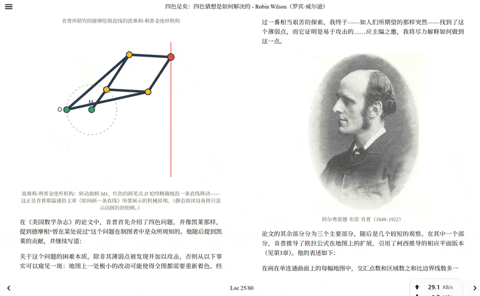

# 四色足矣：地图着色问题是如何解决的

《*Four Colors Suffice: How the Map Problem Was Solved*》（Robin Wilson，罗宾·威尔逊）中译本 —— 个人翻译与排版项目。

成品 EPUB 见 [Releases](../../releases)。



---

## 当前进度：正在重绘原书插图

正文翻译与校对已完成，目前处于**排版收尾阶段**。

原书约 200 张几何类插图是从扫描件截取的位图，线条发糊。本阶段用 Python（matplotlib / scipy / geopandas）程序化重绘为清晰的 SVG 矢量图并替换原图。

| 项目 | 数量 |
| --- | --- |
| 正文插图总数 | 218 |
| 已重绘为 SVG | **185** |
| 仍为位图 | 33（其中大部分是历史照片与人物肖像，不在重绘范围内） |

重绘规范见 [`_redraw_tools/GUIDE.md`](_redraw_tools/GUIDE.md)，逐图任务清单见 `_redraw_tools/work_units.json`。

人工校对流程：`gen_review.py` 生成 `review.html` 对照页（原图 / 新图并排），校对意见记录在 `review_result.json`，返工稿存入 `_rejected_svg/`。

## 仓库结构

```
FourColors_Suffice_zh.md   # 全书正文（Markdown，唯一信息源）
images/                    # 正文引用的插图：重绘后的 .svg + 尚未重绘的 .jpg/.png
images_original/           # 原书截取的位图，重绘时作对照基准
_redraw_tools/             # 重绘规范、共享绘图库（多面体渲染等）、任务清单
_rejected_svg/             # 校对未通过、待返工的 SVG
res/                       # 附加材料（如肯普连杆机构的交互演示与推导）
gen_review.py              # 生成人工校对对照页
epub_style.css             # EPUB 样式
build_epub.ps1 / .bat      # 构建脚本
```

## 构建 EPUB

需要 [pandoc](https://pandoc.org/installing.html)：

```powershell
./build_epub.ps1
```

或双击 `build_epub.bat`。产物为 `《四色足矣：四色猜想是如何解决的》.epub`。

## 说明

本仓库是出于学习与交流目的制作的非商业中文译本，原作著作权归 Robin Wilson 及其出版方所有。如权利人提出异议，将立即下架。
